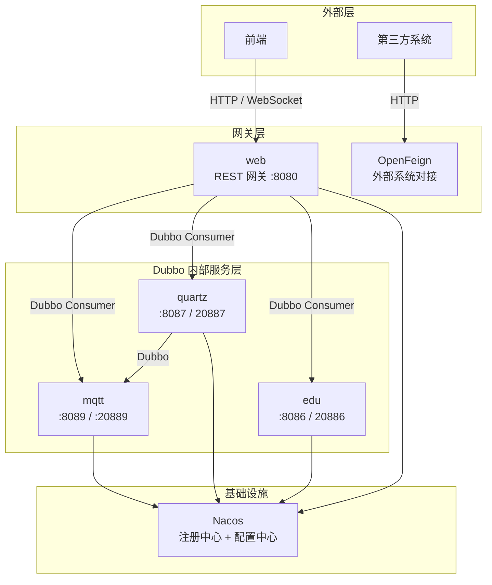

# Lab System Cloud

> 基于 Spring Cloud Alibaba + Nacos + Dubbo 的实验室管理微服务平台。

---

## 🎯 项目使命

将现有的多模块项目骨架演进为**真正的微服务体系**：

- **单一职责**：各服务独立部署、独立扩缩容。
- **高性能内部通信**：内部服务间统一使用 **Dubbo (Triple/gRPC)**，消除 HTTP 直连的序列化与连接开销。
- **REST 网关收敛**：`web` 作为唯一对外暴露 HTTP 的入口，统一鉴权、路由与 WebSocket 接入。
- **同步化异步链路**：将 MQTT 这条天然异步的协议，借助 NIO 思想改造为**同步可感知、可追溯、可超时控制**的稳定链路。

---

## 🏗️ 架构概览



> 注：虚线框内为**目标架构**，当前项目尚处于骨架搭建与演进阶段。未来可能新增 `api`（API 契约）、`device`（设备管理）等模块。

---

## 📦 模块说明（当前实际目录）

| 模块 | 端口 | 职责 | 可启动 | 根 POM 聚合状态 |
|------|------|------|--------|-----------------|
| `common` | - | 公共实体、工具类 | 否（库模块） | ✅ 已聚合 |
| `cache` | - | 缓存抽象（未来升级为 Starter） | 否 / 可启动 | ❌ 待接入 |
| `mqtt` | 8089 | MQTT 通信服务、设备指令下发 | 是 | ✅ 已聚合 |
| `quartz` | - | 定时任务调度 | 是 | ❌ 待接入 |
| `edu` | - | 教务管理（学期、课程、排课） | 是 | ❌ 待接入 |
| `web` | 8080 | REST API 网关、WebSocket 接入 | 是 | ✅ 已聚合 |

> **当前状态**：
> - 根 POM 当前聚合了 `common`、`mqtt`、`web`。
> - `cache`、`quartz`、`edu` 目录已创建，但 parent 仍指向 `spring-boot-starter-parent`，尚未统一到根 POM 管理。
> - 各模块目前多为 Spring Boot 骨架代码，业务代码正在逐步填充中。

---

## 🔌 通信协议分层（设计原则）

| 场景 | 协议 | 说明 |
|------|------|------|
| **内部服务间调用** | **Dubbo (Triple)** | 查询、CRUD、控制、调度的唯一协议。高性能、低延迟，统一超时/重试/熔断策略。 |
| **设备控制 (MQTT)** | **Dubbo** | 同步等待 ACK，`CompletableFuture + 请求映射表` 实现 NIO 思想。 |
| **定时任务执行** | **Dubbo** | 高频、低延迟、稳定调用。 |
| **缓存读写** | **Dubbo** | 高频、低延迟。 |
| **与第三方系统对接** | **OpenFeign (HTTP)** | 学校 SSO、教务系统、外部开放平台等。内部服务间**不再使用 Feign**。 |
| **分布式事务（未来）** | **Dubbo + Seata** | 最终一致性保障。 |

---

## ⚡ 核心场景

### 1. MQTT 同步调用

将 MQTT 的异步协议改造为**同步可感知**的调用链路：

1. 每次请求生成全局唯一 `traceId`。
2. `mqtt` 模块维护内存映射表：`traceId → CompletableFuture<MqttResponse>`。
3. 下发 MQTT 指令后，`future.get(timeout)` 等待设备 ACK。
4. 设备应答到达时，根据 `traceId` 完成对应的 `CompletableFuture`。
5. Dubbo 将结果返回给调用方（如 `web` 或未来的 `device` 模块），对外完全透明。

> 这是 **NIO Reactor 模式**在应用层的体现：发送线程不阻塞在 IO 上，而是注册 Callback，由消息到达事件驱动完成。

### 2. WebSocket 统一推送

- 前端统一连接 `web`（`ws://gateway.lab-system/ws`）。
- `web` 维护 `userId → WebSocketSession` 映射，同时作为 **Dubbo Provider** 暴露 `WebSocketPushService`。
- 下游服务（如 `mqtt`）通过 Dubbo 调用 `web` 的推送接口，将消息实时送达前端。

---

## 🛠️ 技术栈

- **Spring Boot 3.5.13**
- **Spring Cloud Alibaba 2025.0.0.0**
- **Dubbo 3.x** (Triple 协议)
- **Nacos** (服务注册发现 + 配置中心)
- **Sa-Token** (鉴权)
- **Quartz** (定时任务)
- **Paho MQTT** (MQTT 客户端)
- **Redisson** (分布式锁)
- **MySQL**
- **OpenFeign** (仅用于外部系统对接)

---

## 🚀 快速开始

### 前置依赖

- JDK 21+
- Maven 3.9+
- MySQL 8.0+
- Nacos 2.x

### 启动 Nacos

```bash
docker run --name nacos-standalone -e MODE=standalone -p 8848:8848 -p 9848:9848 nacos/nacos-server:v2.3.0
```

### 编译打包

```bash
mvn clean install -DskipTests
```

> 当前根 POM 仅聚合了 `common`、`mqtt`、`web`。如需编译全部模块，请先在根 `pom.xml` 中将 `cache`、`edu`、`quartz` 加入 `<modules>`，或进入各模块目录单独编译。

### 启动服务

建议按以下顺序启动：

```bash
# 1. 启动 mqtt 服务
java -jar mqtt/target/mqtt-0.0.1-SNAPSHOT.jar

# 2. 启动 edu 服务
java -jar edu/target/edu-0.0.1-SNAPSHOT.jar

# 3. 启动 quartz 服务
java -jar quartz/target/quartz-0.0.1-SNAPSHOT.jar

# 4. 最后启动网关层 web
java -jar web/target/web-0.0.1-SNAPSHOT.jar
```

---

## 📋 迁移路线（基于当前骨架的演进规划）

| 阶段 | 周期 | 目标 |
|------|------|------|
| **Phase 1** | 1 周 | 统一父 POM：将 `cache`、`edu`、`quartz` 纳入根 POM 管理；引入 Dubbo BOM；统一 JDK 版本为 21。 |
| **Phase 2** | 1 周 | 搭建 `api` 模块（Dubbo 接口契约 + DTO）；改造 `mqtt` 实现 `MqttRemoteService` Dubbo Provider。 |
| **Phase 3** | 1 周 | 明确 `web` 为纯网关层：只保留 Controller，通过 Dubbo 透传到下游；业务编排下沉到 `edu` / `quartz` / 未来的 `device`。 |
| **Phase 4** | 2 周 | 按需新增 `device` 模块；完善各模块业务代码；将 `cache` 升级为自动配置 Starter。 |
| **Phase 5** | 1 周 | 接入 Sentinel、链路追踪（SkyWalking / Micrometer Tracing）、Dubbo 线程池调优。 |

---

## 📄 相关文档

- [重构方案详情](./REFACTORING_PLAN.md) — 完整的设计原则、接口定义、代码示例与风险应对。

---

## 📌 设计金句

> **"web 变薄，业务编排下沉到领域服务。"**
>
> **"内部通信统一 Dubbo，OpenFeign 仅用于外部对接。"**
>
> **"用 TraceId 替代 ThreadLocal，实现跨进程、跨线程的任务回溯。"**
