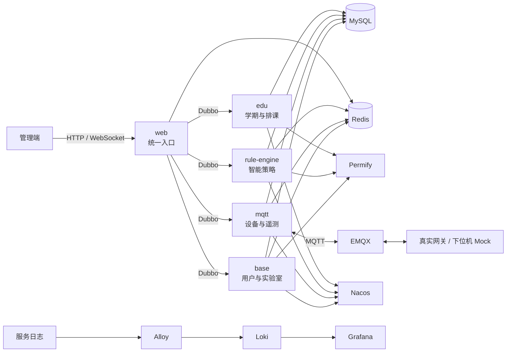

# Lab System Cloud

实验室综合管理系统后端：连接实验室业务、教学排课、物联网设备与自动化策略的服务端工程。

项目采用 Spring Boot 3、Dubbo 3 和 Maven 多模块组织。对外由 `web` 提供统一的 HTTP / WebSocket 入口，对内按业务域拆分服务，通过 Nacos 完成服务注册与发现；设备侧通过 MQTT 接入真实网关或本地 mock。

## 简介

Lab System Cloud 为实验室管理提供一套完整的后端能力：

- **人员与实验室**：用户、联系人、登录会话、实验室资料、负责人和数据范围管理。
- **统一授权**：基于 Sa-Token 管理会话，使用 Permify 表达应用级和实验室级关系权限。
- **设备接入**：管理 MQTT 网关与门禁、空调、断路器、灯光、环境传感器五类设备。
- **实时控制**：完成二进制协议编解码、指令校验、请求响应匹配、串行调度和批量控制。
- **状态采集**：自动轮询设备，将最新状态写入 Redis、历史遥测写入 MySQL，并通过 WebSocket 推送变化。
- **智能策略**：根据设备事件和时间条件增量求值，执行设备控制或生成告警与站内通知。
- **教学管理**：管理学期、实验室课表、排课冲突，并支持 Excel 课表导入。
- **审计与可观测性**：记录业务操作，贯通 HTTP / Dubbo 调用上下文，并使用 Alloy、Loki、Grafana 收集和检索日志。
- **本地完整环境**：通过 Docker Compose 启动数据库、缓存、消息代理、权限服务、注册中心、日志平台和全部 Java 服务。

## 快速开始

### 环境要求

- Docker，且支持 `docker compose`
- JDK 17
- 项目自带 Maven Wrapper，无需单独安装 Maven
- Node.js 20+（仅启动下位机 mock 时需要）

### 一键部署

进入后端目录并执行：

```bash
cp .env.example .env
./scripts/deploy.sh
```

脚本会依次完成：

1. 启动 MySQL、Redis、EMQX、Permify、PostgreSQL、Nacos、Loki、Alloy 和 Grafana。
2. 创建业务库与 UID 数据库，应用数据库 schema 和增量迁移。
3. 上传 Permify 权限模型，初始化超级管理员及其授权关系。
4. 构建 `base`、`mqtt`、`rule-engine`、`edu` 和 `web`。
5. 启动全部 Java 服务，并等待服务健康。

部署完成后，后端 API 地址为：

```text
http://localhost:8989/api
```

本地默认管理员为 `admin / Admin@123456`。账号、密码、端口和镜像均可在 `.env` 中修改；默认凭据只能用于本地开发。

### 启动下位机 Mock

先确保 EMQX 已启动，再打开另一个终端：

```bash
cd tools/mqtt-mock
npm install
npm run dev
```

mock 默认订阅 `test/accept/+`，并向对应的 `test/send/<topicKey>` 发布响应。它会解析后端下发的真实二进制指令，维护设备内存状态，并模拟门禁、空调、断路器、灯光和传感器。

设备状态管理页：

```text
http://127.0.0.1:8787
```

页面与 MQTT 指令处理共享同一份内存状态，可直接查看和修改 mock 设备；进程重启后状态会恢复为默认值。

需要调整 Broker、主题或管理页端口时，复制并修改 mock 配置：

```bash
cd tools/mqtt-mock
cp .env.example .env
npm run dev
```

完整配置与支持的设备指令见 [MQTT Mock 文档](tools/mqtt-mock/README.md)。

## 主要能力

### MQTT 设备接入

MQTT 模块是设备通信中心，负责把上层业务请求转换为下位机协议，并将设备响应还原为领域状态。

- 每个网关维护独立 MQTT Client，支持运行态同步、自动重连和状态修复。
- 同一网关上的请求严格串行；用户指令优先于后台轮询，避免 RS485 总线竞争。
- 支持同步、异步和批量控制，通过 Seq 规则关联请求与响应。
- 使用延迟队列调度设备轮询，并对排队中、执行中的轮询任务去重。
- 按设备类型完成响应解码与校验，将最新快照、历史遥测和实时事件分别送往 Redis、MySQL、规则引擎与 WebSocket。
- 遥测查询优先读取 Redis，缓存缺失时回退 MySQL。

→ [MQTT 核心设计](domains/mqtt/arch.md) · [设备领域设计](domains/device/arch.md) · [设备协议](docs/设备请求及响应.md)

### 智能策略与规则引擎

规则引擎消费设备状态变化和时间事件，只刷新受影响的条件节点，并异步执行命中的动作组。

- 智能策略以不可变 revision 持久化，服务重启后可恢复已启用的 Runtime。
- 支持设备条件组、日期范围、星期、普通或跨午夜时间窗口以及 TimePoint。
- 条件表达式编译为可增量刷新的平衡求值树，设备字段变化时无需全量重算。
- Runtime 具有 `PENDING`、`ACTIVE`、`EXPIRED`、`CANCELLED` 生命周期。
- 同一 Runtime 单飞执行；设备候选事件合并，时间点事件按 occurrence 保序。
- 控制动作通过 MQTT 服务异步下发；报告动作生成告警记录和站内通知。
- 补偿任务用于承接需要后续重试或恢复的执行工作。

→ [规则引擎核心设计](domains/rule/arch.md)

### 实验室、用户与权限

基础域负责系统身份和实验室主数据，认证组件负责把权限约束嵌入各业务服务。

- 登录、登出、会话查询和当前用户上下文。
- 用户与联系人管理。
- 实验室资料、负责人和组织维度的数据范围。
- Sa-Token 会话认证与 Redis 上下文共享。
- Permify 关系授权以及应用级、实验室级动作校验。
- 关键业务操作审计。

→ [基础域核心设计](domains/base/arch.md) · [认证授权设计](domains/auth/arch.md) · [审计设计](domains/audit/arch.md)

### 学期与实验室排课

教学域提供实验室课表维护和导入能力。

- 学期生命周期与当前学期管理。
- 实验室课表的创建、更新、查询和删除。
- 按周次、星期和节次表达排课区间。
- 排课冲突检查。
- Excel 课表导入与导入大小限制。
- 面向统计分析的教学数据视图。

→ [教务域核心设计](domains/edu/arch.md)

### Web 入口与实时推送

`web` 是前端唯一需要访问的后端服务。

- 将会话、用户、实验室、设备、网关、遥测、策略、告警、学期、课表和审计能力统一暴露为 HTTP API。
- 只依赖各业务域的 API 契约，通过 Dubbo 调用服务实现，不直接访问业务数据库。
- 将设备状态变化合并后通过 WebSocket 推送，降低高频遥测造成的更新压力。
- 统一处理认证、错误响应、调用上下文和跨服务链路信息。

→ [Web 入口核心设计](web/arch.md)

## 系统结构


```mermaid
flowchart LR
    User["管理端"] -->|"HTTP / WebSocket"| Web["web<br/>统一入口"]

    Web -->|"Dubbo"| Base["base<br/>用户与实验室"]
    Web -->|"Dubbo"| Mqtt["mqtt<br/>设备与遥测"]
    Web -->|"Dubbo"| Rule["rule-engine<br/>智能策略"]
    Web -->|"Dubbo"| Edu["edu<br/>学期与排课"]

    Base --> MySQL[("MySQL")]
    Mqtt --> MySQL
    Rule --> MySQL
    Edu --> MySQL

    Base --> Redis[("Redis")]
    Mqtt --> Redis
    Rule --> Redis
    Web --> Redis

    Base --> Permify["Permify"]
    Rule --> Permify
    Edu --> Permify

    Mqtt <-->|"MQTT"| EMQX["EMQX"]
    EMQX <--> Device["真实网关 / 下位机 Mock"]

    Base & Mqtt & Rule & Edu --> Nacos["Nacos"]
    Logs["服务日志"] --> Alloy["Alloy"] --> Loki["Loki"] --> Grafana["Grafana"]
```

工程遵循以下边界：

- `web` 只负责协议适配和请求入口，不承载业务持久化。
- `domains/*/api` 定义跨服务契约，服务实现不通过源码相互耦合。
- `domains/*/service` 与 `domains/rule/engine` 承载业务实现和数据访问。
- `device/domain` 维护跨模块共享的稳定设备模型。
- `shared` 提供持久化、Redis、UID、可观测性和通用基础能力。

## 模块结构

```text
lab-system-cloud/
├── domains/
│   ├── audit/               # 审计契约与实现
│   ├── auth/                # 会话上下文与 Permify 授权
│   ├── base/                # 用户、联系人、实验室
│   ├── device/domain/       # 设备领域模型
│   ├── edu/                 # 学期、课表与 Excel 导入
│   ├── mqtt/                # 网关、设备、协议、轮询与遥测
│   └── rule/                # 智能策略、增量求值与动作执行
├── shared/
│   ├── common/              # 通用模型、异常与基础工具
│   ├── observability/       # HTTP / Dubbo 追踪与日志平台配置
│   ├── persistence-core/    # MyBatis-Plus 与持久化基础设施
│   ├── redis/               # Redis、Pub/Sub 和事件总线
│   └── uid-springboot-starter/
├── web/                     # HTTP / WebSocket 统一入口
├── tools/mqtt-mock/         # Node.js 下位机模拟器
├── tools/infra/             # 容器运行辅助脚本
├── sql/                     # 初始 schema 与增量迁移
├── scripts/deploy.sh        # 部署、初始化与热更新入口
└── compose.yml              # 本地完整运行环境
```

## 部署与开发

### 部署命令

`scripts/deploy.sh` 是统一的环境管理入口：

| 命令 | 作用 |
| --- | --- |
| `./scripts/deploy.sh` | 完整部署；等同于 `deploy` |
| `./scripts/deploy.sh infra` | 仅启动基础设施，并初始化数据库、权限模型和管理员 |
| `./scripts/deploy.sh apps` | 构建并启动 Java 服务，不重建基础设施 |
| `./scripts/deploy.sh build` | 重新构建服务 JAR；运行中的容器自动加载新产物 |
| `./scripts/deploy.sh hot-reload` | 启动应用并持续监听源码，变更后自动构建和重载 |
| `./scripts/deploy.sh bootstrap` | 重新应用 schema、迁移、Permify 模型和管理员数据 |
| `./scripts/deploy.sh status` | 查看容器状态 |
| `./scripts/deploy.sh logs` | 持续查看全部服务日志 |
| `./scripts/deploy.sh down` | 停止项目容器，保留数据卷 |

部署脚本可重复执行。Java 容器挂载各模块的 `target` 目录，JAR 发生变化后会在原容器内重启 JVM，因此日常后端开发不需要反复重建镜像。

### 服务入口

| 服务 | 默认地址 | 说明 |
| --- | --- | --- |
| Web API | `http://localhost:8989/api` | 前端统一访问入口 |
| EMQX Dashboard | `http://localhost:18083` | 默认 `admin / public123` |
| Nacos Console | `http://localhost:8080` | 本地默认关闭鉴权 |
| Permify HTTP | `http://localhost:3476` | 权限模型与关系数据 |
| Grafana | `http://localhost:3000` | 默认 `admin / admin` |
| Alloy | `http://localhost:12345` | 日志采集组件状态 |
| MQTT Mock UI | `http://127.0.0.1:8787` | mock 进程启动后可用 |

### 构建与测试

构建全部模块：

```bash
./mvnw clean package
```

执行默认验证：

```bash
./mvnw clean verify
```

默认验证不要求外部 MQTT Broker。准备好真实外部依赖后，可运行集成测试：

```bash
./mvnw clean verify -Pexternal-tests
```

### 常见开发流程

仅启动依赖，在本机运行 Java 服务：

```bash
./scripts/deploy.sh infra
```

以容器方式运行应用，并在源码变化后自动构建：

```bash
./scripts/deploy.sh infra
./scripts/deploy.sh hot-reload
```

查看运行状态与日志：

```bash
./scripts/deploy.sh status
./scripts/deploy.sh logs
```

## 技术栈

- Java 17、Spring Boot 3.5
- Apache Dubbo 3.3、Nacos 3.2
- MyBatis / MyBatis-Plus、MySQL 8
- Redis / Jedis、Redis Hash、Pub/Sub
- Eclipse Paho MQTT、EMQX 5.8
- Sa-Token、Permify 1.6
- Docker Compose
- Grafana Alloy、Loki、Grafana
- Node.js、TypeScript、MQTT.js（下位机 mock）

## 文档

- [Base：用户、联系人与实验室](domains/base/arch.md)
- [Auth：UserContext 与 Permify 授权](domains/auth/arch.md)
- [Audit：审计切面、上下文与持久化](domains/audit/arch.md)
- [Device：设备领域模型与共享契约](domains/device/arch.md)
- [MQTT：网关、调度、轮询与遥测](domains/mqtt/arch.md)
- [Rule：策略编译、增量求值与动作](domains/rule/arch.md)
- [Edu：学期、课表、冲突与导入](domains/edu/arch.md)
- [Web：HTTP / WebSocket 统一入口](web/arch.md)
- [Shared：共享基础设施](shared/arch.md)
- [下位机 Mock 核心设计](tools/mqtt-mock/arch.md)
- [下位机 Mock 使用说明](tools/mqtt-mock/README.md)
- [设备请求与响应协议](docs/设备请求及响应.md)
- [可观测性与集中日志](shared/observability/README.md)
- [UID Starter](shared/uid-springboot-starter/README.md)

README 只保留当前代码仍可验证的文档入口。模块设计发生变化时，应先更新对应模块文档，再同步这里的能力摘要和链接。
