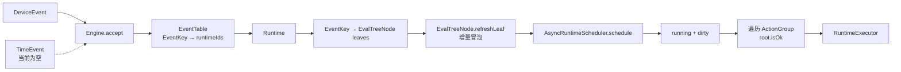
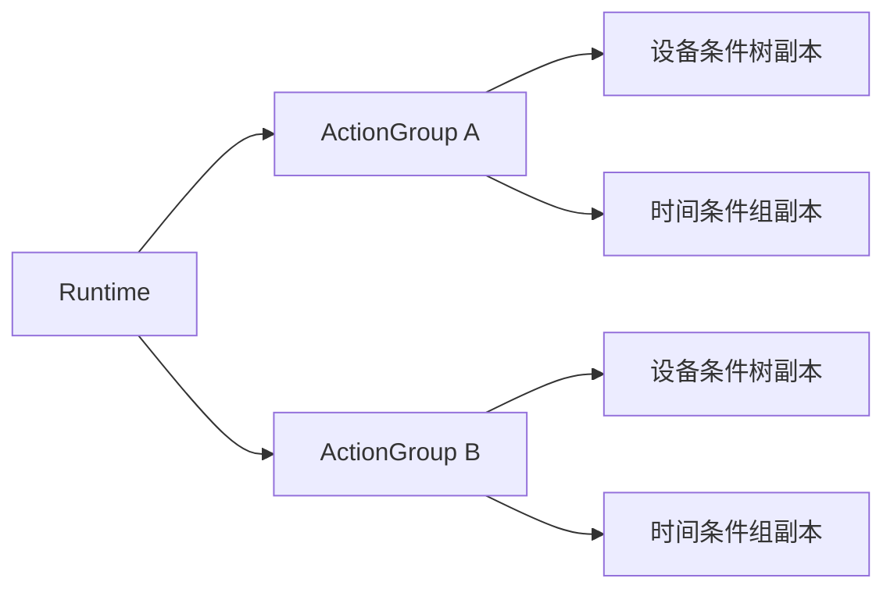
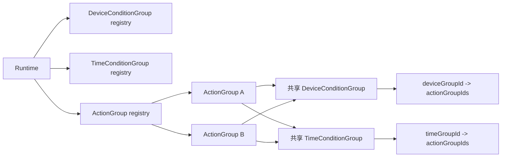
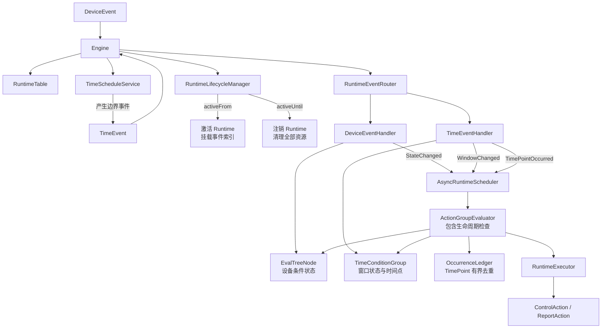
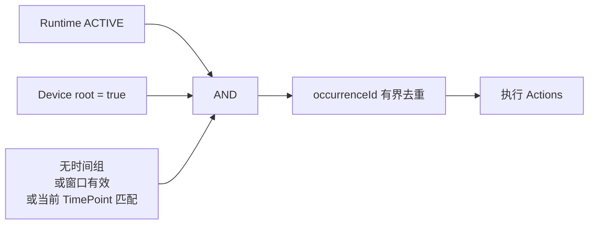
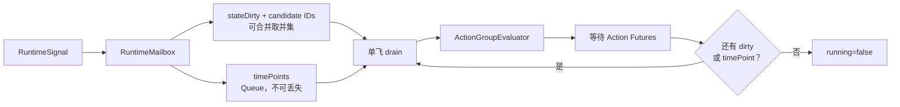
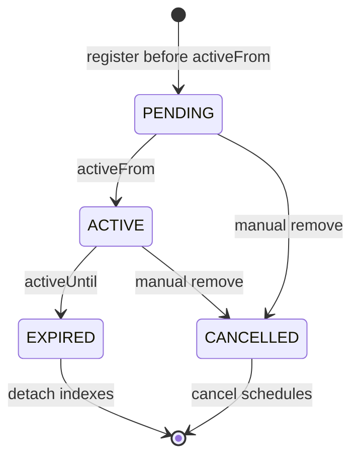

核心原则是：**设备条件维护状态，时间窗口维护状态，时间点维护不可丢失的瞬时事件，Runtime 生命周期管理规则存亡；条件组属于 Runtime，可被多个 ActionGroup 引用。**

**改造前模块关系**


改造前缺失：

- Runtime 没有生命周期状态。
- Engine 只接收 `DeviceEvent`。
- ActionGroup 只判断 `EvalTreeNode.root`。
- `dirty` 可以合并状态事件，但会错误吞掉不可合并的 TimePoint。
- Runtime 注册后立即进入事件索引，无法表达 `PENDING`。

**条件组复用前**


**条件组复用后**


复用后的能力：

- 条件组只编译、建立叶子索引和注册时间任务一次。
- 设备条件组根结果变化后，通过反向引用生成候选 ActionGroup 集合。
- 一个共享 TimePoint 事件会触发所有引用该时间条件组的动作组。
- Web revision 独立保存条件组，ActionGroup 使用 groupId 引用，不复制配置。

**当前已落地模块关系**


**各模块职责**

| 模块 | 承载职责 |
|---|---|
| `Engine` | 对外接收事件；注册、激活、注销 Runtime；不负责具体时间计算和 Action 执行 |
| `Runtime` | 保存生命周期、条件组 registry、ActionGroup、叶子索引和条件组反向引用 |
| `RuntimeRevisionCompiler` | 校验 Web revision，并把 ID 引用编译成共享条件组对象 |
| `RuntimeLifecycleManager` | 注册时计算激活与到期任务，并在边界到达时回调 Engine |
| `TimeScheduleService` | 按唯一时间条件组计算下一次窗口进入、退出和 TimePoint；不重复调度共享组 |
| `RuntimeEventRouter` | 按事件类型分发到 Device/Time handler |
| `DeviceEventHandler` | 刷新共享条件树；根结果变化时产生带候选 ActionGroup ID 的状态信号 |
| `TimeEventHandler` | 修改共享窗口状态，并向引用该组的 ActionGroup 扇出 |
| `TimeConditionGroup` | 多个时间条件 OR；单个条件内部日期、星期、时段为 AND |
| `ActionGroupEvaluator` | 先按候选集合过滤，再综合生命周期、设备根结果和时间条件 |
| `AsyncRuntimeScheduler` | 每个 Runtime 单飞；状态候选集合取并集；TimePoint 顺序保留 |
| `RuntimeExecutor` | 执行 Action，并统计成功、失败和失败详情 |

**ActionGroup 判断**


其中：

```text
TimeConditionGroup = condition1 OR condition2 OR condition3

condition1 =
    dateRange
    AND weekdays
    AND dailyTimeRange
```

**对三个现有类的影响**

| 类 | 改造影响 |
|---|---|
| `EvalTreeNode` | 基本不变，继续只处理设备字段表达式；不要把日期、星期和 TimePoint 塞进这棵树 |
| `Engine` | `accept(DeviceEvent)` 泛化为接收统一事件；事件处理委托 Router；注册流程接入 LifecycleManager |
| `AsyncRuntimeScheduler` | 从单个 `dirty` 标记升级成 Runtime mailbox，区分可合并状态和不可合并 TimePoint |

Scheduler 最关键的变化：



当前信号模型：

```text
RuntimeSignal
├── StateChanged(candidateActionGroupIds)
└── TimePointOccurred
    ├── timeConditionGroupId
    └── TimeEvent
```

`WINDOW_ENTER/WINDOW_EXIT` 先修改 TimeConditionGroup，再转换为 `StateChanged`。`dirty` 适合设备状态和窗口状态，因为只关心最新值；但 `08:00` 和 `12:00` 两个 TimePoint 都必须执行，不能被压成一次。

**Runtime 生命周期**


注销时应统一完成：

1. 从 RuntimeTable 移除。
2. 从设备事件索引移除。
3. 取消时间边界任务。
4. 清空 Scheduler mailbox。
5. 阻止已提交但尚未执行的 ActionGroup 推演。

当前已经实现：

- `EngineEvent` 统一设备事件和时间事件入口。
- `RuntimeLifecycleManager` 主动激活、到期注销；Engine 收到事件时也会被动检查到期状态。
- `TimeScheduleService` 只计算并调度下一次边界，不使用全局 Tick。
- `TimeWindowCondition` 支持日期范围、星期、普通窗口和跨午夜窗口。
- `TimePointCondition` 生成带 `occurrenceId` 的瞬时事件。
- 可复用设备/时间条件组和双向引用索引。
- `AsyncRuntimeScheduler` 使用 `stateDirty + candidate IDs + timePoints FIFO` mailbox。
- `RuntimeRevisionCompiler` 将 Web JSON revision 编译成共享对象图。

当前仍未实现：

- 时间任务持久化和应用重启后的恢复。
- misfire 策略，例如 `SKIP / FIRE_ONCE / CATCH_UP`。
- 多实例下的时间任务选主或分布式锁。
- 通用的 Rising Edge、冷却时间和 Action 重试策略。

改造后，`EvalTreeNode` 仍然只负责设备表达式，`Engine` 只负责入口和 Runtime 管理，时间计算与并发推演分别落在独立模块中。
