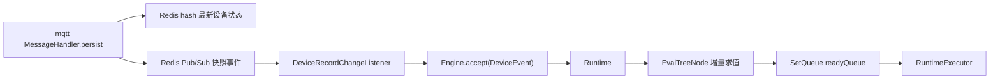

# RuleEngine 当前实现说明

本文档描述 `rule-engine` 模块当前已经落地的事件驱动规则引擎实现。

核心目标是：设备状态变化后，只驱动受影响的表达式叶子节点，避免每次状态变化都全量扫描所有规则。

## 整体链路



处理过程：

1. MQTT 模块收到设备响应后，`MessageHandler.persist()` 解码为具体 record。
2. record 被转换为 `Map<String, String>`，写入 Redis hash，供字段级状态读取。
3. 同一个 record 快照会发布到 Redis Pub/Sub channel：`rule-engine:device-record-change`。
4. `rule-engine` 订阅该 channel，由 `DeviceRecordChangeListener` 维护上一条设备快照。
5. listener 将快照变化拆成字段级 `DeviceEvent`。
6. `Engine` 根据 `DeviceEventKey` 找到相关 runtime，只刷新命中的表达式叶子。
7. 表达式树根结果发生变化时，runtime id 进入 `readyQueue`。
8. 后续由 `RuntimeExecutor` 消费就绪 runtime；当前默认实现是日志记录。

## 跨模块事件契约

公共事件契约位于 `common.event`：

- `RuleEngineChannels.DEVICE_RECORD_CHANGE`
- `DeviceRecordSnapshotEvent`

`DeviceRecordSnapshotEvent` 字段如下：

```java
class DeviceRecordSnapshotEvent {
    private DeviceType deviceType;
    private String deviceId;
    private Map<String, String> recordFields;
    private Instant occurredAt;
}
```

约定：

- `recordFields` 使用 Java 字段名，不使用数据库列名。
- 例如空调开关字段是 `opened`，室温字段是 `roomTemperature`。
- 表达式右值目前仍以字符串保存，但求值时会按 record 字段真实类型还原。

MQTT 发布点在 `mqtt.client.message_handler.MessageHandler`：

```java
Map<String, String> rmap = ObjectMapUtil.toStringMap(record);
redisBus.hsetex(RECORD_KEY(deviceType, deviceId), rmap, Duration.ofSeconds(15));
redisBus.publish(RuleEngineChannels.DEVICE_RECORD_CHANGE, snapshotJson);
```

## Listener 行为

`DeviceRecordChangeListener` 负责把完整 record 快照转换成字段事件。

它内部维护：

```java
ConcurrentHashMap<RecordIdentity, Map<String, String>> snapshots;
```

其中 `RecordIdentity = deviceType + deviceId`。

触发规则：

- 首次见到某个设备：缓存完整快照，并对快照内所有字段生成 `DeviceEvent`。
- 后续再次见到该设备：只对新增字段或值发生变化的字段生成 `DeviceEvent`。
- 未变化字段不会重复触发。

这样首次快照可以把 runtime 从默认状态同步到真实设备状态，之后再走增量更新。

## Engine 核心结构

`Engine` 是调度入口，当前包含三部分：

```java
class Engine {
    private final EventTable<Set<String>> eventHelper;
    private final RuntimeTable runtimeHelper;
    private final SetQueue<String> readyQueue;
}
```

职责：

- `eventHelper`：`EventKey -> runtimeId set`，用于从事件快速定位 runtime。
- `runtimeHelper`：`runtimeId -> Runtime`，保存运行时实例。
- `readyQueue`：就绪 runtime 队列，使用 `SetQueue` 避免同一 runtime 重复入队。

`Engine.accept(DeviceEvent)` 的语义：

1. 根据 `DeviceEvent.eventKey()` 查询受影响 runtime。
2. 对每个 runtime，查找该事件对应的叶子节点集合。
3. 调用叶子节点 `refreshLeaf(eventValue)`。
4. 如果任一叶子导致根结果变化，则将 `runtimeId` 放入 `readyQueue`。

`DeviceEventKey` 当前格式为：

```text
DEVICE:{deviceType}:{deviceId}:{field}
```

例如：

```text
DEVICE:AirCondition:ac-1:roomTemperature
```

## Runtime 与 ActionGroup

`Runtime` 表示一组规则动作运行上下文：

```java
class Runtime {
    private final String runtimeId;
    private final List<ActionGroup> actionGroups;
    private final EventTable<Set<EvalTreeNode>> roots;
    private final Map<String, EvalTreeNode> treeRootMap;
    private final Map<String, EvalNode> dummyNodeMap;
}
```

含义：

- `actionGroups`：runtime 内可被触发的动作组。
- `roots`：`EventKey -> EvalTreeNode leaf set`，用于字段事件命中叶子。
- `treeRootMap`：`actionGroupId -> EvalTreeNode root`，用于获得条件组当前结果。
- `dummyNodeMap`：`actionGroupId -> EvalNode dummyHead`，保留原始链表表达式。

`ActionGroup` 当前是最小实现：

```java
class ActionGroup {
    private final String actionGroupId;
    private final EvalNode dummyHead;
    private final EvalTreeNode root;
}
```

当前版本只完成规则求值和 runtime 就绪调度。真实动作执行、告警发送、设备控制等仍通过 `RuntimeExecutor` 扩展。

## 表达式模型

### EvalNode

`EvalNode` 表示原始链式条件节点：

```java
class EvalNode {
    private String nodeId;
    private String deviceId;
    private DeviceType deviceType;
    private String field;
    private Operator operator;
    private String value;
    private LogicType logicToPrev;
    private volatile boolean result;
    private EvalNode next;
}
```

约定：

- dummy head 表示条件组初始值，通常 `result = true`。
- 真实条件节点从 `dummyHead.next` 开始。
- `logicToPrev` 表示当前节点与前一个节点的关系。
- 构建树时严格按照链表顺序从左到右计算，不使用 `AND`/`OR` 运算符优先级。

### EvalTreeNode

`EvalTreeNode` 是可增量刷新的二叉表达式树：

```java
class EvalTreeNode {
    private EvalNode source;
    private NodeType nodeType;
    private LogicType logicType;
    private volatile boolean result;
    private EvalTreeNode parent;
    private EvalTreeNode left;
    private EvalTreeNode right;
}
```

当前提供的核心能力：

- `leaf(EvalNode source)`：构造叶子节点。
- `logic(LogicType logicType, EvalTreeNode left, EvalTreeNode right)`：构造逻辑节点。
- `fromChain(EvalNode head)`：从链式表达式构造左结合表达式树。
- `refreshLeaf(String eventValue)`：刷新叶子结果，并向父节点冒泡。
- `root()`：获取当前节点所在表达式树根节点。

`refreshLeaf()` 会返回根结果是否发生变化。只有根结果变化时，runtime 才会进入 `readyQueue`。

`fromChain()` 的构造规则可以理解为：

```java
EvalTreeNode root = leaf(head);
for (EvalNode current = head.next; current != null; current = current.next) {
    root = logic(current.logicToPrev, root, leaf(current));
}
```

因此所有逻辑关系都按链表顺序左结合。例如：

```text
A OR B AND C
```

会被计算为：

```text
(A OR B) AND C
```

而不是传统布尔表达式优先级下的：

```text
A OR (B AND C)
```

## 类型化求值

表达式右值保存为字符串，但求值前会通过字段真实类型还原。

相关组件：

- `RecordFieldTypeResolver`
- `TypedValueParser`

`RecordFieldTypeResolver` 按 `DeviceType` 映射到具体 record 类型：

- `Access -> AccessRecord`
- `AirCondition -> AirConditionRecord`
- `CircuitBreak -> CircuitBreakRecord`
- `Light -> LightRecord`
- `Sensor -> SensorRecord`

然后通过反射查找字段类型，并缓存结果。

`TypedValueParser` 会把事件值和表达式右值解析成同一种类型：

- `boolean / Boolean`
- `int / long / float / double / BigDecimal`
- `enum`
- `String`

比较规则：

- 数字类型支持 `EQ`、`NE`、`GT`、`GE`、`ST`、`SE`。
- boolean、enum、string 只支持 `EQ`、`NE`。
- 非法类型、未知字段、非法 enum、非法数字会抛出受控异常；表达式叶子刷新时会将该条件评估为 `false`。

## 示例

链式表达式：

```text
GResult(true)
AND AirCondition:ac-1:opened EQ true
OR  AirCondition:ac-1:roomTemperature GT 26
```

可构造为：

```java
EvalNode dummy = new EvalNode();
dummy.setResult(true);

EvalNode opened = new EvalNode();
opened.setDeviceId("ac-1");
opened.setDeviceType(DeviceType.AirCondition);
opened.setField("opened");
opened.setOperator(Operator.EQ);
opened.setValue("true");
opened.setLogicToPrev(LogicType.AND);

EvalNode temperature = new EvalNode();
temperature.setDeviceId("ac-1");
temperature.setDeviceType(DeviceType.AirCondition);
temperature.setField("roomTemperature");
temperature.setOperator(Operator.GT);
temperature.setValue("26");
temperature.setLogicToPrev(LogicType.OR);

dummy.setNext(opened);
opened.setNext(temperature);

EvalTreeNode root = EvalTreeNode.fromChain(dummy);
```

等价逻辑：

```text
(true AND opened == true) OR roomTemperature > 26
```

因为当前示例只有两个真实条件节点，所以顺序计算结果与常见布尔优先级写法看起来一致。若链式条件为：

```text
A OR B AND C
```

则必须按链式顺序理解为：

```text
(A OR B) AND C
```

当收到事件：

```text
DEVICE:AirCondition:ac-1:roomTemperature = 27
```

engine 只会刷新监听 `roomTemperature` 的叶子节点，然后向上冒泡刷新根结果。

## 当前边界

已实现：

- MQTT 发布完整设备快照事件。
- rule-engine 订阅 Redis Pub/Sub。
- 首次快照全字段事件触发。
- 后续快照字段级差量触发。
- `EventKey -> Runtime -> EvalTreeNode leaf` 增量调度。
- 表达式树按链式顺序进行 AND/OR 求值和根结果变化判断。
- 基于 record 字段类型的表达式值还原和比较。
- runtime ready 队列去重。

暂未实现：

- 规则/ActionGroup 的持久化加载。
- 可视化规则配置 DSL。
- 告警动作、设备控制动作等真实执行器。
- 时间事件 `TimeEvent` 的调度。
- 分布式 runtime ownership 或多实例消费协调。

## 测试覆盖

当前相关测试：

- `TypedValueParserTests`
- `EvalTreeNodeTests`
- `DeviceRecordChangeListenerTests`
- `EngineTests`
- `MessageHandlerSnapshotPublishTests`

推荐验证命令：

```shell
./mvnw test -pl rule-engine -am
./mvnw test -pl mqtt -am -Dtest=MessageHandlerSnapshotPublishTests -Dsurefire.failIfNoSpecifiedTests=false
```

注意：`mqtt` 全量测试中包含真实 MQTT 集成测试，可能受 broker 状态和既有 `MqttCallback` 并发窗口影响，不应作为 rule-engine 本次实现的唯一判断依据。
