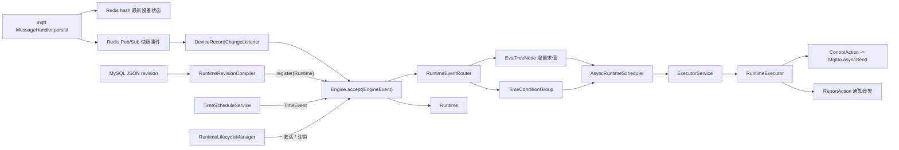
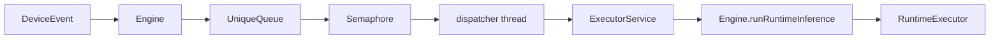
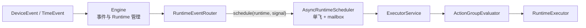
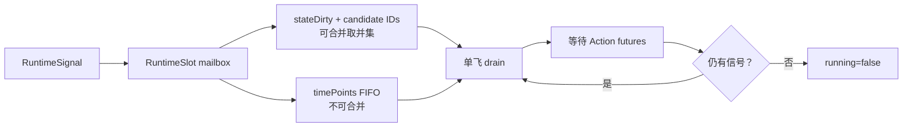
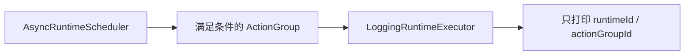
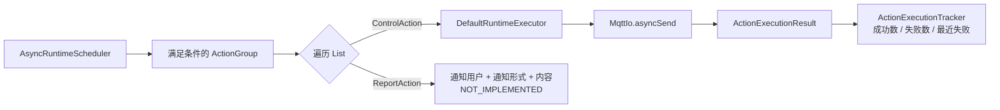

# RuleEngine 当前实现说明

本文档描述 `rule-engine` 模块当前已经落地的事件驱动规则引擎实现。

核心目标是：设备状态变化后，只驱动受影响的表达式叶子节点，避免每次状态变化都全量扫描所有规则。

## 整体链路


```mermaid
flowchart LR
    MQTT["mqtt MessageHandler.persist"]
    Hash["Redis hash 最新设备状态"]
    PubSub["Redis Pub/Sub 快照事件"]
    Listener["DeviceRecordChangeListener"]
    Revision["MySQL JSON revision"]
    Compiler["RuntimeRevisionCompiler"]
    TimeService["TimeScheduleService"]
    Lifecycle["RuntimeLifecycleManager"]
    Engine["Engine.accept(EngineEvent)"]
    Router["RuntimeEventRouter"]
    Runtime["Runtime"]
    Eval["EvalTreeNode 增量求值"]
    TimeGroup["TimeConditionGroup"]
    Scheduler["AsyncRuntimeScheduler"]
    Pool["ExecutorService"]
    Executor["RuntimeExecutor"]
    Control["ControlAction -> MqttIo.asyncSend"]
    Report["ReportAction 通知骨架"]

    MQTT --> Hash
    MQTT --> PubSub
    PubSub --> Listener
    Listener --> Engine
    Revision --> Compiler
    Compiler -->|"register(Runtime)"| Engine
    TimeService -->|"TimeEvent"| Engine
    Lifecycle -->|"激活 / 注销"| Engine
    Engine --> Router
    Engine --> Runtime
    Router --> Eval
    Router --> TimeGroup
    Eval --> Scheduler
    TimeGroup --> Scheduler
    Scheduler --> Pool
    Pool --> Executor
    Executor --> Control
    Executor --> Report
```

处理过程：

1. MQTT 模块收到设备响应后，`MessageHandler.persist()` 解码为具体 record。
2. record 被转换为 `Map<String, String>`，写入 Redis hash，供字段级状态读取。
3. 同一个 record 快照会发布到 Redis Pub/Sub channel：`rule-engine:device-record-change`。
4. `rule-engine` 订阅该 channel，由 `DeviceRecordChangeListener` 维护上一条设备快照。
5. listener 将快照变化拆成字段级 `DeviceEvent`。
6. `Engine` 只为 `ACTIVE` runtime 路由事件；`PENDING` runtime 尚未挂入设备事件索引。
7. `DeviceEventHandler` 刷新命中的表达式叶子；共享条件组根结果变化后，生成带候选 ActionGroup ID 的 `StateChanged`。
8. `TimeScheduleService` 按唯一时间条件组调度下一边界，生成携带 `timeConditionGroupId` 的窗口或 TimePoint 事件。
9. `TimeEventHandler` 更新窗口状态；TimePoint 会保留 `occurrenceId` 并进入不可丢失队列。
10. `AsyncRuntimeScheduler` 保证同一 runtime 单飞；状态信号合并，TimePoint 按 occurrence 去重并顺序消费。
11. `ActionGroupEvaluator` 同时检查 Runtime 生命周期、设备条件树和时间条件组。
12. 条件满足后逐个调用 `RuntimeExecutor`；`ControlAction` 通过 `MqttIo.asyncSend()` 执行控制并记录结果。

## 跨模块事件契约

公共事件契约位于 `common.event`：

- `RuleEngineChannels.DEVICE_RECORD_CHANGE`
- `DeviceRecordSnapshotEvent`

`DeviceRecordSnapshotEvent` 字段如下：

```java
class DeviceRecordSnapshotEvent {
    private DeviceType deviceType;
    private String deviceId;
    private Map<String, String> recordFields;
    private Instant occurredAt;
}
```

约定：

- `recordFields` 使用 Java 字段名，不使用数据库列名。
- 例如空调开关字段是 `opened`，室温字段是 `roomTemperature`。
- 表达式右值目前仍以字符串保存，但求值时会按 record 字段真实类型还原。

MQTT 发布点在 `mqtt.client.message_handler.MessageHandler`：

```java
Map<String, String> rmap = ObjectMapUtil.toStringMap(record);
redisBus.hsetex(RECORD_KEY(deviceType, deviceId), rmap, Duration.ofSeconds(15));
redisBus.publish(RuleEngineChannels.DEVICE_RECORD_CHANGE, snapshotJson);
```

## Listener 行为

`DeviceRecordChangeListener` 负责把完整 record 快照转换成字段事件。

它内部维护：

```java
ConcurrentHashMap<RecordIdentity, Map<String, String>> snapshots;
```

其中 `RecordIdentity = deviceType + deviceId`。

触发规则：

- 首次见到某个设备：缓存完整快照，并对快照内所有字段生成 `DeviceEvent`。
- 后续再次见到该设备：只对新增字段或值发生变化的字段生成 `DeviceEvent`。
- 未变化字段不会重复触发。

这样首次快照可以把 runtime 从默认状态同步到真实设备状态，之后再走增量更新。

## Engine 核心结构

`Engine` 是事件入口和 runtime 管理器，时间计算和推演执行均委托给独立组件：

```java
class Engine {
    private final EventTable<Set<String>> eventHelper;
    private final RuntimeTable runtimeHelper;
    private final RuntimeScheduler runtimeScheduler;
    private final RuntimeLifecycleManager lifecycleManager;
    private final TimeScheduleService timeScheduleService;
    private final RuntimeEventRouter eventRouter;
}
```

职责：

- `eventHelper`：`EventKey -> runtimeId set`，用于从事件快速定位 runtime。
- `runtimeHelper`：`runtimeId -> Runtime`，保存运行时实例。
- `runtimeScheduler`：异步执行 runtime；状态合并和 TimePoint FIFO 由调度器负责。
- `lifecycleManager`：按 `activeFrom/activeUntil` 主动激活或注销 runtime。
- `timeScheduleService`：计算并投递时间条件的下一次边界。
- `eventRouter`：把设备事件和时间事件交给对应 handler。

`Engine.accept(EngineEvent)` 的语义：

1. `DeviceEvent` 根据反向索引查询受影响 runtime；`TimeEvent` 根据自身 key 定向找到 runtime。
2. 被动检查 runtime 是否到期，到期则立即执行幂等注销。
3. Router 更新设备表达式叶子或时间窗口状态。
4. 将 `StateChanged` 或 `TimePointOccurred` 交给 RuntimeScheduler。

## 调度职责重构

### 修改前


```mermaid
flowchart LR
    Event["DeviceEvent"] --> Engine["Engine"]
    Engine --> Queue["UniqueQueue"]
    Queue --> Signal["Semaphore"]
    Signal --> Dispatcher["dispatcher thread"]
    Dispatcher --> Pool["ExecutorService"]
    Pool --> Inference["Engine.runRuntimeInference"]
    Inference --> RuntimeExecutor
```

修改前的亮点是 readyQueue 状态直观、能够对等待中的 runtimeId 去重；但 Engine 同时管理队列、信号量、dispatcher、线程池和 ActionGroup 推演，职责较重。runtimeId 被 poll 后立即释放去重索引，还可能让同一 runtime 出现并发推演。

### 修改后


```mermaid
flowchart LR
    Event["DeviceEvent / TimeEvent"] --> Engine["Engine<br/>事件与 Runtime 管理"]
    Engine --> Router["RuntimeEventRouter"]
    Router -->|"schedule(runtime, signal)"| Scheduler["AsyncRuntimeScheduler<br/>单飞 + mailbox"]
    Scheduler --> Pool["ExecutorService"]
    Pool --> Inference["ActionGroupEvaluator"]
    Inference --> RuntimeExecutor["RuntimeExecutor"]
```

修改后的能力：

- Engine 只负责 `accept/register/remove` 和事件索引。
- 不再需要 readyQueue、Semaphore 和独立 dispatcher 线程。
- 同一个 runtime 同时最多有一个推演任务，并且单飞状态会保持到本轮所有 Action future 完成。
- runtime 执行期间的多个状态 event 会合并成一次后续推演。
- TimePoint 使用 FIFO 保存，并以 `occurrenceId` 有界去重，不会被 dirty 合并吞掉。
- 不同 runtime 仍可以在线程池中并行执行。
- `RuntimeExecutor` 负责单个 Action 的异步执行，并返回结构化执行结果。

`RuntimeScheduler` 对 Engine 暴露的接口只有：

```java
interface RuntimeScheduler {
    void schedule(Runtime runtime, RuntimeSignal signal);
    void cancel(String runtimeId);
}
```

`AsyncRuntimeScheduler` 内部为每个 runtime 维护一个 `RuntimeSlot`：


```mermaid
flowchart LR
    Signal["RuntimeSignal"] --> Mailbox["RuntimeSlot mailbox"]
    Mailbox --> Dirty["stateDirty + candidate IDs<br/>可合并取并集"]
    Mailbox --> Points["timePoints FIFO<br/>不可合并"]
    Dirty --> Drain["单飞 drain"]
    Points --> Drain
    Drain --> Await["等待 Action futures"]
    Await --> Pending{"仍有信号？"}
    Pending -->|"是"| Drain
    Pending -->|"否"| Idle["running=false"]
```

`running` 保证单飞；`stateDirty` 保存最新状态推演需求并合并候选 ActionGroup ID；`timePoints` 保存每个瞬时 occurrence。

`DeviceEventKey` 当前格式为：

```text
DEVICE:{deviceType}:{deviceId}:{field}
```

例如：

```text
DEVICE:AirCondition:ac-1:roomTemperature
```

`TimeEventKey` 当前格式为：

```text
TIME:{runtimeId}:{timeConditionGroupId}:{conditionId}
```

## Runtime 与 ActionGroup

`Runtime` 表示一组规则动作运行上下文：

```java
class Runtime {
    private final String runtimeId;
    private final RuntimeLifetime lifetime;
    private final AtomicReference<RuntimeState> lifecycleState;
    private final List<ActionGroup> actionGroups;
    private final Map<String, DeviceConditionGroup> deviceConditionGroups;
    private final Map<String, TimeConditionGroup> timeConditionGroups;
    private final Map<String, Set<String>> deviceGroupActionGroups;
    private final Map<String, Set<String>> timeGroupActionGroups;
    private final EventTable<Set<DeviceConditionLeaf>> roots;
    private final Map<String, EvalTreeNode> treeRootMap;
    private final Map<String, EvalNode> dummyNodeMap;
}
```

含义：

- `actionGroups`：runtime 内可被触发的动作组。
- `lifetime`：start-inclusive、end-exclusive 的运行有效期。
- `lifecycleState`：`PENDING / ACTIVE / EXPIRED / CANCELLED`。
- `deviceConditionGroups/timeConditionGroups`：按 groupId 保存可复用条件组。
- `deviceGroupActionGroups/timeGroupActionGroups`：条件组到 ActionGroup ID 的反向引用。
- `roots`：`EventKey -> DeviceConditionLeaf set`，叶子同时携带所属设备条件组 ID。
- `treeRootMap/dummyNodeMap`：按设备条件组 ID 保存运行树和原始链。

`ActionGroup` 当前是最小实现：

```java
class ActionGroup {
    private final String actionGroupId;
    private final DeviceConditionGroup deviceConditionGroup;
    private final TimeConditionGroup timeConditionGroup;
    private final List<Action> actions;
}
```

多个 ActionGroup 可以引用同一个 `DeviceConditionGroup` 或 `TimeConditionGroup`。`actions` 使用线程安全列表，可以在规则装配阶段加入 `ControlAction` 或 `ReportAction`。
`timeConditionGroup` 内多个完整时间条件为 OR；单个条件内部日期范围、星期和时段为 AND。

## Action 执行

### 修改前


```mermaid
flowchart LR
    Scheduler["AsyncRuntimeScheduler"] --> Group["满足条件的 ActionGroup"]
    Group --> Logging["LoggingRuntimeExecutor"]
    Logging --> Log["只打印 runtimeId / actionGroupId"]
```

修改前能够确认哪个 ActionGroup 被触发，但没有 Action 级执行契约、异步结果、成功失败统计或失败明细。

### 修改后


```mermaid
flowchart LR
    Scheduler["AsyncRuntimeScheduler"] --> Group["满足条件的 ActionGroup"]
    Group --> Actions{"遍历 List<Action>"}
    Actions -->|"ControlAction"| Executor["DefaultRuntimeExecutor"]
    Executor --> Mqtt["MqttIo.asyncSend"]
    Mqtt --> Result["ActionExecutionResult"]
    Result --> Tracker["ActionExecutionTracker<br/>成功数 / 失败数 / 最近失败"]
    Actions -->|"ReportAction"| Skeleton["通知用户 + 通知形式 + 内容<br/>NOT_IMPLEMENTED"]
```

`RuntimeExecutor` 现在是单 Action 异步执行接口：

```java
@FunctionalInterface
interface RuntimeExecutor {
    CompletableFuture<ActionExecutionResult> execute(
        Runtime runtime,
        ActionGroup actionGroup,
        Action action
    );
}
```

`ControlAction` 保存一个 `MqttTaskDto`。执行过程：

1. 调用 Dubbo `MqttIo.asyncSend(task)`。
2. future 正常完成时增加成功计数并返回 `SUCCESS`。
3. future 异常完成或同步调用抛错时增加失败计数并返回 `FAILED`。
4. 最近保留 100 条失败摘要，包括 runtime、action group、action 类型、目标设备、异常类型、错误信息和时间。

`ReportAction` 当前保存：

- `userIds`：通知用户集合。
- `types`：通知形式，目前是 `SMS`、`SMTP`。
- `content`：通知内容。

由于通知服务尚未接入，执行时返回 `NOT_IMPLEMENTED`，不会误计为成功或失败。

`AsyncRuntimeScheduler` 会等待一个 ActionGroup 内所有 Action future 完成。执行期间到达的新 event 只设置 dirty，本轮动作结束后再合并补跑，避免同一个 runtime 的控制动作并发重入。

## 表达式模型

### EvalNode

`EvalNode` 表示原始链式条件节点：

```java
class EvalNode {
    private String nodeId;
    private String deviceId;
    private DeviceType deviceType;
    private String field;
    private Operator operator;
    private String value;
    private LogicType logicToPrev;
    private volatile boolean result;
    private EvalNode next;
}
```

约定：

- dummy head 表示条件组初始值，通常 `result = true`。
- 真实条件节点从 `dummyHead.next` 开始。
- `logicToPrev` 表示当前节点与前一个节点的关系。
- 构建树时严格按照链表顺序从左到右计算，不使用 `AND`/`OR` 运算符优先级。

### EvalTreeNode

`EvalTreeNode` 是可增量刷新的二叉表达式树。它保留链式表达式的左结合语义，但内部不再构造左倾树，而是构造平衡的 transformer segment tree：

```java
class EvalTreeNode {
    private EvalNode source;
    private NodeType nodeType;
    private LogicType logicType;
    private volatile boolean result;
    private volatile boolean onFalse;
    private volatile boolean onTrue;
    private EvalTreeNode parent;
    private EvalTreeNode left;
    private EvalTreeNode right;
}
```

每个叶子不只保存自身条件结果，还保存一个布尔转换函数：

```text
transform(acc) -> nextAcc
```

因为输入只有 boolean，所以函数可以用两个值表达：

```text
onFalse = transform(false)
onTrue  = transform(true)
```

首节点没有前置累计值，等价于：

```text
const(A) = [A, A]
```

后续节点根据 `logicToPrev` 生成 transformer：

```text
acc AND B = [false, B]
acc OR  B = [B, true]
```

内部节点不再表示普通的 `left AND right` 或 `left OR right`，而是表示左右两段 transformer 的函数复合：

```text
combined(false) = right(left(false))
combined(true)  = right(left(true))
```

当前提供的核心能力：

- `leaf(EvalNode source)`：构造叶子节点。
- `logic(LogicType logicType, EvalTreeNode left, EvalTreeNode right)`：兼容逻辑节点构造入口，内部按 transformer 复合刷新。
- `fromChain(EvalNode head)`：从链式表达式构造平衡 transformer 树，同时保持链式左结合求值语义。
- `refreshLeaf(String eventValue)`：刷新叶子结果，并向父节点冒泡；如果叶子结果不变，或某个父节点重算后结果不变，则停止继续向上刷新。
- `root()`：获取当前节点所在表达式树根节点。

`refreshLeaf()` 会返回根结果是否发生变化。由于树高被压缩到接近 `log(n)`，单个字段事件只需要沿平衡树路径刷新 transformer；刷新过程会比较新旧 transformer，父节点复合结果不变时立即停止 bubble。只有共享设备条件组的根结果变化，handler 才通过反向引用产生候选 ActionGroup 集合并唤醒 Runtime。

`fromChain()` 的构造规则可以理解为：

```text
A || B && C

T0 = const(A)
T1 = acc -> acc || B
T2 = acc -> acc && C

root = compose(T0, T1, T2)
```

因此所有逻辑关系都按链表顺序左结合。例如：

```text
A OR B AND C
```

会被计算为：

```text
(A OR B) AND C
```

而不是传统布尔表达式优先级下的：

```text
A OR (B AND C)
```

## 类型化求值

表达式右值保存为字符串，但求值前会通过字段真实类型还原。

相关组件：

- `RecordFieldTypeResolver`
- `TypedValueParser`

`RecordFieldTypeResolver` 按 `DeviceType` 映射到具体 record 类型：

- `Access -> AccessRecord`
- `AirCondition -> AirConditionRecord`
- `CircuitBreak -> CircuitBreakRecord`
- `Light -> LightRecord`
- `Sensor -> SensorRecord`

然后通过反射查找字段类型，并缓存结果。

`TypedValueParser` 会把事件值和表达式右值解析成同一种类型：

- `boolean / Boolean`
- `int / long / float / double / BigDecimal`
- `enum`
- `String`

比较规则：

- 数字类型支持 `EQ`、`NE`、`GT`、`GE`、`ST`、`SE`。
- boolean、enum、string 只支持 `EQ`、`NE`。
- 非法类型、未知字段、非法 enum、非法数字会抛出受控异常；表达式叶子刷新时会将该条件评估为 `false`。

## 示例

链式表达式：

```text
GResult(true)
AND AirCondition:ac-1:opened EQ true
OR  AirCondition:ac-1:roomTemperature GT 26
```

可构造为：

```java
EvalNode dummy = new EvalNode();
dummy.setResult(true);

EvalNode opened = new EvalNode();
opened.setDeviceId("ac-1");
opened.setDeviceType(DeviceType.AirCondition);
opened.setField("opened");
opened.setOperator(Operator.EQ);
opened.setValue("true");
opened.setLogicToPrev(LogicType.AND);

EvalNode temperature = new EvalNode();
temperature.setDeviceId("ac-1");
temperature.setDeviceType(DeviceType.AirCondition);
temperature.setField("roomTemperature");
temperature.setOperator(Operator.GT);
temperature.setValue("26");
temperature.setLogicToPrev(LogicType.OR);

dummy.setNext(opened);
opened.setNext(temperature);

EvalTreeNode root = EvalTreeNode.fromChain(dummy);
```

等价逻辑：

```text
(true AND opened == true) OR roomTemperature > 26
```

因为当前示例只有两个真实条件节点，所以顺序计算结果与常见布尔优先级写法看起来一致。若链式条件为：

```text
A OR B AND C
```

则必须按链式顺序理解为：

```text
(A OR B) AND C
```

当收到事件：

```text
DEVICE:AirCondition:ac-1:roomTemperature = 27
```

engine 只会刷新监听 `roomTemperature` 的叶子节点，然后向上冒泡刷新根结果。

## 当前边界

已实现：

- MQTT 发布完整设备快照事件。
- rule-engine 订阅 Redis Pub/Sub。
- 首次快照全字段事件触发。
- 后续快照字段级差量触发。
- `EventKey -> Runtime -> EvalTreeNode leaf` 增量调度。
- 表达式树按链式顺序进行 AND/OR 求值和根结果变化判断。
- 基于 record 字段类型的表达式值还原和比较。
- Runtime 生命周期主动激活、主动到期注销和事件到达时的被动到期检查。
- 时间窗口、跨午夜窗口、星期和日期范围约束。
- TimePoint 精确边界投递和 occurrence 有界去重。
- 可复用设备/时间条件组及条件组到 ActionGroup 的反向引用。
- runtime 单飞调度、状态 dirty 候选集合并集和 TimePoint FIFO。
- MySQL metadata + JSON revision 表结构、`RuntimeRevision` DTO 和编译器。
- `ControlAction -> MqttIo.asyncSend` 异步控制。
- Action 成功/失败计数和有界失败历史。
- `ReportAction` 用户、通知形式和内容骨架。

暂未实现：

- Web Controller、Repository、发布事务和 RuntimeReload 消息。
- 前端可视化规则表单。
- ReportAction 对应的短信、邮件通知服务。
- Action 重试、冷却时间和失败持久化。
- 时间调度的持久化恢复、misfire 策略和集群选主。
- 分布式 runtime ownership 或多实例消费协调。

## 测试覆盖

当前相关测试：

- `TypedValueParserTests`
- `EvalTreeNodeTests`
- `DeviceRecordChangeListenerTests`
- `EngineTests`
- `AsyncRuntimeSchedulerTests`
- `TimeConditionGroupTests`
- `TimeScheduleServiceTests`
- `RuntimeRevisionCompilerTests`
- `DefaultRuntimeExecutorTests`
- `MessageHandlerSnapshotPublishTests`

推荐验证命令：

```shell
./mvnw test -pl rule-engine -am
./mvnw test -pl mqtt -am -Dtest=MessageHandlerSnapshotPublishTests -Dsurefire.failIfNoSpecifiedTests=false
```

注意：`mqtt` 全量测试中包含真实 MQTT 集成测试，可能受 broker 状态和既有 `MqttCallback` 并发窗口影响，不应作为 rule-engine 本次实现的唯一判断依据。
