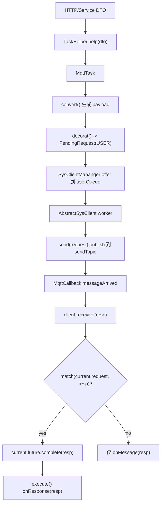
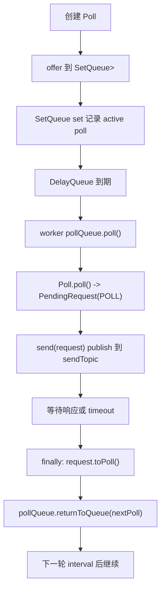

# MQTT 部分设计

本文档描述当前 `mqtt` 模块的实际代码设计，核心类包括：

- `AbstractSysClient`
- `SysClientMananger`
- `MqttClient`
- `MqttCallback`
- `PendingRequest`
- `Poll`
- `SetQueue`
- `MqttTask`

## 总体目标

MQTT 客户端负责把上层业务指令转换为底层 MQTT payload，发送到网关，并把网关响应匹配回当前请求。

系统同时支持两类任务：

- `USER`：用户主动发起的同步请求，进入 `userQueue`。
- `POLL`：系统后台轮询请求，进入 `pollQueue`。

每个网关对应一个 `AbstractSysClient` 实例。客户端内部只有一个 worker 线程，因此同一网关下的请求天然串行执行。

## 核心组件职责

### AbstractSysClient

`AbstractSysClient<REQ extends Task>` 继承 Paho 的 `MqttClient`，是网关客户端的调度基类。

它维护两个队列：

```java
private final BlockingQueue<PendingRequest<REQ>> userQueue = new LinkedBlockingQueue<>();
private final SetQueue<Poll<REQ>> pollQueue = new SetQueue<>(ConcurrentHashMap.newKeySet(), new DelayQueue<>());
```

其中：

- `userQueue` 保存用户主动请求。
- `pollQueue` 保存后台轮询任务。
- `current` 保存当前正在执行的 `PendingRequest`。
- `worker` 是单线程调度器，负责不断从队列取任务并执行。

调度顺序在 `next()` 中定义：

```java
PendingRequest<REQ> userReq = userQueue.poll();
if (userReq != null){
    return userReq;
}

Poll<REQ> poll = pollQueue.poll();
if (poll != null){
    return poll.poll();
}
```

因此 `userQueue` 优先级高于 `pollQueue`。只要存在用户请求，worker 会优先处理用户请求；只有用户请求为空时，才处理轮询请求。

### PendingRequest

`PendingRequest<REQ>` 表示一次正在执行或等待执行的请求。

它包含：

- `request`：实际请求任务。
- `type`：`USER` 或 `POLL`。
- `timeout`：等待响应的超时时间。
- `interval`：仅用于 `POLL`，表示轮询间隔。
- `future`：请求完成信号。

`AbstractSysClient.execute()` 会发送请求，然后等待：

```java
Object result = request.getFuture().get(request.getTimeout(), TimeUnit.MILLISECONDS);
```

响应到达时，`recevive()` 会尝试匹配当前请求；匹配成功后完成 `future`。

### Poll

`Poll<REQ>` 表示一个轮询任务。

它实现 `Delayed`，因此可以被 `DelayQueue` 按时间调度。`Poll.poll()` 会把轮询任务转换成一次 `PendingRequest.Type.POLL` 请求：

```java
return new PendingRequest<>(
        this.request, PendingRequest.Type.POLL, timeout, interval
);
```

轮询请求执行完成后，`AbstractSysClient.execute()` 的 `finally` 会调用：

```java
pollQueue.returnToQueue(request.toPoll());
```

这意味着轮询不是固定时间无脑发送，而是：

1. 到达轮询时间。
2. worker 取出 `Poll`。
3. 转换为 `PendingRequest.Type.POLL`。
4. 发送 MQTT 请求。
5. 等待响应或 timeout。
6. 请求结束后重新生成 `Poll` 并按 interval 回填队列。

所以下一轮轮询的时间点是“本轮结束后 + interval”。

### SetQueue

`SetQueue<E>` 是队列和 set 的组合。

在 MQTT 轮询中实际使用的是：

```java
SetQueue<Poll<REQ>>
```

它的语义是：

- `queue` 负责实际调度。
- `set` 负责记录当前活跃的轮询任务。
- `poll()` 只从 queue 取出元素，不从 set 移除。
- `remove()` 才从 queue 和 set 中释放任务。
- `returnToQueue()` 只能把仍然 active 的任务放回 queue。

这样设计的目的是防止同一设备重复开启轮询。即使某个 `Poll` 被 worker 取出执行，它仍然保留在 set 中，因此重复提交同一设备的轮询任务会被拒绝。

`Poll.equals()` 依赖内部 `request.equals()`。当前 `MqttTask.equals()` 基于：

- `gatewayId`
- `type`
- `deviceId`

因此同一网关、同一设备类型、同一设备 id 会被认为是同一个轮询任务。

## MqttTask

`MqttTask` 是 MQTT 模块的具体任务类型，继承 `Task`。

它额外包含：

- `commandLine`
- `args`
- `DeviceType type`
- `deviceId`

上层 DTO 通过：

```java
MqttTask.fromDto(gatewayId, dto)
```

转换为 `MqttTask`。其中 `gatewayId` 来自外部上下文或 `TaskHelper`，不放在 DTO 内。

发送前需要调用：

```java
userTask.convert();
```

`convert()` 会根据 `CommandLine` 的命令模板和参数生成底层 payload，并按命令配置追加校验位。

用户请求可以通过：

```java
userTask.decorat()
```

包装成：

```java
PendingRequest<MqttTask>
```

其类型为 `PendingRequest.Type.USER`。

## MqttClient

`MqttClient` 是 MQTT 协议下的具体实现：

```java
public class MqttClient extends AbstractSysClient<MqttTask>
```

它负责：

- 保存 `sendTopic`
- 保存 `acceptTopic`
- 保存 `version`
- 把 `MqttTask.payload` publish 到 `sendTopic`
- 根据 seq 规则匹配请求和响应

发送逻辑：

```java
publish(sendTopic, new MqttMessage(mqttTask.getPayload()));
```

匹配逻辑：

```java
String reqSeq = reqGenerator.generate(mqttTask.getPayload());
String respSeq = respGenerator.generate(resp.getPayload());
return Objects.equals(reqSeq, respSeq);
```

匹配规则来自 `SeqGeneratorManager`。当前请求和响应分别使用 `CommandLine` 中配置的：

- `reqSeq`
- `respSeq`

如果 seq 规则缺失、payload 长度不够、命令为空或解析异常，则匹配失败。

## MqttCallback

`MqttCallback` 实现 Paho 的 `MqttCallbackExtended`。

### connectComplete

连接完成后订阅客户端的 `acceptTopic`：

```java
client.subscribe(client.acceptTopic);
```

订阅失败时会指数退避重试，最多 5 次。超过次数后调用：

```java
SysClientMananger.remove(client);
```

移除当前客户端，后续交由 Manager 的 watchdog 重新拉起。

### connectionLost

连接丢失后不会阻塞 MQTT 回调线程，而是异步执行重连：

```java
CompletableFuture.runAsync(this::reconnectWithBackoff);
```

重连最多 5 次，失败后从 `SysClientMananger` 移除当前 client。

### messageArrived

消息到达时，将 MQTT payload 包装为普通 `Task`，然后交给当前 client：

```java
client.recevive(new Task(client.gatewayId, mqttMessage.getPayload()));
```

注意：`onMessage()` 只表示消息到达，不表示消息一定匹配当前请求。真正完成请求的是 `AbstractSysClient.recevive()` 中的：

```java
if (pending != null && match(pending.getRequest(), resp)){
    pending.getFuture().complete(resp);
}
```

## SysClientMananger

`SysClientMananger` 是客户端注册和同步发送入口。

当前客户端表：

```java
private final static Map<String, AbstractSysClient<? extends Task>> clients = new ConcurrentHashMap<>();
```

其中 key 是 `gatewayId`。

### 注册和移除

客户端创建后应调用：

```java
SysClientMananger.register(client);
```

连接失败、订阅失败或重连失败时，回调会调用：

```java
SysClientMananger.remove(client);
```

### 同步发送

同步发送入口：

```java
public Object syncSend(MqttTask.Dto dto)
```

流程：

1. 通过 `TaskHelper` 把 DTO 转为 `MqttTask`。
2. 根据 `gatewayId` 从 `clients` 中查找 client。
3. 将 `MqttTask` 转换为底层 payload。
4. 调用 `decorat()` 生成 `PendingRequest.Type.USER`。
5. offer 到 client 的 `userQueue`。
6. 等待 `PendingRequest.future` 完成。

代码中当前存在一次强制转换：

```java
var client = (AbstractSysClient<MqttTask>) clients.get(userTask.getGatewayId());
```

这是因为 `clients` 的 value 类型是 `AbstractSysClient<? extends Task>`。该类型只能安全读取为某种 `Task`，不能直接写入 `PendingRequest<MqttTask>`。当前业务实际使用 MQTT client，因此这里通过强转恢复为 `AbstractSysClient<MqttTask>`。

如果后续只管理 MQTT 客户端，可以把 map 收紧为：

```java
Map<String, AbstractSysClient<MqttTask>>
```

或：

```java
Map<String, MqttClient>
```

这样可以移除 unchecked cast。

## 请求执行链路

### USER 请求



### POLL 请求



## 串行性和优先级

同一个 `AbstractSysClient` 只有一个 worker 线程，因此同一网关内发送是串行的。

优先级规则：

1. 先检查 `userQueue`。
2. 没有用户请求时才检查 `pollQueue`。

所以当用户请求和轮询请求同时存在时，用户请求优先执行。

但注意：一旦某个请求已经开始执行，worker 会等待该请求响应或 timeout。正在执行的 poll 不会被新的 user 请求中断；user 请求会在当前请求结束后优先于下一轮 poll 执行。

## 当前限制和注意事项

- `recevive` 方法名存在拼写问题，但当前代码按此名称调用。
- `SysClientMananger` 当前 `clients` 使用 `? extends Task`，同步发送 MQTT 请求时需要强转。
- `watchdog()` 只有设计注释，尚未真正实现。
- `MqttClient.onMessage/onResponse/onTimeout/onError` 当前为空，具体业务处理还未落地。
- `Poll` 的重复判断依赖 `MqttTask.equals()`，当前是同网关、同设备类型、同设备 id 去重。
- `SetQueue.poll()` 不释放 active set；取消轮询必须调用 `remove(Poll)`。
