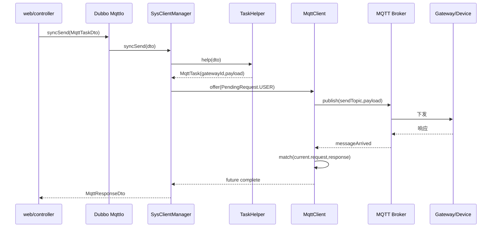

# MQTT 部分设计

本文档描述 `mqtt` 模块当前代码现状。它不是单纯的 MQTT client 封装，而是承担了网关运行时管理、用户指令发送、后台轮询、响应匹配、设备状态解析、状态缓存和消息落库等职责。

## 模块目标

`mqtt` 模块面向 RS485 网关和设备协议，核心目标是：

- 为每个 RS485 网关维护一个真实 MQTT client。
- 将上层 `MqttTaskDto` 转换为底层设备协议 payload。
- 保证同一网关下 MQTT 请求串行发送。
- 支持用户主动请求和系统后台轮询两类任务。
- 防止同一设备重复注册轮询任务。
- 收到设备响应后完成当前请求的 future，并异步解析、缓存和持久化设备状态。
- 通过 Dubbo 暴露 `MqttIo`、`MqttPollCo` 等服务契约。

## 关键类

```text
mqtt
├── client
│   ├── AbstractSysClient.java
│   ├── ClientsRuntime.java
│   ├── SysClientManager.java
│   ├── SysPollingManager.java
│   ├── common
│   │   ├── PendingRequest.java
│   │   └── Poll.java
│   ├── event
│   │   ├── GatewayClientReadyEvent.java
│   │   └── GatewayClientsInitialRebuildCompletedEvent.java
│   ├── itfc
│   │   ├── DeviceHelper.java
│   │   ├── GatewayHelper.java
│   │   └── TaskHelper.java
│   ├── message_handler
│   │   ├── MessageHandler.java
│   │   ├── MessageHandlerManager.java
│   │   ├── MessagePersistent.java
│   │   └── handlers/*.java
│   └── mqtt
│       ├── MqttCallback.java
│       ├── MqttClient.java
│       └── MqttTask.java
└── config
    └── MqttOptions.java
```

## 运行时分层

### Dubbo 服务层

`SysClientManager` 标注为 `@DubboService`，实现：

- `MqttIo`：用户同步/异步发送 MQTT 指令。
- `MqttGatewayCRUD`：预留网关 client 管理能力。

`SysPollingManager` 标注为 `@DubboService`，实现：

- `MqttPollCo`：启停设备轮询。

这意味着 `web` 等模块不直接依赖 Paho MQTT client，而是通过 `api` 模块中的 Dubbo 契约调用 `mqtt` 模块。

### 网关运行时层

`ClientsRuntime` 是进程内网关 client 注册表：

```java
Map<String, AbstractSysClient<? extends Task>>
```

key 是 `gatewayId`，value 是对应网关的运行时 client。它只负责内存态注册、移除、查询和快照，不直接创建 client。

`SysClientManager` 的 watchdog 根据 `GatewayHelper.listAll()` 读取数据库中的 RS485 网关列表，然后用 `ClientsRuntime.clientIds()` 对比当前运行时状态：

- 数据库有、运行时没有：创建 `MqttClient`、设置 `MqttCallback`、连接 broker、注册到 `ClientsRuntime`。
- 运行时有、数据库没有：从 `ClientsRuntime` 移除并关闭 client。
- topic 或 MQTT url 缺失：跳过并记录 warn。

首次重建成功后会发布：

```java
GatewayClientsInitialRebuildCompletedEvent
```

单个网关 client 创建成功后会发布：

```java
GatewayClientReadyEvent
```

这些事件用于驱动轮询管理器同步轮询任务。

### 单网关串行调度层

`AbstractSysClient<REQ extends Task>` 继承 Paho 的 `MqttClient`，是单个网关 client 的调度基类。它内部有一个 daemon worker 线程：

```java
private final BlockingQueue<PendingRequest<REQ>> userQueue;
private final SetQueue<Poll<REQ>> pollQueue;
private volatile PendingRequest<REQ> current;
```

调度优先级固定为：

1. 优先从 `userQueue` 取用户请求。
2. 用户请求为空时，从 `pollQueue` 取到期轮询任务。
3. 两者都没有时短暂 sleep。

因此同一网关下不会并发 publish，多请求会被单 worker 串行化。这个设计对于 RS485 下位机链路尤其重要，因为很多设备协议天然不适合并发请求。

## 请求模型

### MqttTaskDto

`api` 模块中的 `MqttTaskDto` 是远程调用入参，包含：

- `commandLine`：设备指令枚举。
- `args`：指令模板参数。
- `type`：设备类型。
- `deviceId`：设备 id。

它不直接携带 `gatewayId`，因为网关归属应由设备数据决定。

### TaskHelper

`TaskHelper` 根据 `deviceId` 查询设备，补齐：

- `gatewayId`
- 设备地址
- 自编号等协议参数

然后构造 `MqttTask`。这样上层只需要知道“对哪个设备执行什么指令”，不需要关心该设备挂在哪个网关、地址是多少。

### MqttTask

`MqttTask` 继承 `Task`，在通用 `gatewayId + payload` 基础上增加：

- `CommandLine commandLine`
- `int[] args`
- `DeviceType type`
- `String deviceId`

`MqttTask.fromDto(gatewayId, dto)` 会调用 `convert()`。转换过程是：

1. 将 `args` 格式化为两位十六进制字符串。
2. 用 `MessageFormat` 填充 `CommandLine` 中的命令模板。
3. 将命令字符串转换为 byte payload。
4. 根据 `CheckType` 追加校验：
   - `CRC16`
   - `SIGN_SUM`
   - `UNSIGN_SUM`

`MqttTask.equals()` 和 `hashCode()` 基于：

- `gatewayId`
- `type`
- `deviceId`
- `commandLine`

这使它可以作为轮询去重的核心标识。

## PendingRequest 与 Poll

### PendingRequest

`PendingRequest<REQ>` 表示一次待执行或正在执行的请求，包含：

- `request`
- `type`：`USER` 或 `POLL`
- `timeout`
- `interval`
- `future`

`USER` 请求由 `MqttTask.decorate()` 创建。`POLL` 请求由 `Poll.poll()` 创建。

执行时，`AbstractSysClient.execute()` 会：

1. 将请求设为 `current`。
2. 调用 `send(request)`。
3. 阻塞等待 `future.get(timeout)`。
4. 收到匹配响应后完成 future。
5. 超时或异常时完成异常。
6. 如果是轮询请求，在 finally 中重新回填到 `pollQueue`。

### Poll

`Poll<REQ>` 实现 `Delayed`，用于 `DelayQueue` 定时调度。它保存：

- 轮询任务本体。
- 轮询间隔。
- 下一次执行时间。
- 单次响应超时时间。

轮询不是固定时间盲发，而是：

1. 到达 `nextTime`。
2. worker 从 `DelayQueue` 取出 `Poll`。
3. 转为 `PendingRequest.Type.POLL`。
4. 发送请求并等待响应或超时。
5. 执行结束后 `refresh()`，按 `interval` 计算下一次执行时间。
6. 如果轮询仍然 active，则回填队列。

## SetQueue 轮询语义

`pollQueue` 的类型是：

```java
SetQueue<Poll<MqttTask>>
```

它由两部分组成：

- `queue`：真实调度队列，这里是 `DelayQueue`。
- `set`：活跃轮询集合，用来记录当前正在工作的轮询任务。

关键语义：

- `offer()` 同时写入 set 和 queue，set 已存在时拒绝重复 offer。
- `poll()` 只从 queue 取出元素，不从 set 移除。
- `returnToQueue()` 只有在 set 仍然包含该元素时才回填 queue。
- `remove()` 同时移除 queue 和 set，表示彻底停止轮询。
- `activeSnapshot()` 返回 set 快照，用于外部感知当前 active 轮询任务。

这正好贴合当前业务语义：set 不是“队列里还有哪些元素”，而是“系统认为哪些轮询任务正在工作”。即使某个 `Poll` 已经被 worker 取出执行，它仍在 set 中，所以同一设备不会在执行窗口内被重复注册。

## 用户请求链路



`MqttClient.match()` 使用 `CommandLine` 中的 `reqSeq` 和 `respSeq`，通过 `SeqGeneratorManager` 计算请求和响应序列。如果序列一致，就认为响应属于当前请求。

## 轮询链路

轮询由 `SysPollingManager` 管理，分为两条路径。

### 手动启停

`enable(deviceId)`：

1. 读取设备。
2. 将设备 `polling` 状态更新为 true。
3. 根据设备类型构造 `Poll<MqttTask>`。
4. 如果 gateway client 已就绪，则 `client.offer(poll)`。
5. 如果 client 未就绪，只保留数据库状态，等待事件或 watchdog 后续同步。

`disable(deviceId)`：

1. 读取设备。
2. 将设备 `polling` 状态更新为 false。
3. 构造同一个语义的 `Poll<MqttTask>`。
4. 如果 client 存在，则 `client.remove(poll)`。

### 事件驱动同步

`SysPollingManager` 监听：

- `GatewayClientsInitialRebuildCompletedEvent`
- `GatewayClientReadyEvent`

当网关 client 首次重建完成或单个 client 就绪时，轮询管理器会读取所有 `polling=true` 的设备，按 `gatewayId` 分组，然后和各 client 的 `pollSnapshot()` 对比，只对缺失的 poll 执行 offer。

这避免了“首次 watchdog 还没创建 client，轮询注册失败”的问题。

### Watchdog 兜底

事件驱动之外，`SysPollingManager` 还有自己的 watchdog。它不维护独立的 gateway flag，而是依赖：

```java
SysClientManager.clientIds()
```

周期性检查当前已经存在的 client，然后同步这些 client 应该拥有的轮询任务。这个 watchdog 是兜底机制，用来修复事件丢失、手动变更、运行时短暂不一致等情况。

## MQTT 回调与消息处理

`MqttCallback` 实现 Paho 的 `MqttCallbackExtended`。

### connectComplete

连接完成后订阅当前 client 的 `acceptTopic`。订阅失败会指数退避重试，最多 5 次。失败后移除当前 client，后续交给 `SysClientManager` watchdog 重建。

### connectionLost

连接丢失后异步重连。重连期间使用 `AtomicBoolean reconnecting` 防止重复重连任务。超过重试次数后移除 client，让 watchdog 重新拉起。

### messageArrived

收到 MQTT 消息后执行两件事：

1. 调用 `client.receive(new Task(client.gatewayId, payload))`，尝试匹配当前请求并完成 future。
2. 根据当前请求的 `CheckType` 校验响应，通过后异步调用 `MessageHandlerManager.persist(task, payload)`。

这里要注意：消息到达不等于请求一定匹配。匹配逻辑仍然在 `AbstractSysClient.receive()` 中完成。

## 设备状态解析、缓存和落库

消息处理由 `MessageHandler<R extends BaseRecord>` 抽象：

```java
protected abstract R decode(byte[] payload);
public void persist(String deviceId, byte[] payload)
```

处理流程：

1. 对应设备 handler 解码 payload 为 record。
2. 设置 `deviceId`。
3. 调用 `onChange(record)`，目前用于日志提示，后续可以演进为前端推送。
4. 使用 `ObjectMapUtil.toStringMap(record)` 转为字段级 map。
5. 写入 Redis hash，并设置短 TTL，给规则表达式提供字段级读取能力。
6. 通过 `MessagePersistent` 落库。

当前支持的 handler：

- `AccessMessageHandler`
- `AirConditionMessageHandler`
- `CircuitBreakMessageHandler`
- `LightMessageHandler`
- `SensorMessageHandler`

`MessagePersistent<R>` 继承 MyBatis-Plus `BaseMapper<R>`，默认 `persist()` 调用 `insert(record)`。这样 record 主键生成由 MyBatis-Plus 和项目级 `IdentifierGenerator` 负责，不在 XML 中手写 id。

## 配置

`MqttOptions` 使用前缀：

```yaml
mqtt:
  connect:
    url: tcp://localhost:1883
    username:
    password:
    qos: at_least_once
  poll:
    interval-millis: 2000
    timeout-millis: 5000
    watchdog-interval-millis: 60000
  gateway:
    watchdog-interval-millis: 60000
```

配置被拆成三组：

- `connect`：broker 地址、账号密码、QoS。
- `poll`：轮询间隔、轮询请求超时、轮询 watchdog 周期。
- `gateway`：网关 client watchdog 周期。

## 测试与 mock

`mqtt` 模块测试分三类：

- `MqttTaskTest`：验证命令模板到 payload 的转换。
- `MqttClientMatchTests`：验证请求和响应序列匹配逻辑。
- `DeviceProtocolContractTests`：验证 `MqttTask.convert -> mock response -> MessageHandler.decode` 的端到端协议契约。
- `MqttClientSendIntegrationTests`：依赖真实 broker 和真实 client 的发送链路集成测试。
- `UidGeneratorDataSourceIsolationTests`：验证 uid-generator 主键生成和数据源隔离。

`tools/mqtt-mock` 是 Node.js + TypeScript 设备 mock。它订阅类似：

```text
test/accept/*
```

并根据 `*` 中的网关 id 回复到：

```text
test/send/*
```

mock 按指令 payload 识别设备类型，生成符合 Java handler decode 逻辑的响应 payload。

## 当前设计边界

当前 MQTT 模块已经形成了比较清晰的边界：

- Dubbo 入参和返回值放在 `api`。
- 设备、网关、命令、校验、字节工具放在 `common`。
- MQTT client runtime、轮询、消息处理和 mapper 放在 `mqtt`。
- Redis 能力放在独立 `redis` 模块。
- 设备 mock 放在 `tools/mqtt-mock`。

仍可继续演进的方向：

- 将 `Poll.of(Device, TaskHelper)` 中的设备类型分发抽到更显式的策略表。
- 将 `MessageHandlerManager` 从静态注册进一步改成 Spring bean map。
- 将 `onChange()` 从日志扩展为 WebSocket、Redis Pub/Sub 或领域事件。
- 将 `MqttClient.onMessage/onResponse/onTimeout/onError` 补齐可观测日志和指标。
- 对 `MqttCallback.messageArrived()` 中 `client.current()` 的空值和并发窗口做更防御式处理。
