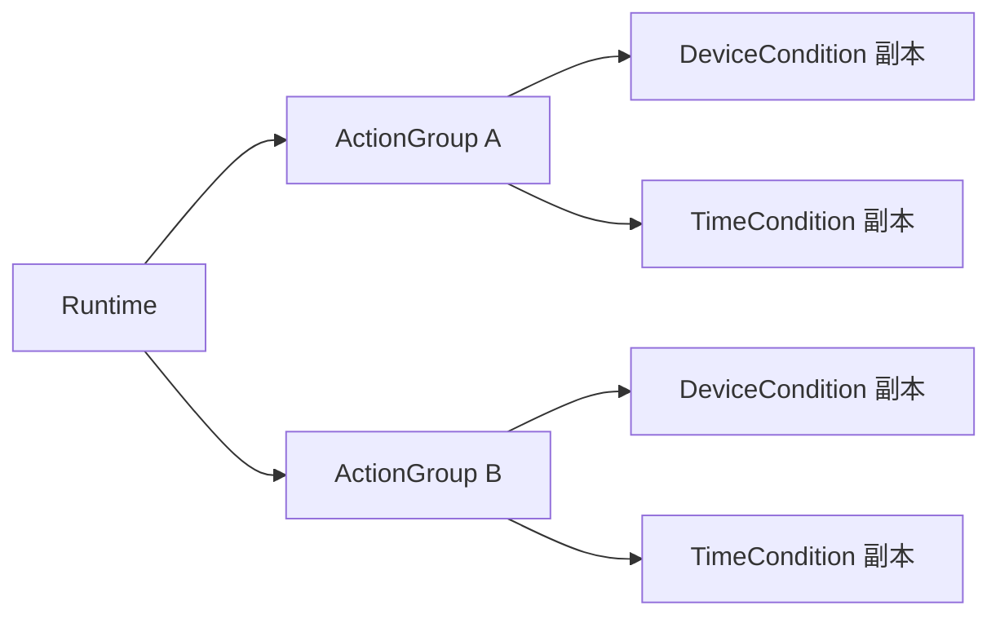
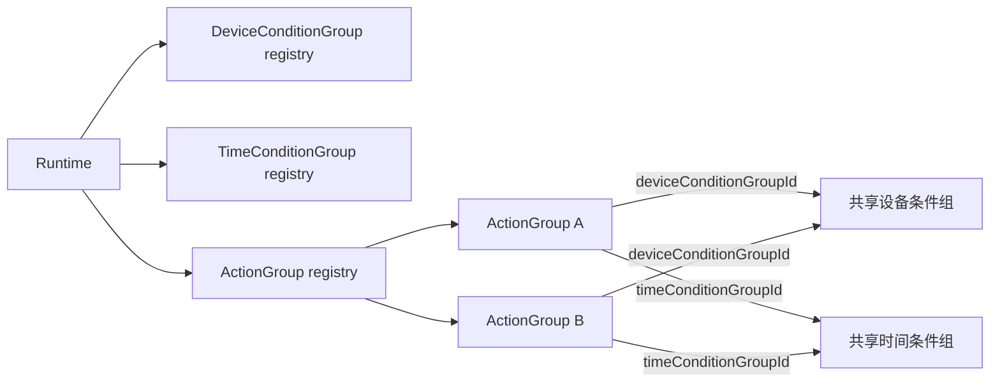
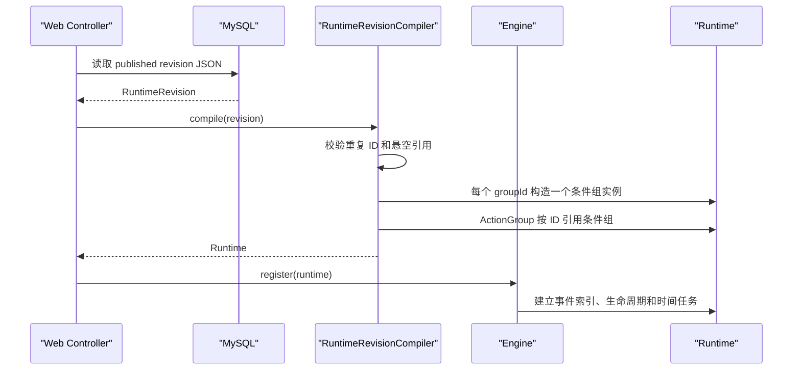
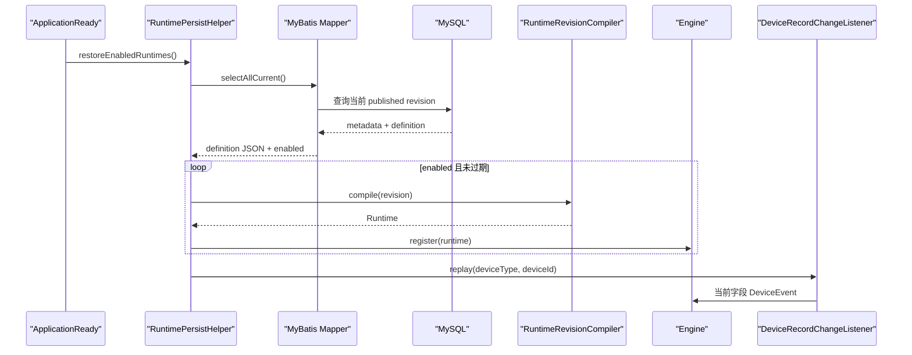
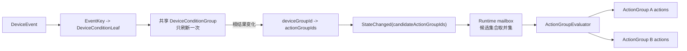
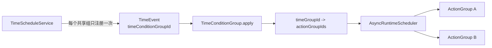

# Runtime 持久化与 Web 配置

本项目采用 **MySQL metadata + JSON revision**。MySQL 元数据负责列表查询、状态和生命周期索引；JSON revision 保存一次完整、不可变的规则配置。

## 为什么条件组必须独立

旧模型把设备条件树和时间条件直接放在 ActionGroup 内：



这种结构对代码构造方便，但不适合 Web 表单：相同条件会被复制，编辑时容易产生多个不一致版本，运行时也会重复索引和调度。

当前模型把条件组提升为 Runtime 内可复用对象，ActionGroup 只保存引用：



亮点：

- 前端可以独立创建、编辑和选择条件组。
- 一个条件组只编译、索引和调度一次。
- 条件根结果变化后，通过反向引用找到所有关联 ActionGroup。
- TimePoint 发生一次，可以扇出触发所有引用该时间组的 ActionGroup。

## Revision JSON

`RuntimeRevision` 是 Web DTO 与引擎运行对象之间的边界。建议 JSON 结构如下：

```json
{
  "runtimeId": "runtime-lab-101",
  "enabled": true,
  "activeFrom": "2026-07-01T00:00:00Z",
  "activeUntil": "2026-12-31T16:00:00Z",
  "deviceConditionGroups": [
    {
      "groupId": "room-too-hot",
      "conditions": [
        {
          "conditionId": "temperature-over-26",
          "deviceType": "AirCondition",
          "deviceId": "ac-1",
          "field": "roomTemperature",
          "operator": "GT",
          "value": "26",
          "logicToPrevious": "AND"
        }
      ]
    }
  ],
  "timeConditionGroups": [
    {
      "groupId": "weekday-office-hours",
      "conditions": [
        {
          "conditionId": "office-window",
          "type": "WINDOW",
          "startDate": "2026-07-01",
          "endDate": "2026-12-31",
          "weekdays": ["MONDAY", "TUESDAY", "WEDNESDAY", "THURSDAY", "FRIDAY"],
          "zoneId": "Asia/Shanghai",
          "startTime": "08:30:00",
          "endTime": "18:00:00",
          "timePoint": null
        }
      ]
    }
  ],
  "actionGroups": [
    {
      "actionGroupId": "notify-user",
      "deviceConditionGroupId": "room-too-hot",
      "timeConditionGroupId": "weekday-office-hours",
      "actions": [
        {
          "type": "Report",
          "control": null,
          "userIds": ["user-1"],
          "reportTypes": ["SMTP"],
          "content": "实验室温度过高"
        }
      ]
    },
    {
      "actionGroupId": "control-air-condition",
      "deviceConditionGroupId": "room-too-hot",
      "timeConditionGroupId": "weekday-office-hours",
      "actions": []
    }
  ]
}
```

这里两个 ActionGroup 复用了同一组设备条件和时间条件。JSON 中不嵌套复制条件组。

## 编译与注册



`RuntimeRevisionCompiler` 承担：

- 校验 Runtime 生命周期。
- 校验设备/时间条件组 ID 唯一。
- 校验 ActionGroup ID 唯一。
- 拒绝不存在的条件组引用。
- 将设备条件列表编译成严格左结合的 `EvalTreeNode`。
- 将时间 DTO 编译成窗口或 TimePoint。
- 将动作 DTO 编译成 `ControlAction` 或 `ReportAction`。
- 保证同一个条件组对象被所有引用它的 ActionGroup 共享。

`enabled` 控制整个 Runtime 是否进入 Engine：

- `enabled=true`：当前 revision 会被编译并注册。
- `enabled=false`：revision 仍然持久化，但对应 Runtime 会从 Engine 注销。
- `enable/disable` 不修改旧 JSON，而是复制当前定义并追加一版新 revision。
- 旧 JSON 没有 `enabled` 字段时按 `true` 兼容读取。

## 数据表

`rule_runtime` 保存可检索元数据：

- `id` 继承 `BaseEntity`，由 uid-springboot-starter 生成分布式主键。
- `runtime_id` 是 Engine 和 Web API 使用的稳定业务标识，并建立唯一索引。
- 规则名称、所有者和发布状态。
- 当前发布版本号。
- 当前 revision 的 `enabled` 镜像，便于启动查询和后台列表过滤。
- `active_from/active_until`，用于启动恢复和后台扫描。

`rule_runtime_revision` 保存不可变版本：

- 每个 revision 同样继承 `BaseEntity`，使用独立分布式主键。
- `(runtime_id, revision_no)` 唯一。
- `definition` 保存完整 JSON。
- `schema_version` 用于未来 JSON 迁移。
- `checksum` 用于审计和幂等发布。

发布建议放在一个数据库事务内：

1. 锁定 `rule_runtime` 当前行。
2. 分配下一个 `revision_no`。
3. 插入新的 `rule_runtime_revision`，历史 revision 不更新。
4. 更新 `rule_runtime.published_revision_no`、生命周期和状态。
5. 事务提交后发布 RuntimeReload 消息；rule-engine 加载 revision、编译并原子替换旧 Runtime。

当前仓库已经落地 `RuntimePersistHelper`：

- `RuleRuntimeMapper`：通过 MyBatis-Plus `BaseMapper` 写入 metadata，并提供行锁、发布指针更新和软删除 SQL。
- `RuleRuntimeRevisionMapper`：通过 MyBatis-Plus `BaseMapper` 追加不可变 revision，并联表读取当前发布版本。
- `register(revision)`：写入 metadata 和第 1 版 revision。
- `update(runtimeId, revision)`：在行锁下追加版本并切换当前版本。
- `enable/disable(runtimeId)`：追加仅改变 enabled 的新版本，并同步 Engine。
- `remove(runtimeId)`：软删除 metadata、保留 revision 审计记录并注销 Runtime。
- `fetch()`：读取每个 Runtime 的当前发布 revision。
- ApplicationReady 时自动恢复 enabled 且未过期的 Runtime。

Web Controller 和跨服务发布契约仍需在后续接入。

## 服务重启恢复



恢复失败采用单 Runtime 隔离：某条 JSON 损坏或编译失败时记录错误并跳过，不阻止其他规则恢复。

## 运行时扇出



时间条件对应链路：



状态事件可合并，但合并时必须保留候选 ActionGroup ID 的并集；TimePoint 仍按 `occurrenceId` 去重并进入 FIFO，不能被状态合并吞掉。

Runtime 历史结构迁移已合并进 `sql/schema.sql`。部署入口统一使用
`scripts/deploy.sh`：主结构创建完成后，仅继续执行脚本中
`DATABASE_MIGRATIONS` 白名单列出的、仍需兼容已有数据卷的可重复迁移。
