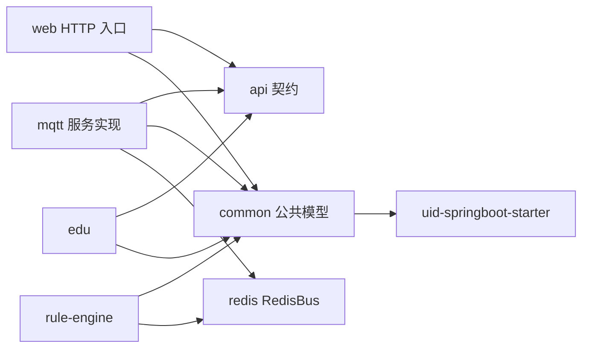
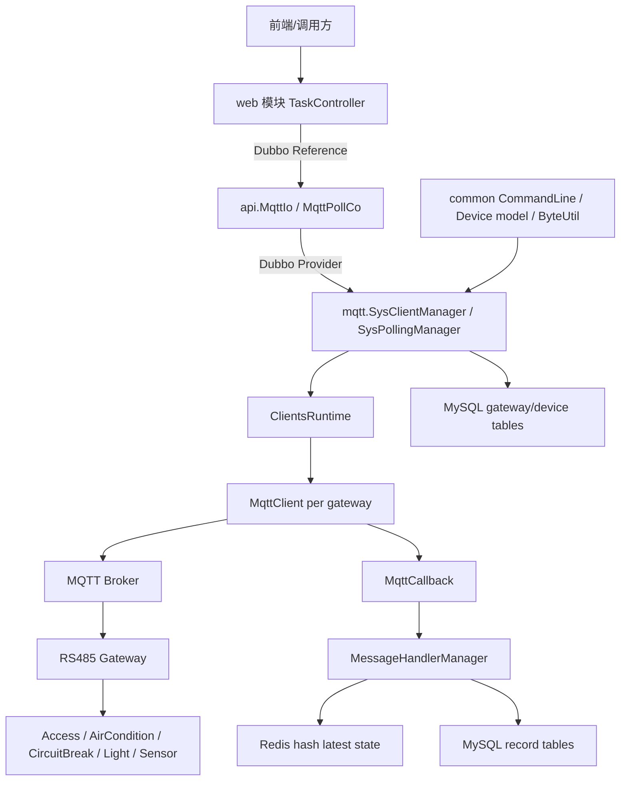

# 项目整体架构设计

本文档从项目整体角度描述 `lab-system-cloud` 当前架构。它基于当前代码现状，而不是理想化最终版。

## 项目定位

`lab-system-cloud` 是一个面向实验室设备综合管理的后端工程。当前重点能力包括：

- 管理网关和设备基础数据。
- 通过 MQTT 与 RS485 网关及下位设备通信。
- 支持用户主动控制和后台轮询。
- 解析设备响应，形成设备状态记录。
- 将最新状态写入 Redis，给规则表达式和进程间通信提供字段级数据。
- 将历史状态落入业务数据库。
- 通过 Dubbo 在模块之间暴露服务契约。

## 模块视图

```text
lab-system-cloud
├── api                      # Dubbo 接口契约和 DTO
├── common                   # 公共模型、协议命令、校验、工具、MyBatis-Plus 配置
├── mqtt                     # MQTT 网关 client、轮询、消息处理、设备/网关访问
├── redis                    # Jedis 自动配置、RedisBus、Pub/Sub 和 hash 能力
├── web                      # HTTP 入口，调用 api 契约
├── uid-springboot-starter   # 本地 uid-generator starter
├── edu                      # 教学业务模块，占位/待扩展
├── rule-engine              # 规则引擎模块，占位/待扩展
├── tools/mqtt-mock          # Node.js + TypeScript 设备模拟器
├── sql                      # MySQL schema
└── docs                     # 设计文档和设备协议文档
```

## 技术栈

- Java 17
- Spring Boot 3.5.12
- Apache Dubbo 3.3.6
- Nacos，作为 Dubbo 注册中心和配置中心
- MyBatis / MyBatis-Plus
- MySQL，作为业务库
- H2，作为部分单元测试数据库
- Baidu uid-generator，作为全局 id 生成方案
- Eclipse Paho MQTT Client
- Jedis，作为 Redis client
- Node.js + TypeScript，作为 MQTT 设备 mock 工具

## 依赖方向

当前推荐依赖方向是：



设计原则：

- `api` 只放分布式接口契约和入参/出参 DTO。
- `common` 放跨模块稳定共享的模型、协议、工具和基础配置。
- 服务实现模块依赖 `api`，不要让 `api` 反向依赖服务实现。
- Redis 能力独立成模块，方便 `mqtt`、规则引擎和其他服务复用。
- `web` 作为 HTTP 门面，通过 Dubbo 契约访问后端服务，不直接操作 MQTT client。

## 运行时组件视图



## 核心业务链路

### 用户主动发送

用户主动发送是同步控制或查询设备的链路：

1. `web` 接收 HTTP 请求，组装 `MqttTaskDto`。
2. `web` 通过 Dubbo 调用 `MqttIo.syncSend()` 或 `asyncSend()`。
3. `mqtt` 模块的 `SysClientManager` 使用 `TaskHelper` 查询设备并补齐网关和协议参数。
4. `MqttTask.convert()` 根据 `CommandLine` 生成底层 payload。
5. 请求被包装为 `PendingRequest.Type.USER`，进入对应网关 client 的 `userQueue`。
6. `AbstractSysClient` worker 串行发送。
7. `MqttCallback` 收到响应，`MqttClient.match()` 通过 seq 规则匹配当前请求。
8. future 完成，返回 `MqttResponseDto`。
9. 响应 payload 通过 `MessageHandler` 异步解析、写 Redis、落库。

### 后台轮询

后台轮询是系统主动请求设备状态的链路：

1. `MqttPollCo.enable(deviceId)` 将设备 `polling` 状态置为 true。
2. `SysPollingManager` 根据设备类型创建 `Poll<MqttTask>`。
3. 如果网关 client 已存在，将 poll 注册到该 client 的 `pollQueue`。
4. 如果网关 client 尚未就绪，只保留数据库状态。
5. 当 `SysClientManager` 完成初始网关重建或单个 client ready 时发布事件。
6. `SysPollingManager` 监听事件，按 gateway 分组同步缺失 poll。
7. 轮询 watchdog 周期性以 `ClientsRuntime.clientIds()` 为准做兜底同步。
8. `SetQueue<Poll<MqttTask>>` 防止同一设备重复注册轮询。

### 设备响应处理

设备响应处理分为“请求匹配”和“状态处理”两部分：

- 请求匹配：`MqttClient.match()` 判断响应是否属于当前 `PendingRequest`，匹配后完成 future。
- 状态处理：`MessageHandlerManager.persist()` 按设备类型选择 handler，decode 成 record。

状态处理结果有两份落点：

- Redis hash：保存短 TTL 最新状态，用于规则表达式字段级读取。
- MySQL record 表：保存历史记录，用于追溯和展示。

## 数据模型

### 网关

`common` 中的网关模型包括：

- `Gateway`
- `RS485Gateway`
- `SocketGateway`
- `GatewayType`

当前 MQTT 模块主要围绕 `RS485Gateway` 创建 client。网关数据包含 `sendTopic`、`acceptTopic` 等 MQTT 通信信息。

### 设备

`common` 中设备模型包括：

- `Device`
- `Access`
- `AirCondition`
- `CircuitBreak`
- `Light`
- `Sensor`

设备包含 `gatewayId`、设备类型、地址、自编号、轮询状态等信息。不同设备类型有不同协议字段。

### 设备记录

设备状态记录模型包括：

- `AccessRecord`
- `AirConditionRecord`
- `CircuitBreakRecord`
- `LightRecord`
- `SensorRecord`

这些 record 一方面落入 MySQL record 表，另一方面会被转换为 Redis hash 字段，用于表达式读取。

## 协议层设计

设备协议集中在 `common.command`：

- `CommandLine`：枚举所有设备指令，绑定命令模板、校验方式、请求 seq 和响应 seq。
- `Command`：保存命令模板和 `CheckType`。
- `Task`：通用 `gatewayId + payload` 任务模型。
- `checker`：CRC16、有符号和、无符号和校验。
- `seq`：请求响应匹配序列生成。

`mqtt` 模块中的 `MqttTask` 是协议运行时对象。它根据 `CommandLine` 和设备参数生成最终 payload。

这套设计的核心取舍是：协议仍然以 Java 枚举和 handler 代码表达，不强行抽象成 DSL。当前设备协议差异比较明显，尤其是断路器、空调、传感器的响应布局不同，用类型化 handler 更容易保持可读性和调试能力。

## Redis 设计

`redis` 模块封装 `RedisBus`，提供：

- 普通 key/value。
- Pub/Sub。
- hash field 级操作。
- `hsetex`，即写 hash 后设置 key 级 TTL。

`mqtt` 的 `MessageHandler` 使用：

```java
jedis.hsetex(RECORD_KEY(deviceType, deviceId), recordMap, Duration.ofSeconds(15));
```

这样规则表达式可以按字段访问设备最新状态，例如读取某个设备的 `temperature`、`isOpen`、`voltage` 等字段。

## 数据库和 ID

业务 schema 位于：

```text
sql/schema.sql
```

项目使用 MyBatis-Plus 处理实体插入。主键策略依赖 `common` 中的 `MybatisPlusConfig` 和本地 `uid-springboot-starter`。

重要边界：

- 业务数据源使用 `spring.datasource`。
- uid-generator 可以使用独立数据源。
- 通过 MyBatis-Plus `BaseMapper.insert()` 插入实体时，主键生成器才会参与。
- 手写 XML insert 且显式写入 `id` 时，不会自动触发 MyBatis-Plus 的主键填充。

因此消息记录持久化使用 `MessagePersistent extends BaseMapper` 的默认 `insert(record)`，避免 XML insert 绕过主键生成能力。

## 配置结构

MQTT 配置由 `MqttOptions` 管理：

```yaml
mqtt:
  connect:
    url: tcp://localhost:1883
    username:
    password:
    qos: at_least_once
  poll:
    interval-millis: 2000
    timeout-millis: 5000
    watchdog-interval-millis: 60000
  gateway:
    watchdog-interval-millis: 60000
```

Redis 配置由 `RedisOptions` 管理，具体前缀以 `redis` 模块配置类为准。

Dubbo/Nacos 配置分布在各服务模块的 `application.yaml` 中。

## 测试策略

当前测试类型包括：

- 校验器测试：验证 CRC、sum 等基础协议校验。
- payload 转换测试：验证 `MqttTask.convert()`。
- match 测试：验证请求响应 seq 匹配。
- 协议契约测试：验证 `MqttTask.convert -> mock response -> MessageHandler.decode`。
- 真实链路集成测试：通过真实 MQTT broker 和 mock/设备验证发送效果。
- 数据源隔离测试：验证 uid-generator 与业务数据源隔离。

其中协议契约测试是当前最适合长期沉淀的测试形态。它不依赖 broker 和数据库，但可以防止 `CommandLine`、mock、handler decode 三者悄悄漂移。

## 本地设备 mock

`tools/mqtt-mock` 是 Node.js + TypeScript 编写的设备模拟器。它的职责是：

- 连接真实 MQTT broker。
- 订阅通配 topic，例如 `test/accept/*`。
- 从 topic 中提取 gatewayId。
- 根据 payload 匹配具体设备指令。
- 构造响应 payload。
- 回复到对应 topic，例如 `test/send/*`。

它是 MQTT 集成测试和本地调试的重要工具，也能帮助验证文档中的设备协议是否和 Java 端一致。

## 当前架构特点

### 优点

- `api` 模块已经把分布式契约抽离出来，Dubbo 化方向清晰。
- `common` 承载协议、模型、工具，复用边界比较明确。
- MQTT 同一网关串行发送，符合 RS485 设备链路特点。
- `SetQueue` 的 active set 语义贴合“防重复轮询”的业务目标。
- 轮询已经从 flag/latch 演进为事件驱动，并用 watchdog 兜底。
- Redis 独立成模块，后续规则引擎和进程间通信可以复用。
- 协议契约测试开始覆盖多设备链路。

### 风险

- `MessageHandlerManager` 和 `SysClientManager` 仍有静态访问点，长期可能影响测试隔离和生命周期控制。
- MQTT 回调线程里读取 `client.current()` 有并发窗口，后续应加强空值保护和上下文捕获。
- 部分协议映射仍散落在 `Poll.of()`、`TaskHelper`、`MessageHandler` 中，新增设备时需要同时修改多个位置。
- `api` 当前仍依赖 `common` 中的 `CommandLine`、`DeviceType`、`Pair`，契约层和内部模型还没有完全解耦。
- `web` 目前较薄，统一异常处理、参数校验和返回格式还可以继续收束。

## 推荐演进路线

1. 稳定协议契约测试。
   每新增或修改一条 `CommandLine`，同步补充 `MqttTask.convert -> mock response -> MessageHandler.decode` 样例。

2. 设备类型注册表化。
   将设备类型到 poll command、handler、record、持久化 mapper 的映射集中成注册表，减少新增设备时的散点修改。

3. 消息处理 Spring 化。
   将 `MessageHandlerManager` 从静态注册迁移为 Spring 注入的 `Map<DeviceType, MessageHandler<?>>`。

4. 状态变更事件化。
   将 `MessageHandler.onChange()` 从日志钩子升级为领域事件，再按需要接 WebSocket、Redis Pub/Sub 或规则引擎。

5. API 契约去内部化。
   中长期可以把 `CommandLine`、`DeviceType`、`Pair<Boolean,String>` 这类内部类型逐步替换为更稳定的 API DTO 和结果模型。

6. 规则引擎接入 RedisBus。
   规则引擎优先读取 Redis hash 最新状态，必要时再查历史库。
