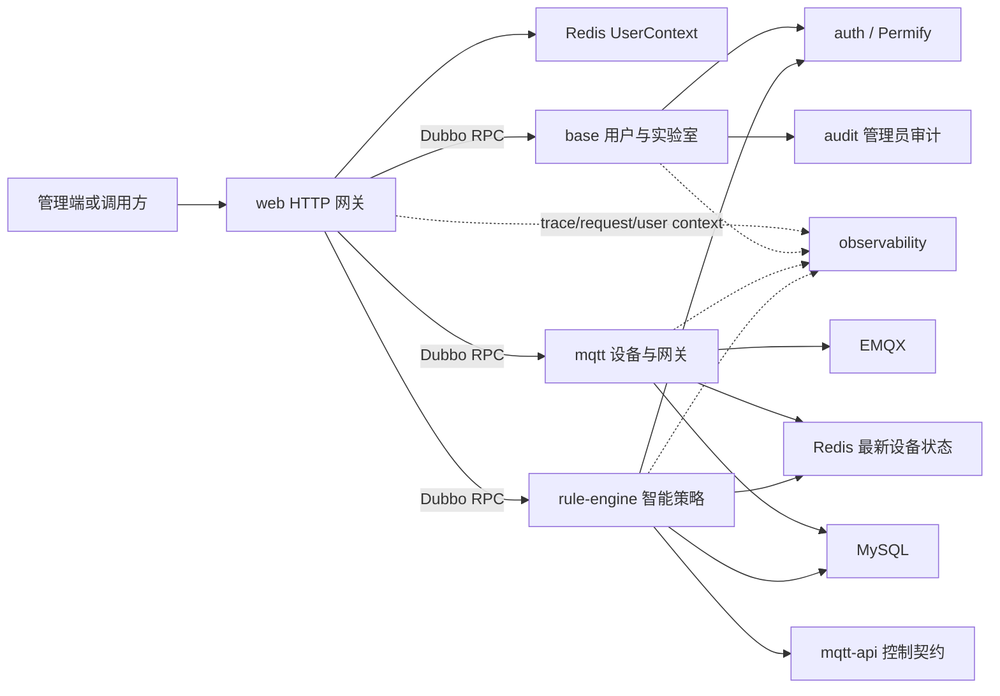
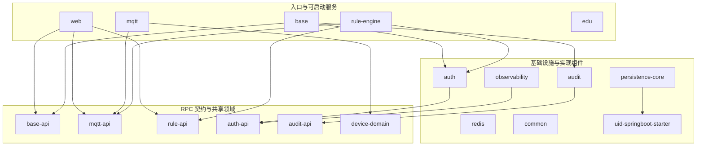

# 项目现状、模块地图与 Code Review 清单

> 更新时间：2026-07-20  
> 本文描述当前仓库的实际代码状态，不把规划中的能力写成已经完成的能力。

## 1. 项目定位

`lab-system-cloud` 是一个面向实验室综合管理的微服务后端。当前核心目标是把用户与实验室管理、设备接入、MQTT 通信、智能规则、Permify 授权、业务审计和全链路日志组合成一个可部署、可演示、可扩展的系统。

主要技术栈：

- Java 17、Spring Boot 3.5、Maven 多模块工程。
- Apache Dubbo 3，使用 Nacos 作为注册中心和配置中心。
- MyBatis-Plus、MySQL、Baidu UID Generator。
- Redis/Jedis、Sa-Token。
- Permify/Zanzibar 关系授权模型。
- Eclipse Paho MQTT Client、EMQX。
- SLF4J MDC、Grafana Alloy、Loki、Grafana。
- MQTT Mock 使用 Node.js、React、TypeScript。

## 2. 当前状态摘要

### 2.1 已形成的主链路



HTTP 请求进入 `web` 后，网关根据 Sa-Token 用户 ID 从 Redis 加载 `UserContext`。Dubbo consumer Filter 将上下文、trace ID 和 request ID 写入 attachment；provider Filter 在业务线程恢复 `UserContextHolder`，调用结束后清理。受保护的服务方法再通过 `@ActionAuthorized` 和 Command Handler 调用 Permify。

### 2.2 已提交能力

- 用户、联系人、实验室服务及 REST 接口。
- 登录时构造并保存 `UserContext`，网关按请求加载上下文。
- Permify Check、Grant、Revoke 抽象及可开关 AOP 鉴权。
- 用户和实验室相关管理员业务审计。
- HTTP、Dubbo、线程池 MDC 全链路日志。
- MQTT 任务发送、设备与 MQTT 网关 CRUD、轮询启停和运行态注册。
- MySQL、Redis、EMQX、Permify、Nacos、Loki、Alloy、Grafana Compose 配置。

### 2.3 当前工作区中尚未提交的能力

- 新增 `rule-api`，作为智能策略 RPC 契约和规则定义边界。
- 智能策略 Create、Update、Delete、StatusChange、Get、ListQuery 独立 Command。
- `SmartStrategyService` Dubbo Provider 和 Web REST Controller。
- `manage_smart_strategy`、`change_smart_strategy_status`、`list_smart_strategies` 权限映射。
- Rule Runtime CRUD 后的 Engine 注册、替换、停用和删除同步。
- Dubbo provider 的 `UserContext` 恢复从 `base` 私有 Filter 收口到 `observability` 通用 Filter。

这些修改已经通过全仓库编译和目标测试，但在 CR 完成前不应与其他大功能继续混合。

### 2.4 当前主要缺口

- `edu` 仍是启动骨架，没有学期、课表等业务实现。
- 主系统尚无完整管理端页面；React 页面目前主要存在于 `tools/mqtt-mock`。
- MQTT 和智能策略尚未完整接入管理员业务审计。
- 数据库提交成功、Engine 或 Polling 运行态同步失败时，缺少可靠重试或补偿机制。
- Redis 中长期保存的 `UserContext` 在权限或实验室信息变化后可能陈旧。
- 缺少覆盖真实 Nacos、Permify、Redis、MySQL、EMQX 的端到端测试。
- `mqtt` 与 `rule-engine` 没有显式配置 Dubbo Provider 协议端口，同机运行时需要确认是否同时占用默认 `20880`。
- 部分旧文档仍把 `device-domain` 内容描述成位于 `common`，需要逐步更新。

## 3. Maven 模块地图

### 3.1 模块分层



原则上，入口模块通过 `*-api` 访问其他服务，不应直接依赖对方的实现模块。`auth`、`audit`、`observability` 当前采用 starter/自动配置方式嵌入业务服务，不是独立进程。

### 3.2 模块总表

| 模块 | 类型 | 当前职责 | 状态 | 核心代码 scope |
|---|---|---|---|---|
| `uid-springboot-starter` | Starter | 分布式 UID、Worker ID 分配 | 可用 | [`uid-springboot-starter/src/main`](../uid-springboot-starter/src/main) |
| `common` | 共享内核 | 结果包装、异常、队列、通用工具 | 可用 | [`common/src/main/java`](../common/src/main/java) |
| `persistence-core` | Starter | `BaseEntity`、MyBatis-Plus ID 配置 | 可用 | [`persistence-core/src/main`](../persistence-core/src/main) |
| `device-domain` | 共享领域 | Device、Gateway、Record、设备事件 | 可用 | [`device-domain/src/main/java`](../device-domain/src/main/java) |
| `mqtt-api` | RPC 契约 | MQTT RPC、DTO、二进制协议 | 可用 | [`mqtt-api/src/main/java`](../mqtt-api/src/main/java) |
| `rule-api` | RPC 契约 | 智能策略 RPC、Command、Revision DTO | 已实现，未提交 | [`rule-api/src/main/java`](../rule-api/src/main/java) |
| `auth-api` | 授权契约 | 权限枚举、UserContext、授权操作接口 | 可用 | [`auth-api/src/main/java`](../auth-api/src/main/java) |
| `observability` | Starter | Trace、MDC、Dubbo/HTTP 上下文传播 | 可用，当前有未提交调整 | [`observability/src/main`](../observability/src/main) |
| `audit-api` | 审计契约 | `@Audited`、Loggable、审计查询模型 | 可用 | [`audit-api/src/main/java`](../audit-api/src/main/java) |
| `audit` | 审计实现 | 审计 AOP、Handler、MySQL Store、Dubbo 查询 | 部分业务已接入 | [`audit/src/main/java`](../audit/src/main/java) |
| `base-api` | RPC 契约 | 用户、联系人、实验室模型与服务接口 | 可用 | [`base-api/src/main/java`](../base-api/src/main/java) |
| `redis` | Starter | Jedis、KV/Hash、Pub/Sub | 可用 | [`redis/src/main/java`](../redis/src/main/java) |
| `mqtt` | 可启动服务 | MQTT Client、CRUD、轮询、状态处理 | 主体可用 | [`mqtt/src/main`](../mqtt/src/main) |
| `auth` | Starter/实现 | Permify Client、AOP、Grant/Revoke/Check | 主体可用 | [`auth/src/main`](../auth/src/main) |
| `web` | 可启动服务 | HTTP 网关、REST、上下文入口 | 主体可用 | [`web/src/main`](../web/src/main) |
| `base` | 可启动服务 | 用户、登录、实验室及授权编排 | 主体可用 | [`base/src/main`](../base/src/main) |
| `edu` | 可启动服务 | 教学业务预留 | 仅骨架 | [`edu/src/main`](../edu/src/main) |
| `rule-engine` | 可启动服务 | 规则编译、执行、持久化与运行态 | 主体可用，RPC 暴露未提交 | [`rule-engine/src/main`](../rule-engine/src/main) |

### 3.3 运行进程与端口

| 进程 | Spring 应用名 | HTTP 端口 | Dubbo/QOS | 说明 |
|---|---|---:|---|---|
| `web` | `lab-system-web` | `8989` | QOS `5555` | HTTP 入口和 Dubbo Consumer |
| `base` | `BaseApplication` | 未显式配置 | Triple `50051` | 用户、实验室和嵌入式审计 Provider |
| `mqtt` | `mqtt` | `3333` | QOS `4444`，Provider 端口未显式配置 | MQTT Provider |
| `rule-engine` | `rule-engine` | `3334` | QOS `4445`，Provider 端口未显式配置 | Rule Provider |
| `edu` | `edu` | 默认配置 | 未配置 Dubbo | 当前只是空 Spring Boot 进程 |

`server.port` 与 Dubbo Provider 协议端口不是同一个端口。正式联调前应给 `mqtt` 和 `rule-engine` 配置不同的 `dubbo.protocol.port`，或者验证当前 Dubbo 端口自动分配策略。

## 4. 各模块详细介绍

### 4.1 `uid-springboot-starter`

本地维护的 Baidu UID Generator Spring Boot 3 Starter。它提供默认/缓存 UID 生成器、DB/Redis Worker ID 分配和自动配置。业务代码不应在 ServiceImpl 中手动调用 `getUID()`；MyBatis-Plus 插入 `BaseEntity` 时由 [`MybatisPlusConfig`](../persistence-core/src/main/java/xyz/jasenon/lab/persistence/config/MybatisPlusConfig.java) 统一接入。

### 4.2 `common`

轻量共享内核，只保存真正跨领域稳定的内容，例如 [`BusinessException`](../common/src/main/java/xyz/jasenon/lab/common/exception/BusinessException.java)、[`R`](../common/src/main/java/xyz/jasenon/lab/common/util/R.java) 和通用队列。用户、设备、鉴权、数据库实体不应重新放回这里。

### 4.3 `persistence-core`

统一持久化基础能力。[`BaseEntity`](../persistence-core/src/main/java/xyz/jasenon/lab/persistence/model/BaseEntity.java) 定义公共主键和审计字段，[`MybatisPlusConfig`](../persistence-core/src/main/java/xyz/jasenon/lab/persistence/config/MybatisPlusConfig.java) 将 UID Generator 注册为 MyBatis-Plus `IdentifierGenerator`。

### 4.4 `device-domain`

设备共享领域模型，包含 Device、Gateway、各种设备状态 Record，以及 MQTT 到 Rule Engine 之间使用的设备状态事件。它被 `mqtt-api`、`mqtt` 和 `rule-engine` 共同依赖，但不包含 MQTT Client 或数据库编排逻辑。

### 4.5 `mqtt-api`

MQTT 服务的对外契约边界：

- [`MqttIo`](../mqtt-api/src/main/java/xyz/jasenon/lab/api/mqtt/MqttIo.java)：同步/异步发送设备任务。
- [`MqttDeviceCRUD`](../mqtt-api/src/main/java/xyz/jasenon/lab/api/mqtt/MqttDeviceCRUD.java)：设备 CRUD。
- [`MqttGatewayCRUD`](../mqtt-api/src/main/java/xyz/jasenon/lab/api/mqtt/MqttGatewayCRUD.java)：MQTT 网关 CRUD。
- [`MqttPollCo`](../mqtt-api/src/main/java/xyz/jasenon/lab/api/mqtt/MqttPollCo.java)：轮询启停。
- [`mqtt-api/.../protocol`](../mqtt-api/src/main/java/xyz/jasenon/lab/mqtt/protocol)：二进制命令、校验和请求响应匹配协议。

### 4.6 `rule-api`

智能策略服务的对外契约边界。Web 只依赖该模块，不依赖 Rule Engine 实现。

- [`SmartStrategyService`](../rule-api/src/main/java/xyz/jasenon/lab/engine/api/SmartStrategyService.java)：策略 RPC 接口。
- [`command`](../rule-api/src/main/java/xyz/jasenon/lab/engine/api/command)：按 Create、Update、Delete、StatusChange、Get、ListQuery 拆分的命令。
- [`RuntimeRevision`](../rule-api/src/main/java/xyz/jasenon/lab/engine/definition/RuntimeRevision.java)：Web JSON、Dubbo 和规则编译器共享的不可变规则定义。

该模块目前位于未提交工作区。

### 4.7 `auth-api`

不依赖 Permify SDK 的授权契约模块。主要包含：

- [`UserContext`](../auth-api/src/main/java/xyz/jasenon/lab/auth/context/UserContext.java)：用户身份、实验室可见 ID 和 building/org scope。
- [`UserContextHolder`](../auth-api/src/main/java/xyz/jasenon/lab/auth/context/UserContextHolder.java)：当前线程上下文。
- [`AuthorizationOperations`](../auth-api/src/main/java/xyz/jasenon/lab/auth/client/AuthorizationOperations.java)：底层授权操作抽象。
- [`Action`](../auth-api/src/main/java/xyz/jasenon/lab/auth/permission/Action.java) 与 [`RelationShip`](../auth-api/src/main/java/xyz/jasenon/lab/auth/permission/RelationShip.java)：Java 权限词汇表。

### 4.8 `auth`

Permify 实现和 Spring 自动配置模块：

- [`AuthClient`](../auth/src/main/java/xyz/jasenon/lab/auth/client/AuthClient.java) 只负责与 Permify 通信。
- [`AuthService`](../auth/src/main/java/xyz/jasenon/lab/auth/service/AuthService.java) 负责 Check、Grant、Revoke 和关系查询编排。
- [`ActionAuthorizationAspect`](../auth/src/main/java/xyz/jasenon/lab/auth/aspect/ActionAuthorizationAspect.java) 拦截 `@ActionAuthorized`。
- [`ActionCommandHandlerRegistry`](../auth/src/main/java/xyz/jasenon/lab/auth/handler/ActionCommandHandlerRegistry.java) 将业务 Command 转换成 Permify Check。
- [`schema`](../auth/schema) 保存 Permify DSL；当前业务基准是 `lab-system-v2.perm`。

`lab.auth.permify.enabled=false` 时不会创建鉴权切面，属于显式的全局关闭开关。

### 4.9 `observability`

通用日志追踪 Starter：

- [`TraceHttpFilter`](../observability/src/main/java/xyz/jasenon/lab/observability/http/TraceHttpFilter.java)：HTTP trace/request ID。
- [`TraceDubboFilter`](../observability/src/main/java/xyz/jasenon/lab/observability/dubbo/TraceDubboFilter.java)：Dubbo consumer/provider 的 Trace 和 UserContext 传播。
- [`TracedAspect`](../observability/src/main/java/xyz/jasenon/lab/observability/aspect/TracedAspect.java)：记录参数、结果、耗时和异常。
- [`AsyncExecutor`](../common/src/main/java/xyz/jasenon/lab/common/util/AsyncExecutor.java)：异步任务包装时复制并恢复完整 MDC。
- [`observability/docker`](../observability/docker)：Loki、Alloy、Grafana 配置。

它记录的是运维技术日志，不等同于管理员业务审计。

### 4.10 `audit-api` 与 `audit`

`audit-api` 定义业务审计契约，`audit` 提供 AOP、模板 Handler、持久化和查询服务。业务参数由具体 `AuditLogHandler` 转换成“主语 + 谓语 + 宾语”形式的人类可读日志。目前用户、联系人、实验室已经接入；MQTT 和智能策略仍需补齐。

### 4.11 `base-api` 与 `base`

`base-api` 保存用户、联系人、实验室 RPC 契约、Command 和 VO。`base` 是独立 Dubbo Provider：

- [`UserServiceImpl`](../base/src/main/java/xyz/jasenon/lab/base/service/impl/UserServiceImpl.java)：登录、用户创建/更新和授权关系编排。
- [`LaboratoryServiceImpl`](../base/src/main/java/xyz/jasenon/lab/base/service/impl/LaboratoryServiceImpl.java)：实验室 CRUD 和可见列表。
- [`UserContextFactory`](../base/src/main/java/xyz/jasenon/lab/base/context/UserContextFactory.java)：结合 Permify 反向查询与实验室信息构造上下文。
- [`handler/authorization`](../base/src/main/java/xyz/jasenon/lab/base/handler/authorization)：业务 Command 到 App Permission 的映射。
- [`handler/audit`](../base/src/main/java/xyz/jasenon/lab/base/handler/audit)：管理员审计文本生成。

联系人没有密码和系统权限，仅作为业务联系人存在。

### 4.12 `redis`

Jedis 自动配置和共享 Redis 能力。`RedisBus` 提供 KV、Hash、TTL、Pub/Sub，服务于 UserContext、MQTT 最新设备状态和 Rule Engine 状态事件。该模块不应该承载具体业务 key 的语义。

### 4.13 `mqtt`

独立 MQTT Dubbo Provider，主要包含：

- [`SysClientManager`](../mqtt/src/main/java/xyz/jasenon/lab/mqtt/client/SysClientManager.java)：网关 Client 和任务发送。
- [`MqttDeviceManager`](../mqtt/src/main/java/xyz/jasenon/lab/mqtt/client/MqttDeviceManager.java)：设备 CRUD，并同步轮询运行态。
- [`MqttGatewayManager`](../mqtt/src/main/java/xyz/jasenon/lab/mqtt/client/MqttGatewayManager.java)：MQTT 网关 CRUD，并同步 Client 运行态。
- [`SysPollingManager`](../mqtt/src/main/java/xyz/jasenon/lab/mqtt/client/SysPollingManager.java)：轮询注册、启停和 watchdog 兜底。
- [`message_handler`](../mqtt/src/main/java/xyz/jasenon/lab/mqtt/client/message_handler)：设备响应解析、Redis 最新状态和 MySQL 历史记录。

主动注册是主路径，watchdog 只应修复漏注册，不应成为正常 CRUD 的唯一同步手段。

### 4.14 `rule-engine`

规则执行服务，包含规则定义编译、事件索引、时间调度、动作执行、不可变 revision 持久化和启动恢复。

- [`RuntimeRevisionCompiler`](../rule-engine/src/main/java/xyz/jasenon/lab/engine/definition/RuntimeRevisionCompiler.java)：将 API Revision 编译成 Runtime。
- [`RuntimePersistHelper`](../rule-engine/src/main/java/xyz/jasenon/lab/engine/definition/persistence/RuntimePersistHelper.java)：事务内追加 revision，事务提交后同步 Engine。
- [`Engine`](../rule-engine/src/main/java/xyz/jasenon/lab/engine/Engine.java)：Runtime 注册、移除和事件路由。
- [`SmartStrategyServiceImpl`](../rule-engine/src/main/java/xyz/jasenon/lab/engine/service/SmartStrategyServiceImpl.java)：新增加的 Dubbo CRUD Provider。
- [`SmartStrategyAuthorizationConfiguration`](../rule-engine/src/main/java/xyz/jasenon/lab/engine/authorization/SmartStrategyAuthorizationConfiguration.java)：智能策略权限映射。

当前实现已经保证 CRUD 成功后直接修改 Engine；服务重启时会从当前 published revision 恢复。运行态同步失败后的可靠补偿仍需设计。

### 4.15 `web`

系统 HTTP 网关，不直接操作业务数据库和 MQTT Client。主要入口：

- [`UserContextRequestFilter`](../web/src/main/java/xyz/jasenon/lab/web/context/UserContextRequestFilter.java)：从 Redis 加载 UserContext。
- [`user`](../web/src/main/java/xyz/jasenon/lab/web/user)：登录、用户和联系人 REST API。
- [`laboratory`](../web/src/main/java/xyz/jasenon/lab/web/laboratory)：实验室 REST API。
- [`mqtt`](../web/src/main/java/xyz/jasenon/lab/web/mqtt)：设备、网关和轮询 REST API。
- [`TaskController`](../web/src/main/java/xyz/jasenon/lab/web/TaskController.java)：MQTT 任务发送。
- [`SmartStrategyController`](../web/src/main/java/xyz/jasenon/lab/web/rule/SmartStrategyController.java)：智能策略 REST API，目前未提交。

授权主要放在真正执行业务的 Dubbo Provider 层，避免绕过 Web 后直接 RPC 调用时失去保护。

### 4.16 `edu`

教学业务服务占位模块。目前只有 Spring Boot 启动类和配置，没有学期、课表、课程等领域模型或 RPC 接口。Permify DSL 中已经预留 `manage_semester`、`manage_timetable` 等权限，但代码尚未实现。

### 4.17 `tools/mqtt-mock`

非 Maven 模块，是 Node.js + React + TypeScript 的 MQTT 设备模拟器。它维护运行时设备状态，根据 Java 协议对应的 handler 接收控制/查询指令，并提供 Web 页面配置设备状态。核心 scope：

- [`src/handlers`](../tools/mqtt-mock/src/handlers)：各类设备协议处理。
- [`src/state`](../tools/mqtt-mock/src/state)：内存设备状态。
- [`src/web`](../tools/mqtt-mock/src/web)：React 管理页面。
- [`src/web-server.ts`](../tools/mqtt-mock/src/web-server.ts)：状态 API 和静态页面服务。

### 4.18 数据库与基础设施

[`sql/schema.sql`](../sql/schema.sql) 当前包含 gateway、device、五类设备记录、rule runtime/revision、user、laboratory 和 audit log 表，全部使用逻辑关联，不声明数据库外键。

[`compose.yml`](../compose.yml) 定义 MySQL 8.0.44、Permify 专用 PostgreSQL 17、Redis、EMQX、Permify、Nacos、Loki、Alloy 和 Grafana。该配置已经做过格式检查，但不代表所有容器和应用已经完成真实联调。

## 5. 下一阶段建议

1. 先完成当前 Rule Strategy 工作区 CR，并按契约、实现、网关/测试分批提交。
2. 使用真实基础设施验证 `Web -> Dubbo -> UserContext -> Permify -> Service` 链路。
3. 验证 Rule CRUD 对 MySQL revision 和 Engine 运行态的双重影响。
4. 为 Runtime/Polling 同步失败增加重试、告警或基于事件的恢复机制。
5. 设计权限和实验室信息变化后的 UserContext 刷新机制。
6. 为 MQTT 与 Smart Strategy 增加管理员审计 Handler。
7. 增加分页、Bean Validation、OpenAPI 和稳定错误码。
8. 实现系统管理端 React 页面，再补真实场景端到端测试。
9. 最后完善 `edu` 业务，不要在核心链路稳定前同时扩张新领域。

## 6. Code Review 清单

以下清单用于当前工作区 CR，也可以作为后续 PR 模板。每项后的 **Scope** 是优先检查范围，不表示只能检查这些文件。

### 6.1 模块与依赖边界

- [x] 服务调用是否始终依赖 `*-api`，没有让 `web` 直接依赖 `base`、`mqtt` 或 `rule-engine` 实现。  
  **Scope：** [`pom.xml`](../pom.xml)、[`web/pom.xml`](../web/pom.xml)、[`base-api`](../base-api)、[`mqtt-api`](../mqtt-api)、[`rule-api`](../rule-api)
- [x] `common` 是否只保存稳定通用能力，没有重新混入用户、设备、RPC 或持久化业务模型。  
  **Scope：** [`common/src/main/java`](../common/src/main/java)、[`device-domain/src/main/java`](../device-domain/src/main/java)、[`persistence-core/src/main/java`](../persistence-core/src/main/java)
- [x] 新增模块是否确实代表独立契约或部署边界，而不是仅为少量类增加 Maven 模块。  
  **Scope：** [`pom.xml`](../pom.xml)、所有模块 `pom.xml`
- [x] Spring 自动配置是否通过 imports/SPI 注册，业务服务是否真正包含对应依赖。  
  **Scope：** [`auth/src/main/resources/META-INF`](../auth/src/main/resources/META-INF)、[`observability/src/main/resources/META-INF`](../observability/src/main/resources/META-INF)、[`redis/src/main/resources/META-INF`](../redis/src/main/resources/META-INF)

### 6.2 RPC 契约与 Command

- [x] Dubbo 接口参数和返回值是否全部位于 API/共享领域模块，没有泄漏实现类、Mapper Entity 或运行时对象。  
  **Scope：** [`base-api`](../base-api)、[`mqtt-api`](../mqtt-api)、[`rule-api`](../rule-api)、[`audit-api`](../audit-api)
- [x] RPC DTO 是否具备稳定的序列化结构，新增字段、枚举重命名和 record 使用是否考虑跨版本兼容。  
  **Scope：** [`base-api/src/main/java`](../base-api/src/main/java)、[`mqtt-api/src/main/java`](../mqtt-api/src/main/java)、[`rule-api/src/main/java`](../rule-api/src/main/java)
- [x] 每个 Command 是否只表达一个业务意图，避免重新形成万能 DTO。  
  **Scope：** [`base-api/.../dto`](../base-api/src/main/java/xyz/jasenon/lab/base/api/dto)、[`rule-api/.../command`](../rule-api/src/main/java/xyz/jasenon/lab/engine/api/command)
- [ ] RPC 超时、`check=false`、重试和幂等语义是否适合写操作。  
  **Scope：** [`web/src/main/java`](../web/src/main/java)、各服务 [`application.yaml`](../web/src/main/resources/application.yaml)

### 6.3 REST 网关

- [x] URL 是否表达资源，GET/POST/PUT/DELETE 是否符合实际幂等语义。  
  **Scope：** [`web/src/main/java/xyz/jasenon/lab/web`](../web/src/main/java/xyz/jasenon/lab/web)
- [x] Path Variable 中的资源 ID 是否与 Body 中的 ID 校验一致，不能静默修改错误资源。  
  **Scope：** [`SmartStrategyController`](../web/src/main/java/xyz/jasenon/lab/web/rule/SmartStrategyController.java)、[`MqttDeviceController`](../web/src/main/java/xyz/jasenon/lab/web/mqtt/MqttDeviceController.java)、[`MqttGatewayController`](../web/src/main/java/xyz/jasenon/lab/web/mqtt/MqttGatewayController.java)
- [x] Controller 是否只做 HTTP/RPC 模型转换，没有数据库、Permify 或运行态编排。  
  **Scope：** [`web/src/main/java`](../web/src/main/java)
- [ ] 列表接口是否需要分页、过滤和稳定排序，避免数据增长后一次返回全部内容。  
  **Scope：** 所有 Controller 的 `list` 方法、各 `*-api` 查询模型
- [x] 业务异常是否映射为明确 HTTP 状态码和统一响应结构。  
  **Scope：** [`BusinessExceptionHandler`](../web/src/main/java/xyz/jasenon/lab/web/response/BusinessExceptionHandler.java)、[`R`](../common/src/main/java/xyz/jasenon/lab/common/util/R.java)

### 6.4 身份与 Permify 授权

- [ ] 所有需要保护的 Provider 写操作和敏感查询是否添加 `@ActionAuthorized`。  
  **Scope：** [`base/service/impl`](../base/src/main/java/xyz/jasenon/lab/base/service/impl)、[`rule-engine/service`](../rule-engine/src/main/java/xyz/jasenon/lab/engine/service)、后续 MQTT 管理服务
- [ ] 每个受保护方法参数是否能命中唯一 `ActionCommandHandler`；零 Handler 和重复 Handler 是否会快速失败。  
  **Scope：** [`ActionAuthorizationAspect`](../auth/src/main/java/xyz/jasenon/lab/auth/aspect/ActionAuthorizationAspect.java)、[`ActionCommandHandlerRegistry`](../auth/src/main/java/xyz/jasenon/lab/auth/handler/ActionCommandHandlerRegistry.java)、各服务 `handler/authorization`
- [x] Java `Action`、`RelationShip` 与 Permify DSL 名称是否完全一致。  
  **Scope：** [`Action.java`](../auth-api/src/main/java/xyz/jasenon/lab/auth/permission/Action.java)、[`RelationShip.java`](../auth-api/src/main/java/xyz/jasenon/lab/auth/permission/RelationShip.java)、[`lab-system-v2.perm`](../auth/schema/lab-system-v2.perm)
- [ ] App 权限是否检查 `app:global`，Laboratory 权限是否检查正确的 `laboratory:{id}`。  
  **Scope：** [`base/handler/authorization`](../base/src/main/java/xyz/jasenon/lab/base/handler/authorization)、[`SmartStrategyAuthorizationConfiguration`](../rule-engine/src/main/java/xyz/jasenon/lab/engine/authorization/SmartStrategyAuthorizationConfiguration.java)
- [ ] Grant/Revoke 是否只能分配操作者有权分配的 relation，并禁止 `super_admin` 等黑名单关系。  
  **Scope：** [`AuthService`](../auth/src/main/java/xyz/jasenon/lab/auth/service/AuthService.java)、[`GrantCommand`](../auth/src/main/java/xyz/jasenon/lab/auth/command/GrantCommand.java)、[`RevokeCommand`](../auth/src/main/java/xyz/jasenon/lab/auth/command/RevokeCommand.java)、[`UserServiceImpl`](../base/src/main/java/xyz/jasenon/lab/base/service/impl/UserServiceImpl.java)
- [ ] `lab.auth.permify.enabled=false` 时鉴权完全关闭是否符合当前环境预期，生产配置是否避免误关闭。  
  **Scope：** [`PermifyAuthAutoConfiguration`](../auth/src/main/java/xyz/jasenon/lab/auth/config/PermifyAuthAutoConfiguration.java)、各服务 `application.yaml`
- [ ] Permify 不可用、超时或 schema version 不匹配时，是拒绝请求还是放行，策略是否明确。  
  **Scope：** [`AuthClient`](../auth/src/main/java/xyz/jasenon/lab/auth/client/AuthClient.java)、[`PermifyAuthProperties`](../auth/src/main/java/xyz/jasenon/lab/auth/config/PermifyAuthProperties.java)

### 6.5 UserContext 与线程安全

- [ ] Web 是否只根据可信 Sa-Token 身份加载 Redis UserContext，不接受调用方直接提交的上下文。  
  **Scope：** [`UserContextRequestFilter`](../web/src/main/java/xyz/jasenon/lab/web/context/UserContextRequestFilter.java)、[`SaTokenCurrentUserIdResolver`](../web/src/main/java/xyz/jasenon/lab/web/context/SaTokenCurrentUserIdResolver.java)
- [ ] HTTP 和 Dubbo provider 在线程入口先清理、在 `finally` 再清理 ThreadLocal。  
  **Scope：** [`UserContextRequestFilter`](../web/src/main/java/xyz/jasenon/lab/web/context/UserContextRequestFilter.java)、[`TraceDubboFilter`](../observability/src/main/java/xyz/jasenon/lab/observability/dubbo/TraceDubboFilter.java)、[`UserContextHolder`](../auth-api/src/main/java/xyz/jasenon/lab/auth/context/UserContextHolder.java)
- [ ] 服务 A 调用服务 B 时，UserContext、trace ID、request ID 是否能够继续传播。  
  **Scope：** [`TraceDubboFilter`](../observability/src/main/java/xyz/jasenon/lab/observability/dubbo/TraceDubboFilter.java)、所有包含 `@DubboReference` 的服务
- [ ] 登录、退出、授权变更、实验室修改后，Redis UserContext 是否创建、删除或刷新。  
  **Scope：** [`UserServiceImpl`](../base/src/main/java/xyz/jasenon/lab/base/service/impl/UserServiceImpl.java)、[`UserContextFactory`](../base/src/main/java/xyz/jasenon/lab/base/context/UserContextFactory.java)、[`RedisUserContextStore`](../auth/src/main/java/xyz/jasenon/lab/auth/context/RedisUserContextStore.java)
- [ ] `laboratoryIds` 与 `laboratoryScopes` 是否保持一致，building/org 单条件和空条件过滤是否符合预期。  
  **Scope：** [`UserContext`](../auth-api/src/main/java/xyz/jasenon/lab/auth/context/UserContext.java)、[`UserContextFactory`](../base/src/main/java/xyz/jasenon/lab/base/context/UserContextFactory.java)

### 6.6 数据库、ID 与事务

- [ ] 表之间是否只使用逻辑外键，没有新增数据库 FOREIGN KEY。  
  **Scope：** [`sql/schema.sql`](../sql/schema.sql)
- [ ] MyBatis-Plus Entity 是否继承正确基类并使用统一 ID 生成器，ServiceImpl 中没有手动 `getUID()`。  
  **Scope：** [`BaseEntity`](../persistence-core/src/main/java/xyz/jasenon/lab/persistence/model/BaseEntity.java)、[`MybatisPlusConfig`](../persistence-core/src/main/java/xyz/jasenon/lab/persistence/config/MybatisPlusConfig.java)、所有 Mapper Entity 与 `insert` 调用
- [ ] 唯一索引、软删除字段和查询条件是否一致，删除后的资源不会被普通查询重新读出。  
  **Scope：** [`sql/schema.sql`](../sql/schema.sql)、[`base/mapper`](../base/src/main/java/xyz/jasenon/lab/base/mapper)、[`mqtt/.../mapper`](../mqtt/src/main/java/xyz/jasenon/lab/mqtt/client/itfc/mapper)、[`rule-engine/.../mapper`](../rule-engine/src/main/java/xyz/jasenon/lab/engine/definition/persistence/mapper)
- [ ] 外部副作用是否发生在数据库事务提交之后，回滚时不会留下 Engine、Polling 或 Permify 脏状态。  
  **Scope：** [`RuntimePersistHelper`](../rule-engine/src/main/java/xyz/jasenon/lab/engine/definition/persistence/RuntimePersistHelper.java)、[`MqttDeviceManager`](../mqtt/src/main/java/xyz/jasenon/lab/mqtt/client/MqttDeviceManager.java)、[`MqttGatewayManager`](../mqtt/src/main/java/xyz/jasenon/lab/mqtt/client/MqttGatewayManager.java)、[`UserServiceImpl`](../base/src/main/java/xyz/jasenon/lab/base/service/impl/UserServiceImpl.java)
- [ ] 并发更新是否通过行锁、版本号、唯一索引或幂等 key 防止覆盖和重复。  
  **Scope：** Rule Runtime Mapper、用户授权编排、MQTT CRUD Mapper

### 6.7 MQTT 设备、网关与轮询

- [ ] Device 创建、修改、删除后是否立即注册、迁移或注销 Polling。  
  **Scope：** [`MqttDeviceManager`](../mqtt/src/main/java/xyz/jasenon/lab/mqtt/client/MqttDeviceManager.java)、[`SysPollingManager`](../mqtt/src/main/java/xyz/jasenon/lab/mqtt/client/SysPollingManager.java)
- [ ] Gateway 创建、修改、删除后是否立即创建、替换或关闭 MQTT Client。  
  **Scope：** [`MqttGatewayManager`](../mqtt/src/main/java/xyz/jasenon/lab/mqtt/client/MqttGatewayManager.java)、[`SysClientManager`](../mqtt/src/main/java/xyz/jasenon/lab/mqtt/client/SysClientManager.java)
- [ ] Watchdog 是否只补齐缺失运行态，不会重复注册 Poll、Client 或任务线程。  
  **Scope：** [`SysPollingManager`](../mqtt/src/main/java/xyz/jasenon/lab/mqtt/client/SysPollingManager.java)、[`SysClientManager`](../mqtt/src/main/java/xyz/jasenon/lab/mqtt/client/SysClientManager.java)、[`ActiveQueue`](../common/src/main/java/xyz/jasenon/lab/common/ActiveQueue.java)
- [ ] 删除 Gateway 时有关联 Device 的行为是否明确，逻辑关联数据不会形成不可恢复状态。  
  **Scope：** MQTT Gateway/Device Manager、[`sql/schema.sql`](../sql/schema.sql)
- [ ] Java `CommandLine`、MQTT Mock handler 和响应 decoder 是否保持协议一致。  
  **Scope：** [`mqtt-api/.../protocol`](../mqtt-api/src/main/java/xyz/jasenon/lab/mqtt/protocol)、[`mqtt/message_handler`](../mqtt/src/main/java/xyz/jasenon/lab/mqtt/client/message_handler)、[`tools/mqtt-mock/src/handlers`](../tools/mqtt-mock/src/handlers)

### 6.8 Rule Runtime 与运行态一致性

- [ ] Create/Update 在编译成功且数据库提交后才注册或替换 Engine Runtime。  
  **Scope：** [`RuntimePersistHelper`](../rule-engine/src/main/java/xyz/jasenon/lab/engine/definition/persistence/RuntimePersistHelper.java)、[`RuntimeRevisionCompiler`](../rule-engine/src/main/java/xyz/jasenon/lab/engine/definition/RuntimeRevisionCompiler.java)
- [ ] Disable/Delete 是否同时清除 Runtime、生命周期任务、时间调度和设备事件索引。  
  **Scope：** [`Engine`](../rule-engine/src/main/java/xyz/jasenon/lab/engine/Engine.java)、[`RuntimeLifecycleManager`](../rule-engine/src/main/java/xyz/jasenon/lab/engine/runtime/RuntimeLifecycleManager.java)、[`TimeScheduleService`](../rule-engine/src/main/java/xyz/jasenon/lab/engine/time/TimeScheduleService.java)
- [ ] Update 是否完整替换旧 Runtime，不会让旧 Runtime 的异步任务继续执行。  
  **Scope：** [`Engine.register`](../rule-engine/src/main/java/xyz/jasenon/lab/engine/Engine.java)、[`AsyncRuntimeScheduler`](../rule-engine/src/main/java/xyz/jasenon/lab/engine/runtime/AsyncRuntimeScheduler.java)
- [ ] Engine 同步失败时是否有日志、指标、重试或启动恢复；数据库与内存状态短暂不一致是否可接受。  
  **Scope：** [`RuntimePersistHelper`](../rule-engine/src/main/java/xyz/jasenon/lab/engine/definition/persistence/RuntimePersistHelper.java)、应用启动恢复测试
- [ ] `activeFrom`、`activeUntil`、时区和临界时间判断是否覆盖未来生效与到期场景。  
  **Scope：** Rule Runtime、Lifecycle、Time 模块及对应测试

### 6.9 审计与技术日志

- [ ] `@Traced` 是否记录了必要的操作名、耗时和异常，同时避免密码、Token 和大对象泄漏。  
  **Scope：** [`TracedAspect`](../observability/src/main/java/xyz/jasenon/lab/observability/aspect/TracedAspect.java)、所有 `@Traced` 使用点
- [ ] 管理员业务操作是否使用 `@Audited` 和 Audit Handler，而不是依赖运维 trace 日志。  
  **Scope：** [`audit`](../audit)、[`base/handler/audit`](../base/src/main/java/xyz/jasenon/lab/base/handler/audit)、待补 MQTT/Rule Handler
- [ ] 审计文本是否能明确表达“谁、做了什么、操作了什么”，多参数聚合是否可读。  
  **Scope：** [`AuditLogAspect`](../audit/src/main/java/xyz/jasenon/lab/audit/aspect/AuditLogAspect.java)、[`AuditLogHandler`](../audit/src/main/java/xyz/jasenon/lab/audit/handler/AuditLogHandler.java)
- [ ] 异步线程、Dubbo 和 HTTP 日志是否保持同一 trace ID，调用结束后 MDC 是否清理。  
  **Scope：** [`observability/src/main/java`](../observability/src/main/java)

### 6.10 配置、部署与安全

- [ ] 密码、Token、主机和端口是否支持环境变量覆盖，仓库中没有真实生产密钥。  
  **Scope：** [`compose.yml`](../compose.yml)、[`.env.example`](../.env.example)、各模块 `application.yaml`
- [ ] Nacos、Permify、Grafana 和 EMQX 的本地默认账号是否明确不能直接用于生产。  
  **Scope：** [`compose.yml`](../compose.yml)、部署文档
- [ ] 服务端口、Dubbo QOS 端口和 Nacos gRPC 端口是否冲突。  
  **Scope：** [`compose.yml`](../compose.yml)、[`web/application.yaml`](../web/src/main/resources/application.yaml)、各服务配置
- [ ] Compose healthcheck、volume 和初始化 SQL 是否指向存在且正确的文件。  
  **Scope：** [`compose.yml`](../compose.yml)、[`infra/mysql`](../infra/mysql)、[`sql/schema.sql`](../sql/schema.sql)、[`observability/docker`](../observability/docker)

### 6.11 测试与代码质量

- [ ] 正常、空值、重复创建、不存在资源、无权限和并发更新路径是否有测试。  
  **Scope：** 各模块 `src/test`
- [ ] CRUD 测试是否同时验证数据库状态和 Engine/Polling/Client 内存状态。  
  **Scope：** [`mqtt/src/test`](../mqtt/src/test)、[`rule-engine/src/test`](../rule-engine/src/test)
- [ ] 授权测试是否覆盖每个 Command 到 permission、entity type、entity ID 和 subject ID 的映射。  
  **Scope：** [`auth/src/test`](../auth/src/test)、[`base/src/test`](../base/src/test)、[`SmartStrategyAuthorizationConfigurationTests`](../rule-engine/src/test/java/xyz/jasenon/lab/engine/authorization/SmartStrategyAuthorizationConfigurationTests.java)
- [ ] Dubbo UserContext provider 恢复与 finally 清理是否有独立测试。  
  **Scope：** [`observability/src/test`](../observability/src/test)、[`TraceDubboFilter`](../observability/src/main/java/xyz/jasenon/lab/observability/dubbo/TraceDubboFilter.java)
- [ ] 生产代码中的 `TODO`、`UnsupportedOperationException`、可疑 `return null` 是否是明确的合法分支。  
  **Scope：** 全仓库 Java 源码，重点检查 Rule Action 和 MQTT Gateway Helper
- [ ] 新增关键代码是否有解释边界或并发原因的注释，而不是重复代码字面含义。  
  **Scope：** 当前 `git diff`
- [ ] 提交前是否完成以下基础验证。  
  **Scope：** 全仓库

```bash
git diff --check
source ~/.zshrc
./mvnw -DskipTests compile
./mvnw test
docker compose -f compose.yml config
```

## 7. CR 结果记录模板

```markdown
### 本次 CR 范围

- 功能：
- 模块：
- 数据库变更：
- RPC 契约变更：
- 权限变更：

### Findings

- [P0/P1/P2/P3] 问题标题
  - Scope：`path/to/file:line`
  - 影响：
  - 建议：

### 验证

- [ ] 编译通过
- [ ] 单元测试通过
- [ ] 集成测试通过
- [ ] REST 接口验证
- [ ] Permify 授权验证
- [ ] 运行态同步验证

### 遗留风险

- 
```
