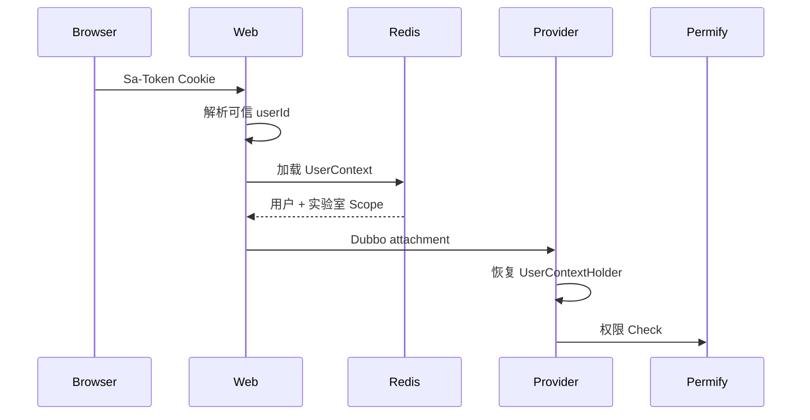

# 认证上下文与 Permify 授权

项目将身份会话和业务授权分开：

- Sa-Token 位于 `web`，负责浏览器登录态和 userId。
- `auth-api` 定义 `UserContext`、权限/关系词汇表和授权操作抽象。
- `auth` 负责 Permify Client、权限检查、关系同步、AOP 和 Redis UserContext。

## 1. 请求上下文



`UserContext` 保存 userId、用户名、显示名称、可见实验室 ID 以及实验室名称/楼栋/组织。调用方不能通过请求 Body 提交或覆盖该上下文。

## 2. 配置

实际配置前缀为 `lab.auth.permify`：

```yaml
lab:
  auth:
    permify:
      base-url: http://localhost:3476
      tenant-id: t1
      schema-version: ""
      depth: 20
      lookup-page-size: 100
```

环境变量由各服务的 `application.yml` 映射：

```text
PERMIFY_HOST
PERMIFY_HTTP_PORT
PERMIFY_TENANT_ID
PERMIFY_SCHEMA_VERSION
PERMIFY_DEPTH
PERMIFY_LOOKUP_PAGE_SIZE
```

当前实现没有 `enabled=false` 的授权降级开关。业务服务包含 `auth` 后会创建 Client 和切面；Permify 不可用或配置错误时，应拒绝受保护请求，而不是放行。

`schema-version` 为空时 Client 查询当前版本。正式环境建议在发布时记录并固定已验证版本。

## 3. 声明式鉴权

Provider 业务方法使用 `@ActionAuthorized`：

```java
@ActionAuthorized
public RpcResult<Laboratory> update(LaboratoryEdit command) {
    // 业务逻辑
}
```

对应服务模块注册 `ActionCommandHandler<LaboratoryEdit>`，将业务意图转换为：

```text
subject = user:{currentUserId}
entity  = app:global 或 laboratory:{id}
action  = manage_laboratory 等
```

切面流程：

1. 从 `UserContextHolder` 获取主体。
2. 按参数运行时类型查找 Handler。
3. 将一个或多个 Command 转换为权限检查。
4. 逐项调用 Permify。
5. 任一拒绝即抛出 `PermissionDeniedException`。

受保护方法没有 Handler 或命中多个不兼容 Handler，属于授权配置错误，应快速失败。

## 4. 权限模型

当前业务 DSL 是：

```text
domains/auth/service/schema/lab-system-v2.perm
```

Java 权限词汇位于：

```text
domains/auth/api/.../permission/Action.java
domains/auth/api/.../permission/RelationShip.java
```

修改权限必须同步：

1. Permify DSL。
2. Java Action/Relation。
3. Provider Command Handler。
4. 前端可见性或操作入口。
5. 授权测试和部署 bootstrap checksum。

## 5. UserContext Store

`RedisUserContextStore` 用于：

- 登录后保存当前上下文。
- HTTP 请求按 userId 加载。
- 权限/实验室变化后替换。
- 退出或用户失效时删除。
- 发布 `USER_CONTEXT_CHANGED` 事件。

Web 实时模块收到变更后：

- UPDATE：重新加载并替换连接 Scope。
- DELETE：以策略违规状态关闭该用户连接。

这能避免长连接继续使用旧权限。

## 6. 数据范围

Permify Check 回答“能否执行动作”，UserContext Scope 回答“能看到哪些实验室数据”。

Provider 列表查询应使用 `filterLaboratoryIds()`：

- 请求范围为空时，使用全部可见实验室。
- 请求范围非空时，与可见集合求交集。
- 交集为空时返回空列表，不回退到全量。

## 7. 测试重点

- 每个 Command 到 entity/action/subject 的映射。
- 无上下文、无 Handler、重复 Handler、Permify 拒绝。
- super admin 通过继承权限获得可见实验室。
- 权限变化后 Redis Context 与 WebSocket Scope 更新。
- Dubbo Provider 恢复并在 finally 清理上下文。
