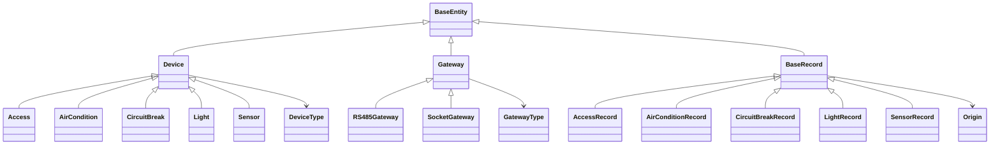

# Device 领域核心设计

Device 模块是设备、网关和设备遥测记录的共享领域契约。它不负责连接下位机、解释 MQTT 字节流、执行控制命令或评估规则；这些能力依赖本模块提供的稳定类型、字段和事件格式。模块当前只有 `domain` 子模块，产物为 `device-domain`。

## 1. 设计边界

本模块维护四类事实：

- **设备配置**：设备是什么、属于哪个实验室、经哪个网关通信、是否参与轮询。
- **网关配置**：网关类型、适用实验室，以及 RS485 网关的收发主题。
- **状态记录**：不同设备上报后形成的类型化状态快照。
- **共享契约**：设备类型枚举、实时记录 Redis key 和设备快照事件。

模块刻意不包含：

- 设备和网关的增删改查流程；
- 物理协议编解码、MQTT topic 匹配、轮询调度和命令白名单；
- 最新状态的缓存策略、历史记录查询策略；
- 规则的编译、比较和执行；
- Web API、鉴权和展示 DTO。

因此，Device 是“通用语言和数据形状”的所有者，而不是设备业务流程的协调者。

## 2. 模型总览



设备配置与状态记录是两个不同的概念：`Device` 及其子类描述相对稳定的资产和寻址配置；`BaseRecord` 及其子类描述某一时刻设备实际上报的状态。不要把命令期望值回写为 record，也不要用 record 替代设备配置。

## 3. 设备配置模型

### 3.1 公共属性

`Device` 继承 `BaseEntity`，公共字段如下：

| 字段 | 含义 |
| --- | --- |
| `id` | 跨存储和消息链路使用的设备身份 |
| `deviceName` | 展示名称 |
| `belongTo` | 所属实验室或业务域 ID |
| `deviceType` | 多态判别符，也是协议、记录和规则的类型路由键 |
| `polling` | 是否允许上层轮询调度采集该设备 |
| `gatewayId` | 承载设备通信的网关 ID |

所有设备子类映射到同一张 `device` 表。差异字段保存在同表的可选列中，类型由 `device_type` 区分。这是单表继承模型：查询能够统一返回 `Device`，但新增类型时必须同步考虑表结构和约束。

### 3.2 类型与寻址

`DeviceType` 当前有五个稳定的、大小写敏感的值：

| 类型 | 配置类 | 寻址能力 | 类型专有配置 |
| --- | --- | --- | --- |
| `Access` | `Access` | `Address` | `locked` |
| `AirCondition` | `AirCondition` | `Address` + `SelfId` | `socketGatewayId`、`groupId`、`locked` |
| `CircuitBreak` | `CircuitBreak` | `Address` | 无额外路由字段 |
| `Light` | `Light` | `Address` + `SelfId` | `locked` |
| `Sensor` | `Sensor` | `Address` + `SelfId` | 无 |

`Address` 和 `SelfId` 是小型能力接口，用于让协议层在不依赖具体设备类的情况下读取总线地址。`selfId` 表示同一地址下的内部编号，并非全局身份；全局业务身份始终使用 `Device.id`。

每个具体设备的无参构造器都会固定自己的 `deviceType`。创建具体设备时应依赖这一不变量，不应把子类和枚举值组合成互相矛盾的状态。

## 4. 网关模型

`Gateway` 同样使用 Jackson 多态和单表持久化：

- `RS485Gateway` 固定 `gatewayType = RS485`，并增加 `sendTopic`、`acceptTopic`；其相等性当前只由这两个 topic 决定。
- `SocketGateway` 当前没有新增字段；它作为 `Socket` 类型的多态落点存在。
- `usingIn` 是实验室 ID 列表，通过 `JacksonTypeHandler` 存入 JSON 列。

网关描述通信入口，不拥有设备状态。设备通过 `gatewayId` 等配置字段引用网关，上层服务负责验证引用、选择连接和组织生命周期。

## 5. Record：设备已观测状态

### 5.1 公共语义

`BaseRecord` 继承 `BaseEntity`，公共业务字段为：

- `deviceId`：状态属于哪台设备；
- `origin`：该对象来自 `Redis` 实时缓存还是 `MySql` 历史存储；
- `laboratoryId`：实时事件路由所需的实验室 ID。

`origin` 和 `laboratoryId` 标记为 `exist = false`，不属于 record 表持久化列。它们是读取来源和传输上下文，不能作为历史事实查询条件。`createAt` 等继承字段表达记录时间；事件链路另有 `occurredAt`，两者不要混用。

### 5.2 类型化字段

| Record | 状态字段 |
| --- | --- |
| `AccessRecord` | `address`、`opened`、`locked`、`lockStatus`、`delayTime` |
| `AirConditionRecord` | `address`、`selfId`、`opened`、`mode`、`temperature`、`speed`、`roomTemperature`、`errorCode` |
| `CircuitBreakRecord` | `address`、`opened`、`fixed`、`locked`、`voltage`、`current`、`power`、`energy`、`leakage`、`temperature` |
| `LightRecord` | `address`、`selfId`、`opened`、`locked` |
| `SensorRecord` | `address`、`selfId`、`temperature`、`humidity`、`light`、`smoke` |

空调模式的合法枚举是 `Cooling`、`Heating`、`Dehumidification`、`AirSupply`；风速是 `Low`、`Middle`、`High`、`Auto`。这些枚举名称会进入数据库和字符串化快照，因此属于外部兼容契约。

布尔字段表达**已观测状态**。例如 `opened` 是设备上报的开合状态，`locked` 是上报或持久化的锁定状态；它们不是“执行打开/锁定”命令。命令的合法设备类型、参数以及发送结果由命令协议模块定义，Device 不推导“下发成功”等于“状态已改变”。

## 6. 序列化与共享契约

### 6.1 多态 JSON

`Device` 使用 JSON 字段 `deviceType` 选择具体子类，`Gateway` 使用 `gatewayType`。两者均采用 `EXISTING_PROPERTY` 且 `visible = true`：判别字段既参与反序列化选型，也保留在对象属性中。

这意味着以下字符串均为稳定协议值：

- 设备：`Access`、`AirCondition`、`Sensor`、`CircuitBreak`、`Light`；
- 网关：`RS485`、`Socket`。

修改枚举名、判别字段名或子类型注册名会同时影响 API JSON、数据库值和跨模块消息，不能作为普通重构处理。

### 6.2 最新记录 key

`DeviceRecordKeys.recordKey(type, deviceId)` 统一生成：

```text
record:<DeviceType.name()>:<deviceId>
```

例如 `record:Sensor:sensor-1`。生产方和消费方必须调用该方法，而不是在各自模块拼接字符串。key 只表达记录身份；缓存内容、TTL 和回源策略由使用方决定。

### 6.3 设备快照事件

`DeviceRecordSnapshotEvent` 是实时状态变化的最小共享消息：

| 字段 | 契约 |
| --- | --- |
| `deviceType` | 决定 record 字段集合和字段类型 |
| `deviceId` | 设备业务身份 |
| `recordFields` | 完整状态快照，字段名到字符串值的映射 |
| `occurredAt` | 本次状态被观测或发布的时间 |

事件 channel 由 `RuleEngineChannels.DEVICE_RECORD_CHANGE` 固定为 `rule-engine:device-record-change`。`recordFields` 使用 `LinkedHashMap` 作为默认实现以提供稳定遍历顺序，但消费者不应把顺序当作业务语义。

该事件传输的是**完整字段快照**，不是某个字段的 patch。新增字段时，旧消费者应忽略未知字段；删除或改名字段则会破坏规则字段引用和历史兼容性。

## 7. 跨模块消费边界

这里只记录 Device 暴露的契约，不展开消费模块内部设计。

- **MQTT** 根据 `DeviceType` 选择对应协议处理器，把报文解析为具体 `BaseRecord`，以 `DeviceRecordKeys` 存放最新快照，并发布 `DeviceRecordSnapshotEvent`。控制命令及其参数校验归 MQTT 协议所有。
- **Rule** 使用 `DeviceType + deviceId + record 字段名` 标识条件输入，并依据具体 Record 的 Java 字段类型解析字符串值。它消费快照事件，也可按统一 key 恢复最新快照；规则树和执行策略不属于 Device。
- **Web/应用层** 可以序列化多态设备、网关和遥测对象，但 API 编排、鉴权、实时推送和 DTO 稳定性由各自边界负责。

这种边界要求消费者依赖 `device-domain`，而 Device 不反向依赖 MQTT、Rule 或 Web。

## 8. 兼容性与扩展规则

### 新增设备类型

新增类型不是只给 `DeviceType` 加一个枚举值。至少需要同步检查：

1. 新增具体 `Device` 和 `BaseRecord` 类型，并在 `Device.@JsonSubTypes` 注册；
2. 确认是否实现 `Address`、`SelfId`，避免协议层靠具体类判断寻址能力；
3. 更新 `device` 单表字段、`device_type` 检查约束、地址约束和新的 record 表；
4. 为 JSON 判别值、数据库枚举值、record 字段名和 Redis key 做兼容性评估；
5. 由 MQTT 增加协议映射，由 Rule 增加 record 类型映射；这些扩展留在各自模块完成；
6. 增加跨序列化、持久化和协议契约测试。

### 修改字段

- 可兼容优先选择“新增可选字段”，并让消费者容忍未知字段。
- 不直接重命名 `DeviceType`、`GatewayType`、Record 字段或空调枚举值；如必须变更，应提供迁移和双读窗口。
- 不改变既有布尔字段语义。尤其 `opened` 在不同设备上的自然语言解释可能不同，应以具体 Record 注释和协议契约为准。
- 不把运行时上下文字段误持久化；新增类似 `origin`、`laboratoryId` 的字段时明确标注 `exist = false`。
- 金额/测量精度式变更需要同时审视 Java 数值类型与数据库列类型。目前断路器使用 Java `float`、数据库 `DECIMAL`，不要假设二者具有完全相同的精度语义。

## 9. 代码导航

| 关注点 | 位置 |
| --- | --- |
| Maven 模块边界 | `domains/device/domain/pom.xml` |
| 设备基类与类型 | `domain/src/main/java/xyz/jasenon/lab/device/model/Device.java`、`DeviceType.java` |
| 具体设备 | `domain/src/main/java/xyz/jasenon/lab/device/model/devices/` |
| 寻址能力 | `domain/src/main/java/xyz/jasenon/lab/device/model/Address.java`、`SelfId.java` |
| 网关模型 | `domain/src/main/java/xyz/jasenon/lab/device/model/gateway/` |
| Record 基类与来源 | `domain/src/main/java/xyz/jasenon/lab/device/model/BaseRecord.java`、`Origin.java` |
| 具体状态记录 | `domain/src/main/java/xyz/jasenon/lab/device/model/records/` |
| Redis key 契约 | `domain/src/main/java/xyz/jasenon/lab/device/model/DeviceRecordKeys.java` |
| 快照事件与 channel | `domain/src/main/java/xyz/jasenon/lab/device/event/` |
| 数据库单表与 record 约束 | `sql/schema.sql` |

当前 `device/domain` 没有独立测试目录；其契约主要由 MQTT 和 Rule 的消费测试间接覆盖。后续修改公共枚举、多态配置或快照格式时，应优先补充本模块的序列化和 key 契约单测，避免只能依靠下游失败发现破坏性变更。
