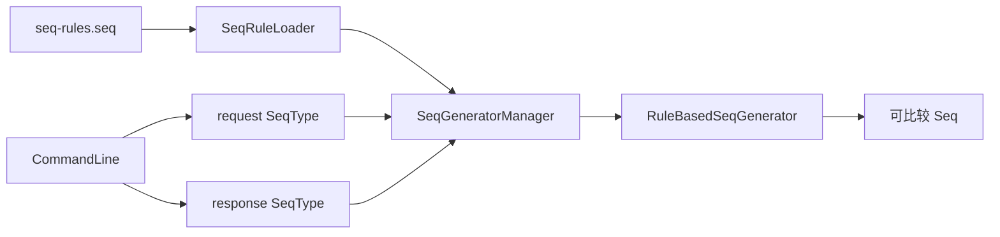
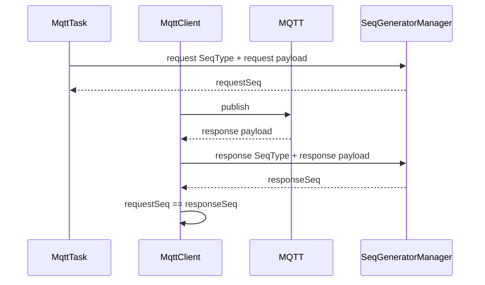

# MQTT 请求/响应 Seq 匹配设计

> 该文件原是早期“设计一个 Seq 策略”的讨论草稿。当前实现已经落地为规则文件 + 生成器，本文件改为实现说明。

## 1. 问题

MQTT/RS485 响应没有统一请求 ID，不同设备协议的请求和响应长度也不同。Client 必须从 payload 中提取一组稳定字段，判断收到的响应是否属于当前 `PendingRequest`。

典型匹配字段包括：

- 设备地址。
- 功能码。
- selfId 或回路号。
- 少数协议特有字段。

校验位、测量值和状态值通常不能作为 Seq，因为请求和响应中不同，或者会随设备状态变化。

## 2. 当前对象



核心类：

- `SeqType`：命名一种请求或响应提取规则。
- `SeqRule`：规则集合。
- `SeqFieldRule`：一个字段如何从 payload 取值。
- `SeqRuleLoader`：加载 `seq-rules.seq`。
- `RuleBasedSeqGenerator`：按规则生成 Seq。
- `SeqGeneratorManager`：按 `SeqType` 查找生成器。

`CommandLine` 为每条指令声明 request/response 两种 SeqType。两者可以从不同位置取字段，但必须生成相同的逻辑标识。

## 3. 匹配流程



只有匹配当前请求的响应才完成 Future。迟到、无关或错误响应不能错误完成新的 PendingRequest。

## 4. 规则设计原则

1. 只选择请求和响应中语义相同的稳定字段。
2. 不包含 checksum。
3. 不包含设备状态或测量数据。
4. 对组合字段明确字节序和长度。
5. 请求/响应规则分别定义，不假设偏移相同。
6. 越界、缺失规则和未知 SeqType 必须快速失败或明确不匹配。
7. 同一网关上能同时存在的设备必须生成不同 Seq。

## 5. 示例

假设开门请求和响应分别为：

```text
request : 01 0A 02 FF 00 00 0D
response: 01 0A 02 FF 0D
```

可以选择地址 `01` 和功能码 `0A 02` 组成 Seq。请求与响应偏移相同只是该协议的偶然特征，不应成为全局假设。

若另一协议把 selfId 放在请求第 4 字节、响应第 6 字节，则为 request/response 分别配置字段偏移，最终标准化为相同 Seq。

## 6. 文件位置

生产规则：

```text
domains/mqtt/api/src/main/resources/seq-rules.seq
domains/mqtt/service/src/main/resources/seq-rules.seq
```

测试可在模块 `src/test/resources` 提供隔离规则。修改时应避免多个副本漂移；长期建议确定单一权威资源并通过测试校验副本 checksum。

## 7. 修改检查

新增或修改 `CommandLine` 时：

1. 明确请求和响应样例。
2. 确认稳定字段。
3. 增加/复用 request/response SeqType。
4. 更新规则文件。
5. 增加正常、错误地址、错误功能码、短 payload 和迟到响应测试。
6. 同步 MQTT Mock。
7. 验证 `MqttTask.convert -> mock response -> MqttClient.match -> MessageHandler.decode`。
