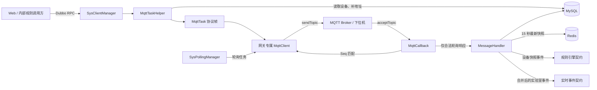

# MQTT 核心设计
本文描述 `domains/mqtt` 当前代码实现的职责、关键链路和边界。它以源码、配置、Mapper 和测试契约为准，不沿用旧文档中的假设。

## 1. 模块定位

MQTT 模块是业务设备模型与 RS485/MQTT 下位机之间的协议网关，负责：

- 管理 RS485 网关和挂载设备的持久化配置；
- 为每个网关维护一个独立 MQTT 客户端及串行任务队列；
- 将业务指令校验、补全设备地址并编码为二进制协议帧；
- 将请求与响应按协议 Seq 关联，向调用方返回同步、异步或批量结果；
- 周期轮询设备，校验并解析响应，保存历史记录和最新快照；
- 发布规则引擎快照事件与面向前端的实验室级实时遥测事件；
- 在 Redis 热数据缺失时从 MySQL 查询设备的最后一条历史记录。

模块不负责 HTTP 路由、登录态生成、规则求值、WebSocket 会话管理或实验室权限模型本身。它只消费用户上下文中的可见实验室集合，并通过明确的 RPC / Redis 事件契约与这些模块协作。

## 2. 代码边界

```text
domains/mqtt/
├── api/                         # 可被其他模块依赖的 RPC DTO、协议枚举、编码与 Seq 规则
│   └── src/main/resources/
│       └── seq-rules.seq        # 请求/响应关联字段定义
├── service/                     # Dubbo provider 与 MQTT 运行时
│   ├── client/                  # 网关、设备、轮询、遥测与任务编排
│   ├── client/mqtt/             # Paho 客户端、回调和协议任务
│   ├── client/message_handler/  # 五类设备响应解码、持久化与事件发布
│   ├── config/                  # mqtt.* 配置绑定
│   └── resources/mapper/        # 网关、设备、最新遥测查询
└── arch.md
```

`mqtt-api` 是编译期契约层，不启动服务；`mqtt-service` 是实际运行的 Dubbo provider。设备及记录对象来自 `device-domain`，MQTT 模块只依赖其模型契约，不接管该模块的领域设计。

## 3. 总体数据流



一个网关同一时刻只处理一个待响应请求。用户任务优先于轮询任务；轮询用于持续采集，而不是控制指令的可靠投递队列。

## 4. 网关客户端生命周期

### 4.1 数据库是期望状态，内存是运行状态

`gateway` 表中未软删除、且 `gateway_type = RS485` 的记录构成期望客户端集合。`ClientsRuntime` 以 `gatewayId -> AbstractSysClient` 的并发 Map 保存进程内实际集合。

`SysClientManager` 启动后由守护线程执行首次重建：

1. 从 MySQL 读取全部 RS485 网关；
2. 为内存中缺失的网关创建 `MqttClient`；
3. 关闭数据库中已不存在的冗余客户端；
4. 首次成功对齐后发布 `GatewayClientsInitialRebuildCompletedEvent`；
5. 此后按 `mqtt.gateway.watchdog-interval-millis` 周期修复漂移。

客户端使用 `gatewayId` 同时作为 MQTT clientId 和运行时索引，订阅网关的 `acceptTopic`，向 `sendTopic` 发布。连接为 clean session，代码关闭 Paho 自动重连，连接和订阅恢复由本模块控制。

### 4.2 写后立即同步

网关 CRUD 不是等待守护线程最终一致：

- 创建成功：数据库事务提交后注册客户端；
- 更新成功：提交后关闭并替换旧客户端，使 Topic 等连接身份立即生效；
- 删除成功：提交后注销并关闭客户端；删除前拒绝仍挂载设备的网关。

使用 `TransactionCallbacks.afterCommit` 的目的，是避免数据库回滚后运行时已提前改变。周期守护线程仍作为连接失败、进程重启和异常漂移的最终修复机制。

### 4.3 断线恢复

`MqttCallback` 对重连与重新订阅采用最多 5 次指数退避（1、2、4、8、16 秒）。连续失败后客户端从运行时集合移除，交给网关守护线程重新创建。`AtomicBoolean` 防止同一客户端并发发起多条重连链路。

需注意：当前客户端采用内存持久化和 clean session，未确认请求不会跨服务重启恢复；系统保证的是运行时自愈，不是消息级 exactly-once。

## 5. 调度与轮询

### 5.1 单网关串行模型

每个 `AbstractSysClient` 启动一个守护 worker，维护两类队列：

- `userQueue`：普通控制/查询请求，FIFO，优先检查；
- `pollQueue`：基于 `DelayQueue` 的周期任务，由 `ActiveQueue` 去重并支持启停。

worker 每次只设置一个 `current` 请求，发送后等待其 Future 完成或超时，结束后才处理下一项。轮询请求结束后重新计算下次执行时间并回填延迟队列。该模型用吞吐量换取了请求响应关联的确定性，也符合一个 RS485 网关下行链路通常应串行访问的约束。

当前普通任务超时固定为 5 秒；轮询间隔、超时由 `mqtt.poll.interval-millis` 与 `mqtt.poll.timeout-millis` 覆盖。代码没有显式队列上限或背压策略，调用量设计应服从单网关串行容量。

### 5.2 轮询期望状态

设备表的 `polling` 字段是轮询期望状态。`SysPollingManager` 为五种设备分别生成其查询指令：门禁、空调、断路器、灯光、传感器。

运行时同步来自三条路径：

- 用户调用 `enable/disable`：先持久化 `polling`，再增删运行时 Poll；
- 设备 CRUD 提交后：依据旧、新设备状态立即迁移或移除 Poll；
- 网关 ready、首次网关重建完成以及周期轮询守护：补齐数据库期望但运行时缺失的 Poll。

轮询守护只补缺失项；关闭轮询和设备删除走主动写路径清理。网关尚未 ready 时，启用操作仍可成功保存期望状态，稍后由 ready 事件或守护线程补齐。

## 6. 指令协议与请求响应关联

### 6.1 从业务 DTO 到二进制帧

`MqttTaskDto` 包含 `commandLine`、业务参数、声明的 `DeviceType` 和 `deviceId`。`MqttTaskHelper` 执行：

1. 从 MySQL 加载真实设备；
2. 校验 DTO 设备类型与真实类型一致；
3. 通过 `MqttCommandPolicy` 校验设备可用指令、参数个数、字节范围和空调控制约束；
4. 按协议自动前置设备 `address`，需要时再前置 `selfId`；
5. 用 `CommandLine` 模板组帧；
6. 按 CRC16、有符号和或无符号和追加校验数据；
7. 将 `gatewayId`、`deviceId`、`laboratoryId` 带入运行时任务。

地址由设备配置提供，调用方不能直接覆盖。当前地址范围在设备写入时约束为：门禁 1–10、断路器 11–30、空调 31–40、灯光 41–60、传感器 61–80；带 `selfId` 的设备还要求其非负。

### 6.2 Seq 匹配

MQTT 响应不携带应用层请求 ID。`MqttClient.matches` 使用 `CommandLine` 声明的请求/响应 `SeqType`，从 `seq-rules.seq` 选取字段字节，生成形如 `address=29|self_id=02` 的关联键。

当前匹配字段为：

| 设备 | 请求与响应关联字段 |
| --- | --- |
| 门禁 | address + 两字节 function_code |
| 空调 | address + self_id |
| 断路器 | address + function_code |
| 灯光 | address + function_code + self_id |
| 传感器 | address + function_code + self_id |

只有网关 ID 相同且 Seq 相等的消息才完成当前 Future。字段越界、规则缺失或生成异常均视为不匹配，不会误完成请求。规则在 `SeqGeneratorManager` 初始化时从 classpath 加载，因此 `api` 和 `service` 中的资源副本必须保持一致。

### 6.3 调用形态

- `syncSend`：等待单任务结果，将超时映射为 504；
- `asyncSend`：返回 Future，但仍受网关内部串行 worker 约束；
- `multiSend`：去重后最多 20 台，先完整校验并准备目标，再按输入顺序逐台同步执行，单台失败形成独立结果；
- `MqttRuleIo.asyncSend`：规则调度线程无登录会话，使用独立 Dubbo group 绕过用户可见范围检查，但仍经过设备存在性和协议校验。

面向用户的发送接口会检查任务的 `laboratoryId` 是否在当前 `UserContext` 可见集合中。该检查依赖上游正确传播用户上下文；本模块不定义用户和实验室授权关系。

## 7. 响应处理与遥测状态

### 7.1 处理准入

MQTT 回调先复制当前请求，再把响应交给客户端完成 Seq 匹配。只有满足以下条件才进入设备记录处理：

- 响应通过当前指令声明的 CRC/和校验；
- 当前请求类型为 `POLL`；
- 对应 `DeviceType` 的 Handler 已注册。

因此，用户控制指令的响应只用于完成 RPC，不会作为设备状态历史落库；设备状态以轮询读取为准。持久化在异步 IO 执行器中完成，不阻塞 MQTT 回调线程。

### 7.2 五类解码器

每类设备有独立 `MessageHandler`：

- 门禁：开关、锁、锁状态、延时；
- 空调：开关、模式、设定温度、风速、室温、错误码；
- 断路器：开关、锁、检修及电压、电流、功率、电量、漏电、温度；
- 灯光：开关与锁；
- 传感器：温度、湿度、光照、烟雾。

解码器生成 `BaseRecord` 子类，并补入设备 ID 与实验室 ID。协议字段布局属于 MQTT 模块；记录对象结构属于 `device-domain` 契约。

### 7.3 一次轮询响应的四个输出

合法记录会产生四个相互独立的输出：

1. 写入对应 MySQL `*_record` 历史表；
2. 写入 Redis Hash `DeviceRecordKeys.recordKey(type, deviceId)`，并设置 15 秒 TTL；
3. 向 `RuleEngineChannels.DEVICE_RECORD_CHANGE` 发布 `DeviceRecordSnapshotEvent` JSON；
4. 经 200ms 默认窗口按 deviceId 合并后，向统一实时事件频道发布实验室受众的 `DEVICE_TELEMETRY_UPDATED`。

规则快照事件只说明设备类型、ID、字段和发生时间；规则模块如何求值不在本文展开。实时事件只声明受众为该记录的 `laboratoryId`；Web 模块如何鉴权、订阅和转发也不属于 MQTT 内部。

Redis/事件发布异常会记录警告，但没有事务将 Redis、事件和 MySQL 写绑定为原子操作。当前设计更强调采集链路持续运行，消费者应把实时事件视为可丢失通知，并通过快照查询恢复状态。

## 8. 快照查询：Redis 热状态与 MySQL 回退

`MqttTelemetryQuery.snapshots` 先用用户上下文收敛实验室范围，再查询范围内设备。对每台设备：

- Redis Hash 存在：返回其字段，`online = true`，时间取 `__occurredAt`；
- Redis Hash 不存在：按设备类型从对应历史表批量查询最后一条记录，`online = false`；
- 两处均无记录：结果中不包含该设备。

Redis TTL 为 15 秒，所以“在线”在这里的精确定义是最近约 15 秒内成功处理过合法轮询响应，而不是 MQTT TCP 连接在线。默认轮询周期为 10 秒、超时 15 秒；调整参数时必须保证 TTL 与采集周期的关系仍符合产品语义。

MySQL 回退使用窗口函数按 `device_id` 分组，以 `create_at DESC, id DESC` 取最新记录，避免逐设备查询。Redis 字符串字段在返回 DTO 前恢复常用布尔/数值类型，并剔除持久化元数据。

## 9. 持久化模型

MQTT 模块直接读写两类配置表和五类记录表：

- `gateway`：只管理 `gateway_type = RS485`，包括名称、实验室集合和收发 Topic；
- `device`：通过 discriminator 恢复五种具体设备模型，包含实验室、网关、轮询、地址及各类型扩展字段；
- `access_record`、`air_condition_record`、`circuit_break_record`、`light_record`、`sensor_record`：轮询历史。

网关和设备删除均为软删除。设备更新禁止改变设备类型；方法参数中的 ID 是资源身份，请求体不能把更新重定向到其他资源。新增实体 ID 由项目公共 UID 基础设施生成，UID 数据源与业务库配置彼此独立。

## 10. 对外契约与跨模块边界

| 契约 | 使用者视角 | MQTT 模块保证 |
| --- | --- | --- |
| `MqttGatewayCRUD` | 管理 RS485 网关 | 校验 Topic、阻止删除仍挂设备的网关、提交后同步客户端 |
| `MqttDeviceCRUD` | 管理五类设备 | 校验具体类型/地址/网关，提交后同步轮询 |
| `MqttIo` | 用户控制与批量控制 | 可见范围检查、协议校验、请求响应关联 |
| `MqttRuleIo` | 规则动作执行 | 独立 group、无用户会话检查，保留设备与协议校验 |
| `MqttPollCo` | 启停采集 | 持久化期望状态并最终对齐运行时 |
| `MqttTelemetryQuery` | 查询实验室设备快照 | 权限范围收敛、Redis 优先、MySQL 回退 |
| Redis 规则事件 | 规则模块输入 | 发布经校验和解码的轮询快照 |
| Redis 实时事件 | Web 实时通道输入 | 发布实验室受众、可合并的设备遥测更新 |

跨模块代码不应直接访问 `ClientsRuntime`、队列、Handler 注册表或 MQTT 表 Mapper；这些都是服务内部实现。新增集成优先扩展 `mqtt-api` 的显式契约。

## 11. 可靠性、并发与已知边界

- **串行隔离**：每个网关独立 worker，单网关故障或慢响应不会直接阻塞其他网关。
- **用户优先**：每轮取任务时先检查用户队列，但已在等待的轮询不会被抢占。
- **响应歧义控制**：同一网关只允许一个 current 请求，Seq 只需区分当前请求；非匹配消息不会完成 Future。
- **运行时自愈**：网关、轮询均以数据库期望状态为依据，由事件快速同步、守护线程兜底。
- **进程内状态**：请求、客户端和 Poll 都不跨实例共享。若部署多个 MQTT provider，多个实例可能以相同 clientId 连接并重复轮询；当前实现更适合单活服务实例，或需要额外的分布式租约/分片后再横向扩展。
- **无持久消息队列**：用户任务与轮询任务只在内存中，重启会丢失；调用方可根据幂等性决定是否重试。
- **弱一致输出**：MySQL、Redis 与两个 Pub/Sub 事件没有统一事务；事件消费者需容忍丢失、重复与乱序。
- **队列容量**：用户队列无界，批量接口虽限制 20 个目标，但高并发仍可能积压；容量治理应以网关数量、轮询数和协议超时为依据。
- **QoS 配置边界**：配置模型暴露 `mqtt.connect.qos`，当前发送和订阅代码未显式使用该值，实际使用 Paho 默认 QoS。变更投递语义前需同时修改客户端调用并补充集成测试。

## 12. 核心配置

| 环境变量 | 默认值 | 作用 |
| --- | --- | --- |
| `MQTT_HOST` / `MQTT_PORT` | `localhost` / `1883` | Broker 地址 |
| `MQTT_USERNAME` / `MQTT_PASSWORD` | 空 | Broker 凭证 |
| `MQTT_POLL_INTERVAL_MILLIS` | `10000` | 单设备轮询间隔 |
| `MQTT_POLL_TIMEOUT_MILLIS` | `15000` | 轮询响应超时 |
| `MQTT_POLL_WATCHDOG_INTERVAL_MILLIS` | `60000` | 轮询期望状态对齐周期 |
| `MQTT_GATEWAY_WATCHDOG_INTERVAL_MILLIS` | `60000` | 网关客户端对齐周期 |
| `MQTT_REALTIME_COALESCE_WINDOW_MILLIS` | `200` | 同设备实时事件合并窗口 |
| `MQTT_DUBBO_PORT` | `50052` | Dubbo Triple provider 端口 |
| `MQTT_SERVER_PORT` | `3333` | 实例端口标识，亦参与 UID worker 身份 |

此外依赖 MySQL、UID 独立数据源、Redis 和 Nacos/Dubbo 注册配置。配置类会把非正的轮询、守护和实时窗口值回退为内建默认值；`application.yaml` 中的部署默认值可能与类内默认值不同，应以最终绑定配置为准。

## 13. 修改指南与测试导航

常见改动应从以下位置进入：

- 新增或修改业务指令：`api/.../CommandLine.java`、`MqttCommandPolicy.java`；
- 修改协议校验：`api/.../checker/`；
- 修改请求响应匹配字段：`api/src/main/resources/seq-rules.seq`，并同步 service 资源副本；
- 新增设备类型采集：设备领域模型、`Poll.of`、对应 `MessageHandler`、持久化 Mapper、最新记录查询需成套变更；
- 修改客户端恢复策略：`SysClientManager`、`MqttCallback`；
- 修改轮询一致性：`SysPollingManager`、`AbstractSysClient`、`ActiveQueue`；
- 修改快照/事件：`MessageHandler`、`RealtimeTelemetryPublisher`、`MqttTelemetryManager`。

现有测试覆盖协议命令策略、Seq 规则加载、请求响应匹配、任务组帧、网关/设备 CRUD 生命周期、可见实验室范围、轮询辅助、五类设备协议解码、Redis 快照与实时事件、Mapper SQL 结构及 UID 数据源隔离。涉及协议、生命周期或持久化的修改，应优先补充对应测试，并在真实 Broker 或下位机 Mock 上验证收发闭环。
