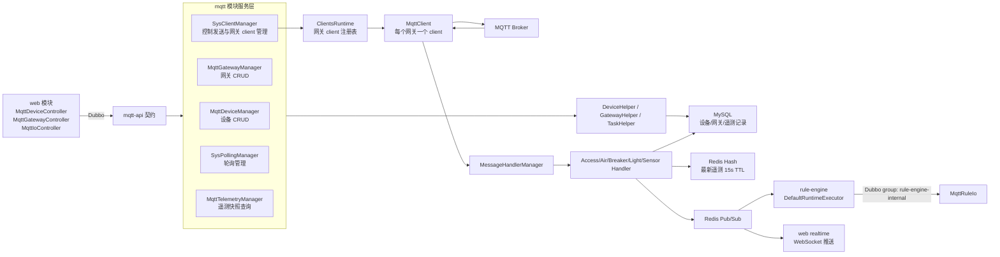
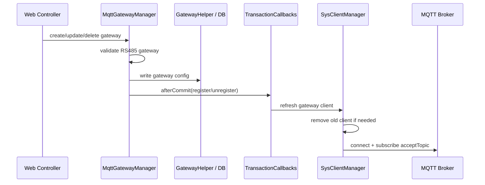
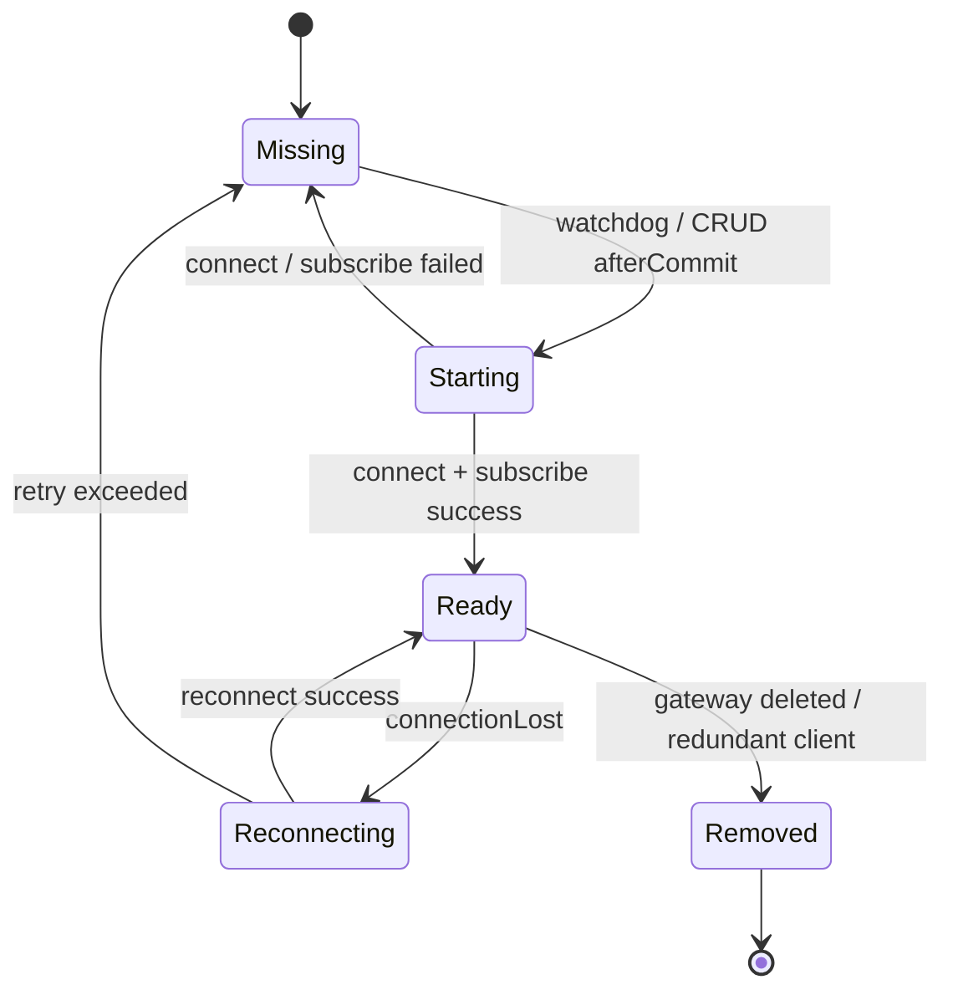
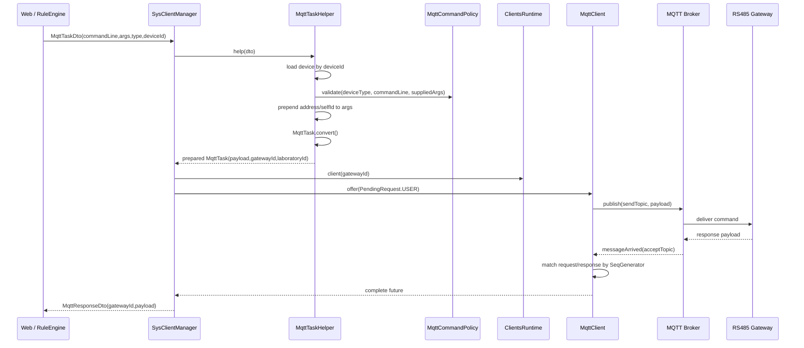
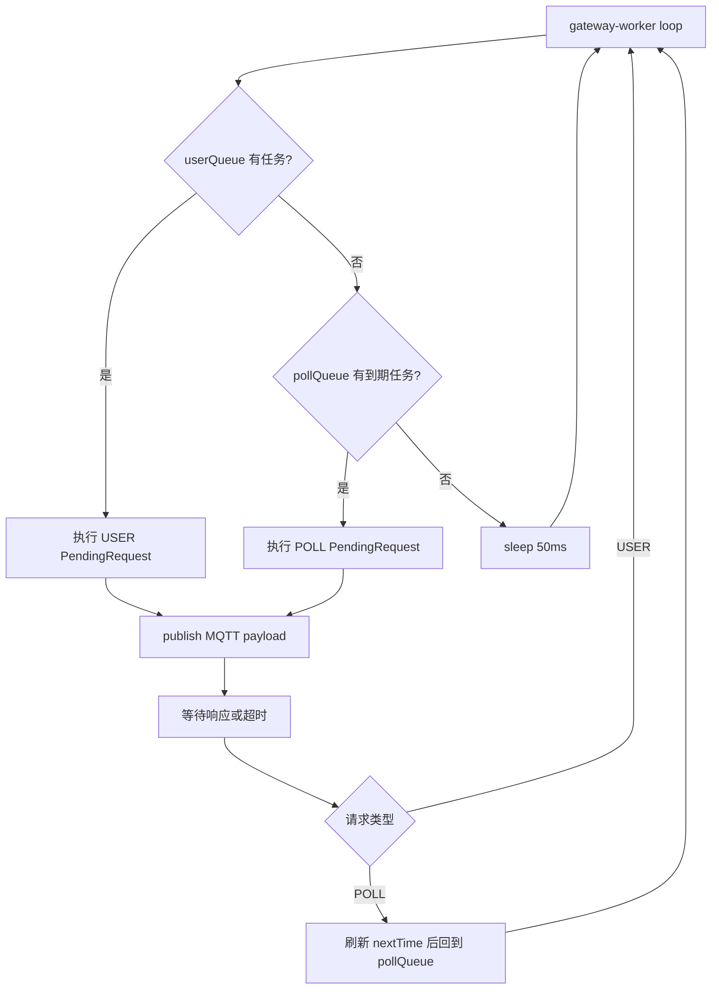
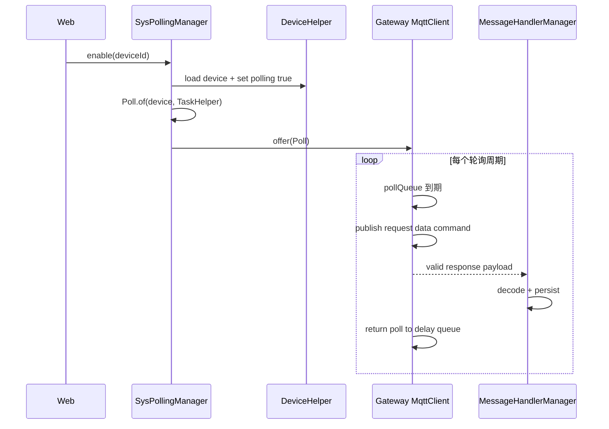
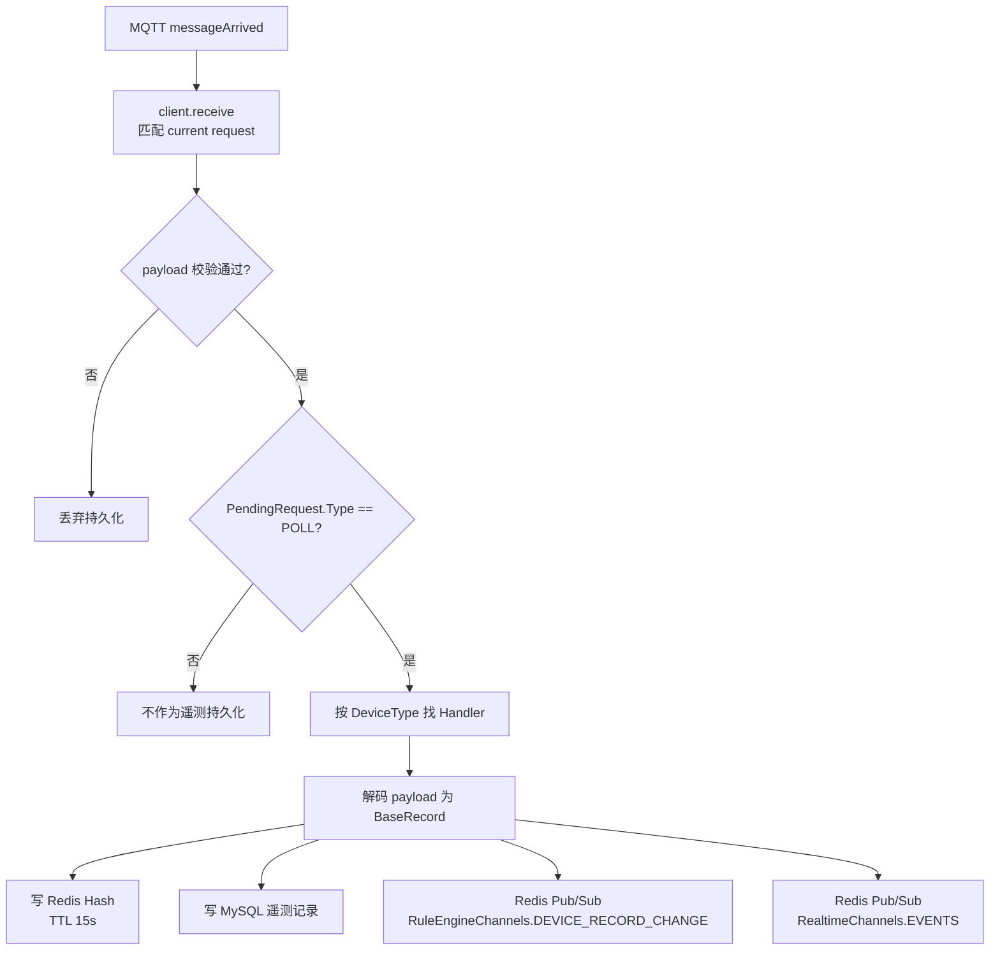
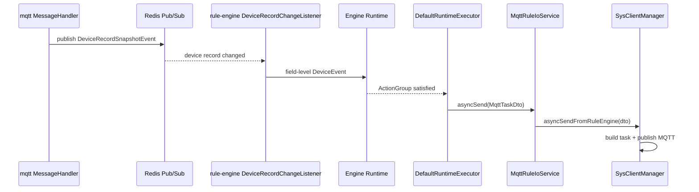

# MQTT 模块架构说明

本文档说明 `lab-system-cloud/domains/mqtt/service` 模块的职责边界、运行时结构、控制链路、轮询链路、遥测持久化链路，以及它和 `domains/mqtt/api`、`domains/device/domain`、`domains/rule/engine`、`web` 模块之间的协作方式。

## 模块定位

`mqtt` 模块是系统和物理设备之间的 MQTT 适配层。它不直接暴露 HTTP 接口，而是以 Dubbo provider 的形式提供能力，HTTP 入口位于 `web` 模块：

- `MqttIo`：面向用户控制的同步、异步、批量设备指令发送。
- `MqttRuleIo`：面向规则引擎的内部异步设备控制通道。
- `MqttDeviceCRUD`：MQTT 设备登记、查询、更新、删除。
- `MqttGatewayCRUD`：RS485 MQTT 网关登记、查询、更新、删除。
- `MqttPollCo`：设备状态轮询启停。
- `MqttTelemetryQuery`：设备最新遥测快照查询。

模块的核心边界是：

- 负责 MQTT broker 连接、topic 订阅、二进制协议封包、响应匹配、轮询调度、遥测解码、遥测落库、Redis 最新状态缓存、WebSocket 实时事件发布、规则引擎设备事件发布。
- 不负责 HTTP session、页面鉴权、前端展示、规则条件推演、规则动作编排。
- 不负责设备实体定义本身；设备模型来自 `device-domain`。
- 不负责命令定义本身；命令枚举和协议策略来自 `mqtt-api`。

## 总体架构



## 包结构与主要类

| 包 | 主要职责 |
| --- | --- |
| `client` | Dubbo 服务实现、网关 client 生命周期、轮询管理、遥测查询 |
| `client.mqtt` | Paho MQTT client 封装、任务封包、回调处理 |
| `client.common` | `PendingRequest`、`Poll` 等队列任务模型 |
| `client.itfc` | 设备、网关、任务 helper 抽象 |
| `client.itfc.impl` | MyBatis mapper 适配、任务构建 |
| `client.message_handler` | 遥测消息解码、持久化、Redis 缓存、事件发布 |
| `client.message_handler.handlers` | 每类设备的二进制 payload 解码器 |
| `config` | MQTT 连接、轮询、实时推送配置 |

## 对外契约

### 设备与网关管理

设备 CRUD 由 `MqttDeviceManager` 实现，网关 CRUD 由 `MqttGatewayManager` 实现。它们共同维护数据库配置与运行时状态的一致性。

设备创建和更新时会校验：

- `deviceType` 必须存在。
- `gatewayId` 必须指向已存在的 MQTT 网关。
- `deviceName` 不能为空。
- Java 实体类型必须和 `deviceType` 匹配，例如 `DeviceType.AirCondition` 必须对应 `AirCondition` 实体。
- 地址必须落入当前约定范围：
  - 门禁：1-10
  - 断路器：11-30
  - 空调：31-40
  - 灯光：41-60
  - 传感器：61-80
- 带 `SelfId` 的设备，`selfId` 不能为负数。

网关当前只实现 `RS485Gateway`：

- 创建、更新时强制设置 `gatewayType = RS485`。
- `sendTopic` 和 `acceptTopic` 必填。
- 删除网关前要求该网关下没有设备。
- 创建、更新、删除成功后在事务提交后同步运行时 client。



### 用户控制接口 `MqttIo`

`SysClientManager` 实现 `MqttIo`：

- `syncSend(MqttTaskDto)`：发送单个控制任务，阻塞等待设备响应，默认用户任务超时 5 秒。
- `asyncSend(MqttTaskDto)`：发送单个控制任务，返回 `CompletableFuture`。
- `multiSend(MqttMultiTaskDto)`：批量发送，同一批最多 20 台设备，逐个构造任务并返回每台设备的成功/失败结果。

面向用户的 `syncSend`、`asyncSend`、`multiSend` 都会通过 `VisibleLaboratoryScope` 校验当前用户是否能访问设备所属实验室。规则引擎内部调用使用 `MqttRuleIo`，不继承 Web 登录用户，因此由独立 Dubbo group 暴露，跳过当前用户实验室可见性校验。

### 规则引擎内部控制接口 `MqttRuleIo`

`RuleMqttIoService` 只提供 `asyncSend(MqttTaskDto)`，底层调用 `SysClientManager.asyncSendFromRuleEngine`。

这条链路的设计目的：

- 规则动作由系统调度线程触发，没有当前 Web 用户上下文。
- 避免规则引擎误用面向用户的 `MqttIo` provider。
- 控制动作仍复用同一套任务构建、MQTT client、payload 校验和响应匹配逻辑。

## MQTT 运行时模型

### 每个网关一个 client

`SysClientManager` 使用 `ClientsRuntime` 维护 `gatewayId -> AbstractSysClient` 的运行时注册表。每个 RS485 网关对应一个 Paho `MqttClient`：

- clientId 使用 `gatewayId`。
- publish topic 来自网关的 `sendTopic`。
- subscribe topic 来自网关的 `acceptTopic`。
- 收到连接完成回调后订阅 `acceptTopic`。
- 连接丢失时执行指数退避重连；超过重试次数后移出注册表，交由 watchdog 重新拉起。



### 看门狗

`SysClientManager` 启动后先执行 `initialRebuild`：

1. 从数据库读取全部 RS485 网关。
2. 为缺失的网关启动 MQTT client。
3. 移除数据库中已不存在的多余 client。
4. 发布 `GatewayClientsInitialRebuildCompletedEvent`。

初始化完成后进入周期 watchdog，默认间隔来自 `mqtt.gateway.watchdog-interval-millis`。CRUD 写路径会主动刷新运行时，watchdog 主要用于连接异常、进程状态漂移后的最终修复。

## 指令发送链路



### `args` 的真实含义

`MqttTaskDto.args` 不是完整协议参数。它只表示调用方需要提供的业务控制参数。

`MqttTaskHelper` 会从设备实体中自动补齐协议前置参数：

1. 如果设备实现 `Address`，先追加设备地址。
2. 如果设备实现 `SelfId`，再追加内机编号或通道编号。
3. 最后追加调用方传入的 `args`。

例如空调增强控制 `ENHANCE_CONTROL_AIR_CONDITION` 的 command 模板为：

```text
{0} {1} {2} {3} {4} {5} FF FF FF
```

其中：

- `{0}` 由设备地址补齐。
- `{1}` 由空调 `selfId` 补齐。
- `{2}` 到 `{5}` 才来自外部传入的 4 个控制参数。

这意味着前端、Web Controller、规则引擎都不应该手动传设备地址和内机编号。它们只传用户真正选择的控制参数。

### 指令策略

`MqttCommandPolicy` 负责在发送前校验：

- 指令是否支持当前设备类型。
- 调用方参数数量是否正确。
- 参数是否在 0-255。
- 空调增强控制的特殊限制：
  - 开关：`0`、`1`、`255`。
  - 模式：`1` 制热、`2` 制冷、`4` 送风、`8` 除湿、`255` 保持。
  - 温度：16-30 或 `255` 保持。
  - 风速：`0` 自动、`1` 低、`2` 中、`3` 高、`255` 保持。
  - 不能四个参数全为 `255`。

### payload 生成与响应匹配

`MqttTask.convert()` 使用 `CommandLine.Command` 的模板和 check type 生成最终二进制 payload：

- `CRC16`：用于断路器 Modbus 风格指令。
- `SIGN_SUM`：有符号和校验。
- `UNSIGN_SUM`：无符号和校验。

响应匹配由 `MqttClient.matches` 完成：

1. gatewayId 必须一致。
2. 请求和响应分别使用 `CommandLine.reqSeq`、`CommandLine.respSeq` 找到 `SeqGenerator`。
3. 从请求 payload 和响应 payload 生成序列号。
4. 序列号一致则认为响应属于当前请求。

这个设计避免仅按 topic 或命令类型粗略匹配，适合单网关串行请求模型。

## 队列模型

`AbstractSysClient` 内部维护两类队列：

- `userQueue`：用户主动控制请求，优先级最高。
- `pollQueue`：设备状态轮询任务，基于 `DelayQueue` 到期执行。

worker 线程循环逻辑：

1. 优先取 `userQueue`。
2. 用户队列为空时取到期的 `pollQueue`。
3. 执行请求，设置 `current`。
4. publish payload。
5. 等待响应 future 完成或超时。
6. 如果是轮询任务，执行完成后重新放回延迟队列。



这个模型保证同一网关下的请求串行执行，避免 RS485 总线场景中多条请求同时在途造成响应归属混乱。

## 轮询链路

轮询由 `SysPollingManager` 管理，提供 `enable(deviceId)` 和 `disable(deviceId)`。

开启轮询时：

1. 查询设备。
2. 根据设备类型构造对应的请求数据指令：
   - 门禁：`REQUEST_ACCESS_DATA`
   - 空调：`REQUEST_AIR_CONDITION_DATA_RS485`
   - 断路器：`REQUEST_CIRCUITBREAK_DATA`
   - 灯光：`REQUEST_LIGHT_DATA`
   - 传感器：`REQUEST_SENSOR_DATA`
3. 更新设备 `polling = true`。
4. 如果网关 client 已 ready，将 `Poll<MqttTask>` 放入该 client 的 `pollQueue`。
5. 如果网关 client 未 ready，只保存启用状态，后续由 ready 事件或 watchdog 补齐。

运行时同步来源有三类：

- 设备 CRUD 成功后调用 `synchronizeRuntime(previous, current)`。
- 网关 client ready 时监听 `GatewayClientReadyEvent`。
- 首次网关 client 重建完成后监听 `GatewayClientsInitialRebuildCompletedEvent`，随后启动轮询 watchdog。



## 遥测处理链路

设备响应进入 `MqttCallback.messageArrived` 后分两步处理：

1. 先调用 `client.receive(new Task(...))`，用于完成当前请求的 future。
2. 如果 payload 校验通过，则异步调用 `MessageHandlerManager.persist(task, payload)`。

`MessageHandlerManager` 当前只持久化 `POLL` 类型请求的响应。用户主动控制响应不会被当作遥测记录落库。



### 每类设备解码字段

| 设备类型 | Handler | 主要字段 |
| --- | --- | --- |
| 门禁 | `AccessMessageHandler` | `address`、`opened`、`locked`、`lockStatus`、`delayTime` |
| 空调 | `AirConditionMessageHandler` | `address`、`selfId`、`opened`、`mode`、`temperature`、`speed`、`roomTemperature`、`errorCode` |
| 断路器 | `CircuitBreakMessageHandler` | `address`、`opened`、`locked`、`fixed`、`leakage`、`temperature`、`voltage`、`current`、`power`、`energy` |
| 灯光 | `LightMessageHandler` | `address`、`selfId`、`opened`、`locked` |
| 传感器 | `SensorMessageHandler` | `address`、`selfId`、`temperature`、`humidity`、`light`、`smoke` |

### Redis 最新值与数据库回退

`MqttTelemetryManager.snapshots(laboratoryIds)` 用于查询最新遥测：

1. 先根据实验室可见范围查设备。
2. 使用 `DeviceRecordKeys.recordKey(deviceType, deviceId)` 批量读 Redis Hash。
3. Redis 有值时直接返回，并标记 `online = true`。
4. Redis 无值时按设备类型查询数据库最后一条记录作为回退，并标记 `online = false`。

Redis Hash 额外保存 `__occurredAt`，用于表示遥测发生时间。Hash TTL 当前为 15 秒，也被用作在线状态判断依据。

### 实时推送

`RealtimeTelemetryPublisher` 对设备实时事件做短窗口合并，默认合并窗口来自 `mqtt.realtime.coalesce-window-millis`，当前默认 200ms。

发布的实时消息：

- channel：`RealtimeChannels.EVENTS`
- audience：`LABORATORY`
- resource：`device`
- event type：`DEVICE_TELEMETRY_UPDATED`
- source：`mqtt`

这样 WebSocket 层可以按实验室范围路由给前端。

## 和规则引擎的协作

MQTT 模块向规则引擎提供两类能力：

1. 遥测变化事件：`MessageHandler.publishSnapshot` 发布 `DeviceRecordSnapshotEvent` 到 Redis channel `RuleEngineChannels.DEVICE_RECORD_CHANGE`。
2. 控制动作执行：`RuleMqttIoService` 通过内部 Dubbo group 接收规则引擎发来的 `MqttTaskDto`。



## 配置项

主要配置位于 `domains/mqtt/service/src/main/resources/application.yaml`：

| 配置 | 含义 |
| --- | --- |
| `mqtt.connect.url` | MQTT broker 地址 |
| `mqtt.connect.username` / `password` | broker 认证 |
| `mqtt.poll.interval-millis` | 设备轮询间隔 |
| `mqtt.poll.timeout-millis` | 单次轮询等待响应超时 |
| `mqtt.poll.watchdog-interval-millis` | 轮询运行时自修复检查间隔 |
| `mqtt.gateway.watchdog-interval-millis` | 网关 client 自修复检查间隔 |
| `mqtt.realtime.coalesce-window-millis` | WebSocket 遥测推送合并窗口 |

模块还依赖：

- MySQL：设备、网关、遥测记录。
- Redis：最新遥测缓存、规则引擎事件、实时事件。
- Nacos + Dubbo：RPC provider 注册与发现。
- Paho MQTT：broker 连接与 topic 收发。

## 失败处理与一致性

### 数据库事务与运行时同步

设备和网关 CRUD 都通过 `TransactionCallbacks.afterCommit` 在事务提交后更新运行时。这样可以避免数据库回滚但 MQTT client 或轮询状态已经变化。

### 网关 client 失败

- 启动失败：watchdog 下个周期重试。
- 连接丢失：`MqttCallback` 指数退避重连。
- 重连超过次数：从 `ClientsRuntime` 移除，watchdog 重新按数据库配置拉起。
- 网关配置变更：事务提交后关闭旧 client，启动新 client。

### 轮询状态漂移

轮询状态以数据库设备 `polling` 字段为准，运行时队列是派生状态。`SysPollingManager` 会在网关 ready、初始化完成、周期 watchdog 中重新对齐。

### 控制超时

用户控制请求默认 `PendingRequest.USER` 超时 5 秒。同步接口会转换为业务异常 `mqtt request timed out`，异步接口通过 future 传播。

## 扩展点

### 新增设备类型

通常需要同时改动：

1. `device-domain`：新增设备实体和记录实体。
2. `mqtt-api`：新增 `CommandLine`，并在 `MqttCommandPolicy.commandsFor` 和参数校验中登记。
3. `mqtt`：
   - `MqttDeviceManager.matchesConcreteType`
   - `validateAddress`
   - `Poll.of`
   - 新增 `MessageHandler` 实现并注册
   - `MqttTelemetryManager.loadDatabaseFallbacks`
   - MyBatis mapper 和 XML
4. 前端命令目录、设备卡片字段目录。

### 新增指令

通常需要改：

1. `CommandLine`：定义模板、校验类型、请求响应序列号规则、中文描述。
2. `MqttCommandPolicy`：声明支持的设备类型、参数数量和参数范围。
3. 前端 `commandCatalog`：补充可视化参数输入。

### 新增网关类型

当前 `MqttGatewayManager` 只支持 `RS485Gateway`。如果要支持 socket gateway，需要新增 gateway CRUD 契约或扩展现有契约，并决定：

- 是否仍是每个网关一个 MQTT client。
- topic 字段是否相同。
- payload 编码和响应匹配是否复用现有 `CommandLine`。
- 运行时注册表是否继续以 `gatewayId` 为 key。

## 当前已知边界

- 只处理 MQTT RS485 网关，socket gateway 暂未接入。
- 遥测持久化只处理轮询响应，普通用户控制响应不会作为设备状态写入。
- 同一网关内部请求串行执行，适合 RS485 响应匹配，但也意味着单网关吞吐受限于设备响应速度和轮询数量。
- Redis 最新值 TTL 为 15 秒，在线状态和最近值 freshness 强绑定。
- `MqttRuleIo` 跳过当前用户可见范围校验，依赖策略配置入口的授权和策略本身的可信性。
