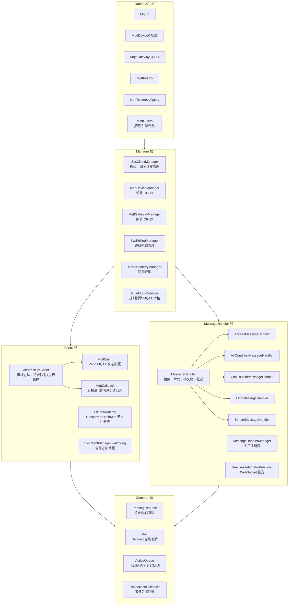

# MQTT 模块 CR 指南 — Code Review Guide

> 模块定位：实验室物联网设备通信的**核心通道**，负责 MQTT Broker 连接、设备指令下发/轮询、设备消息解码持久化、遥测数据查询。

---

## 一、模块架构总览



---

## 二、核心数据流

### 2.1 用户指令下发（同步/异步）

```
用户请求 → MqttIo.syncSend/asyncSend
         → SysClientManager
         → TaskHelper.help(dto) 构建 MqttTask
         → ClientsRuntime.client(gatewayId) 获取 AbstractSysClient
         → client.offer(PendingRequest) 入队
         → AbstractSysClient.loop() 消费队列
         → MqttClient.send() → publish(sendTopic, payload)
         → MqttCallback.messageArrived() → client.receive() 匹配响应
         → CompletableFuture 完成 → 返回 MqttResponseDto
```

### 2.2 设备轮询（Polling）

```
SysPollingManager.enable(deviceId)
  → Poll.of(device) 创建轮询任务
  → client.offer(poll) 入 ActiveQueue
  → AbstractSysClient.next() 按 DelayQueue 排序到期 Poll
  → 发送请求 → 接收响应 → 回调 current Future
  → Poll 自动回队 (returnToQueue)
  → 响应消息 → MessageHandlerManager.persist() → 解码+落库+Redis+推送

看门狗:
  SysPollingManager.watchdog
  → 对比 DB 中 polling=true 的设备 vs client.pollSnapshot()
  → 补充缺失 Poll
```

### 2.3 消息生命周期（设备数据上报）

```
MqttCallback.messageArrived()
  → 1. client.receive() 消解 current Future（匹配请求响应）
  → 2. MessageHandlerManager.persist() 后置处理
       → MessageHandler.decode() 字节码解码
       → jedis.hsetex() 写入 Redis（15s TTL 作为在线判定）
       → redis.publish() 推送 DeviceRecordSnapshotEvent 到规则引擎
       → persistent.persist() 写入 MySQL
       → RealtimeTelemetryPublisher 推送 WebSocket 客户端
```

---

## 三、CR Checklist

### □ 3.1 架构与设计

- [ ] **分层职责**：Manager 层是否只做编排不包含业务逻辑？MQTT 连接细节是否全部封装在 `MqttClient`/`MqttCallback` 中？
- [ ] **Dubbo 接口粒度**：`MqttIo`、`MqttDeviceCRUD`、`MqttGatewayCRUD`、`MqttPollCo`、`MqttTelemetryQuery` 职责是否单一？是否有多余的接口定义？
- [ ] **规则引擎桥接**：`RuleMqttIoService` 是否正确使用了 `MqttRuleIo.DUBBO_GROUP` 做服务分组隔离？回退逻辑是否完善？
- [ ] **依赖方向**：`mqtt` 模块是否只依赖 `mqtt-api`（RPC 契约 + 协议编解码）和 `common` 模块，没有反向依赖？

### □ 3.2 AbstractSysClient 模板方法

- [ ] **线程安全**：`loop()` 单线程消费，`userQueue` 和 `pollQueue` 的优先级是否合理（用户请求优先于轮询）？
- [ ] **竞态条件**：`current` 字段在 `execute()` 前后赋值，`receive()` 读取 `current` 与 `execute()` 之间是否存在 `current` 被篡改的窗口？
- [ ] **Future 超时处理**：`execute()` 中 `get(timeout)` 超时后是否必然调用 `completeExceptionally`？`onTimeout` 钩子是否被正确实现？
- [ ] **Poll 回队机制**：`Poll` 被 `execute()` 消费后，在 `finally` 块中 `returnToQueue`，如果 `send()` 抛异常是否会丢 Poll？
- [ ] **克隆安全**：`current()` 返回 `clone()`，`PendingRequest.clone()` 是否深度复制了 `request` 和 `future`？浅克隆可能导致共享 `CompletableFuture`。

### □ 3.3 SysClientManager（网关连接管理器）

- [ ] **Watchdog 自愈**：`watchdog` 线程启动时是否做了 `initialRebuild`？重试机制是否有指数退避？
- [ ] **并发安全**：`rebuildClients()` 在 `synchronized (ClientsRuntime.class)` 保护下执行，是否会阻塞其他 `register/remove` 操作？
- [ ] **优雅关闭**：`@PreDestroy stopWatchdog()` 是否确保所有 client 的 `disconnect()` 和 `close()` 被调用？
- [ ] **连接泄漏**：`start()` 中如果 `register(client)` 后 `ClientsRuntime.client(gatewayId) != client`（已有旧实例），是否调用了 `close(client)`？
- [ ] **MQTT 配置**：`MqttConnectOptions` 设定了 `setCleanSession(true)` 和 `setAutomaticReconnect(false)`，是否合理？手动重连是否由 `MqttCallback` 接管？

### □ 3.4 MqttCallback（连接回调）

- [ ] **指数退避重连**：`reconnectWithBackoff()` 和 `subscribeWithBackoff()` 是否正确实现了 `1s, 2s, 4s, 8s, 16s` 的退避？
- [ ] **重连超限兜底**：`MAX_RETRY_TIMES(5)` 次失败后，是否从 `ClientsRuntime` 移除自己，交由 `SysClientManager.watchdog` 重新拉起？
- [ ] **重入保护**：`connectionLost()` 中 `reconnecting.compareAndSet(false, true)` 是否有效防止了并发重连？
- [ ] **消息到达顺序**：`messageArrived()` 中先 `receive()` 消解 current Future，再 `persist()` 落库，如果 `receive()` 改变了 `current`，`persist()` 读取的 `task.clone()` 是否安全？

### □ 3.5 MqttTask 与协议编解码

- [ ] **指令构建**：`Explainer.explain()` 中 `MessageFormat.format(commandLine, args)` 是否正确处理了参数占位符？
- [ ] **校验码**：`checker()` 和 `verifier()` 是否覆盖了 `CRC16`、`SIGN_SUM`、`UNSIGN_SUM` 三种校验类型？`CrcChecker` 和 `SumChecker` 是否有充分的单元测试？
- [ ] **匹配逻辑**：`MqttClient.matches()` 使用 `SeqGenerator` 从 payload 中提取序列号匹配，如果 `reqGenerator` 或 `respGenerator` 为 null 是否回了 false？
- [ ] **equals/hashCode**：`MqttTask.equals()` 是否仅基于 `gatewayId + type + deviceId + commandLine` 判断相等？`Poll` 的 `equals` 是否依赖 `MqttTask.equals`？

### □ 3.6 SysPollingManager（轮询管理）

- [ ] **运行时同步**：`synchronizeRuntime()` 在设备 CRUD 事务提交后执行，是否保证了 `registerRuntime` 或 `unregisterRuntime` 的原子性？
- [ ] **Watchdog 启动时机**：`startWatchdog()` 在 `GatewayClientsInitialRebuildCompletedEvent` 后启动，是否确保只启动一次（`Thread.State.NEW` 检查）？
- [ ] **Poll 补充逻辑**：`syncRuntimeForGateways()` 中对比 `targetPolls` 和 `activePolls` 的差集，如果 `Poll.equals()` 语义有误会导致重复注册或遗漏。
- [ ] **配置一致性**：`pollOf()` 中 `changeInterval` 和 `changeTimeout` 是否从 `MqttOptions` 读取？默认值是否合理？

### □ 3.7 MessageHandler 家族

- [ ] **解码鲁棒性**：每种设备类型的 `decode(byte[] payload)` 是否正确处理了 payload 为空、长度不足、校验失败等异常情况？
- [ ] **Redis 写入**：`hsetex()` 设置了 15s TTL，如果消息频率低于 15s，设备是否会被误判为离线？
- [ ] **事件推送**：`publishSnapshot()` 中 `redis.publish()` 失败是否只会 warn 不会中断主流程？
- [ ] **持久化空闲检测**：`persist()` 是否存在高频写入场景（如传感器每秒上报）？MySQL 批量 insert 或缓冲区是否必要？
- [ ] **Handler 注册**：`MessageHandlerManager.register()` 是否在 Spring 启动时完成？是否有 `@PostConstruct` 确保所有 handler 注册后再接收消息？

### □ 3.8 MqttDeviceManager / MqttGatewayManager（CRUD）

- [ ] **设备地址校验**：`validateAddress()` 中 5 种设备类型的 address 范围（1-10, 11-30, 31-40, 41-60, 61-80）是否与实际硬件一致？
- [ ] **事务后置**：`TransactionCallbacks.afterCommit()` 确保事务提交后才通知 `SysPollingManager` 和 `SysClientManager`，但如果事务回滚，回调是否已注册？
- [ ] **可见性校验**：`VisibleLaboratoryScope` 是否正确过滤了用户不可见的实验室设备？
- [ ] **批量控制上限**：`multiSend()` 中 `MAX_MULTI_TARGETS = 20`，是否在文档中有明确说明？

### □ 3.9 MqttTelemetryManager（遥测查询）

- [ ] **Redis + DB 二级缓存**：`snapshots()` 先查 Redis（hgetAllBatch），缺失时回退到 MySQL `latestRecordMapper`，Redis 中没有数据时是否全部回退到 DB？
- [ ] **字段类型转换**：`typedTelemetryFields()` 中将 `opened/locked/fixed` 转为 boolean，`mode/speed` 保留 string，其余尝试 double，是否可能丢失精度？
- [ ] **实验室可见性**：`visibleLaboratoryScope.resolve(laboratoryIds)` 返回空时是否直接返回空列表？

### □ 3.10 工具与辅助类

- [ ] **ActiveQueue**：`ActiveQueue` 内部使用 `ConcurrentHashMap.newKeySet()` 作为活跃集 + `DelayQueue` 作为延迟队列，`offer/remove/poll/returnToQueue` 操作是否线程安全？
- [ ] **Poll 的 Delay 实现**：`Poll.getDelay()` 返回 `nextTime - System.currentTimeMillis()`，`compareTo()` 按 `nextTime` 升序，`DelayQueue` 是否按此排序正确工作？
- [ ] **PendingRequest 克隆**：`clone()` 不复制 `future`，而是创建新的 `CompletableFuture`，这与 `current()` 的设计意图是否一致？

### □ 3.11 可观测性

- [ ] **日志**：关键路径（client 注册/移除、watchdog 触发、消息到达、超时）是否有 `log.info/warn`？
- [ ] **Trace 注解**：`SysClientManager`、`MqttDeviceManager`、`MqttGatewayManager`、`SysPollingManager`、`MqttTelemetryManager`、`RuleMqttIoService` 是否都标注了 `@Traced`？
- [ ] **异常处理**：`syncSend()` 中 `InterruptedException`、`TimeoutException`、`ExecutionException` 是否被恰当转换为 `BusinessException` 并返回给调用方？

---

## 四、关键设计决策

### 4.1 为什么用 watchdog 而不是 Paho 自动重连？

- Paho 的 `setAutomaticReconnect(true)` 行为不可控，无法在网关被删除后主动断开。
- Watchdog 模式由 `SysClientManager` 统一管理网关生命周期，与 `RS485Gateway` 数据库记录保持一致。
- 断线重连由 `MqttCallback` 先尝试 5 次指数退避，失败后交给 watchdog 兜底。

### 4.2 为什么 Polling 用 ActiveQueue + DelayQueue？

- `DelayQueue` 天然支持按到期时间排序，适合轮询定时触发。
- `ActiveQueue` 封装了活跃集（ConcurrentHashMap.newKeySet）和延迟队列，支持 `offer/remove/poll/returnToQueue` 完整生命周期。
- 相比 `ScheduledExecutorService.scheduleAtFixedRate`，`ActiveQueue` 避免了任务爆炸和固定间隔无法动态调整的问题。

### 4.3 为什么消息持久化放在 Poll 响应后而不在 messageArrived 入口？

- `messageArrived()` 同时处理两类消息：**用户指令的响应**（需要消解 current Future）和 **Poll 轮询响应**（需要持久化）。
- 仅对 `Poll` 类型的 `PendingRequest` 执行持久化，通过 `MessageHandlerManager.persist()` 中的 `task.getType() == POLL` 过滤。

### 4.4 为什么 Redis 设置 15s TTL？

- 15s 是设备在线状态的判定窗口：若 Redis 中该设备的 record key 过期，则判定为离线。
- 配合轮询间隔（默认 2s），15s 能在 7-8 次连续轮询失败后标记离线，避免误判。

---

## 五、典型 BUG 场景

| 场景 | 可能原因 | 检查点 |
|------|---------|--------|
| 指令下发后无响应超时 | `MqttClient.matches()` 返回 false，响应无法匹配请求 | SeqGenerator 配置、payload 校验码 |
| 设备状态长时间不更新 | `Poll` 未在 `ActiveQueue` 中或 `watchdog` 未补充 | `syncRuntimeForGateways` 日志 |
| 网关重启后 client 重复创建 | `ClientsRuntime` 未正确清理旧实例 | `start()` 中 `get() == client` 判断 |
| 消息丢失或乱序 | `messageArrived` 中 `current` 被并发修改 | `clone()` 深度复制 |
| 数据库写入暴涨 | 传感器高频上报触发 `persist()` 无缓冲 | 考虑批量 insert 或缓冲区 |

---

## 六、测试覆盖

- [ ] `MqttClientMatchTests` — 请求/响应匹配逻辑
- [ ] `MqttClientSendIT` — 集成测试（需 MQTT Broker）
- [ ] `MqttDeviceManagerTests` — 设备 CRUD 边界
- [ ] `MqttGatewayManagerTests` — 网关 CRUD 边界
- [ ] `MqttTelemetryManagerTests` — 遥测查询 Redis/DB 回退
- [ ] `MqttTaskTest` — 指令构建与校验码生成
- [ ] `RuleMqttIoServiceTests` — 规则引擎调用链路
- [ ] `VisibleLaboratoryScopeTests` — 可见性过滤
- [ ] `DeviceProtocolContractTests` — 协议解码契约测试
- [ ] `MessageHandlerSnapshotPublishTests` — 快照推送测试
- [ ] `RealtimeTelemetryPublisherTests` — 实时推送测试
- [ ] `MqttMapperXmlTests` — MyBatis 映射测试

---

> **CR 原则**：先读接口契约（mqtt-api），再看 Manager 编排，最后深入 AbstractSysClient 和 MessageHandler 实现细节。