# Rule Engine 模块架构说明

本文档说明 `lab-system-cloud/domains/rule/engine` 模块的职责边界、规则模型、编译流程、事件路由、运行时调度、时间条件、动作执行、持久化恢复，以及它和 `domains/mqtt/service` 模块之间的协作方式。

## 模块定位

`rule-engine` 是智能策略运行时。它负责把用户保存的 `RuntimeRevision` 编译成内存中的 `Runtime`，监听设备遥测变化和时间事件，在条件满足时执行动作。

模块对外以 Dubbo provider 暴露 `SmartStrategyService`，HTTP 入口位于 `web` 模块的 `SmartStrategyController`。

模块的核心边界是：

- 负责策略版本持久化、启停、编译、恢复、生命周期管理、事件路由、条件推演、动作调度。
- 负责监听 MQTT 模块发布的设备遥测快照事件。
- 负责调用 MQTT 内部 RPC 执行控制动作。
- 不直接连接 MQTT broker。
- 不直接解码设备二进制 payload。
- 不提供通知通道投递能力；`ReportAction` 当前只记录日志并返回 `NOT_IMPLEMENTED`。
- 不负责前端动态表单；前端最终需要序列化成 `rule-api` 中的 `RuntimeRevision`。

## 总体架构

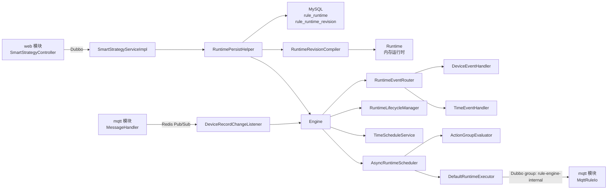

## 包结构与主要类

| 包 | 主要职责 |
| --- | --- |
| `service` | `SmartStrategyService` 的 Dubbo 实现 |
| `definition` | `RuntimeRevision` 编译成 `Runtime` |
| `definition.persistence` | 策略 metadata、不可变 revision、启动恢复 |
| `runtime` | Runtime 生命周期、调度器、执行器、运行时状态 |
| `event` | 设备事件、时间事件、事件路由 |
| `eval` | 设备条件表达式、字段类型解析和值比较 |
| `time` | 时间条件、时间窗口、时间点、日历约束、调度 |
| `action` | ActionGroup、ControlAction、ReportAction、执行结果 |
| `listener` | Redis 设备遥测快照监听与事件重放 |
| `authorization` | 智能策略相关权限配置 |

## 规则定义模型

规则配置的共享模型位于 `rule-api`：

```java
RuntimeRevision(
    runtimeId,
    enabled,
    activeFrom,
    activeUntil,
    deviceConditionGroups,
    timeConditionGroups,
    actionGroups
)
```

`RuntimeRevision` 是 Web 表单、Dubbo 契约、持久化 JSON 和编译器共享的不可变规则版本。

核心语义：

- `runtimeId`：策略运行时 ID，也是持久化主身份。
- `enabled`：是否启用；未传时默认为 `true`。
- `activeFrom` / `activeUntil`：策略生命周期，开始包含、结束不包含。
- `deviceConditionGroups`：设备条件组。
- `timeConditionGroups`：时间条件组。
- `actionGroups`：动作组，每个动作组引用一个设备条件组和一个时间条件组。

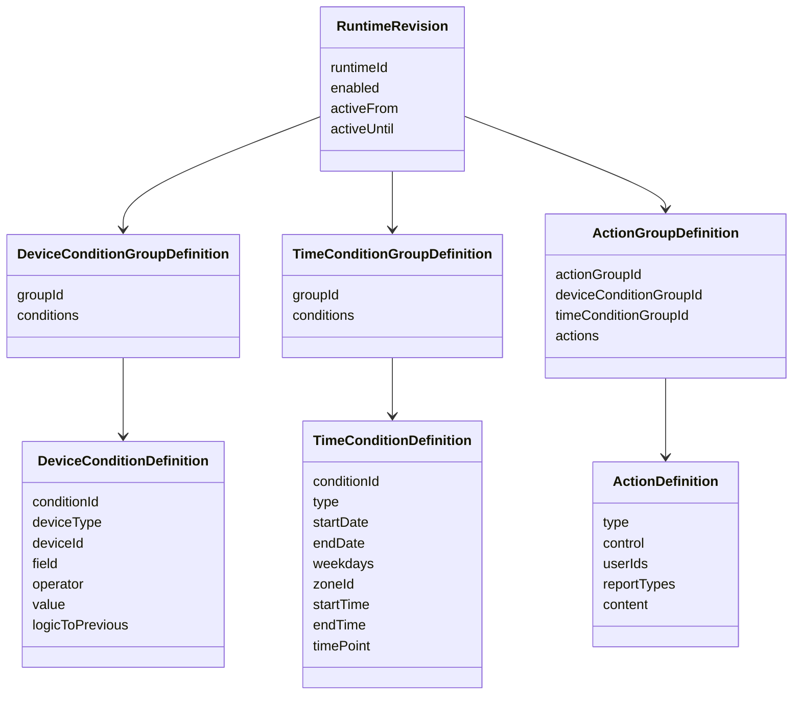

## 编译流程

`RuntimeRevisionCompiler` 把可持久化的 `RuntimeRevision` 转换为可执行的 `Runtime`。

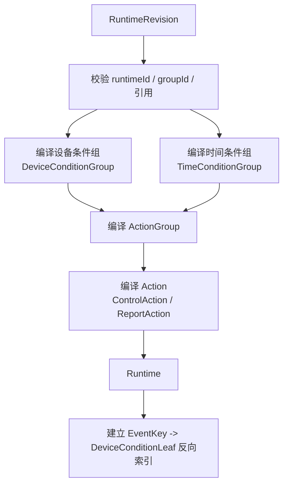

编译阶段做的关键事情：

- 根据 `groupId` 为设备条件组和时间条件组建立索引。
- 校验 `ActionGroupDefinition` 引用的设备条件组、时间条件组必须存在。
- 将设备条件链编译成 `DeviceConditionGroup`。
- 将时间条件编译成 `TimeWindowCondition` 或 `TimePointCondition`。
- 将动作编译成 `ControlAction` 或 `ReportAction`。
- 在 `Runtime` 中建立设备字段事件反向索引。

## 设备条件设计

### 条件链语义

设备条件组由一组 `DeviceConditionDefinition` 构成。每条条件包含：

- 设备类型
- 设备 ID
- 字段名
- 操作符
- 右侧目标值
- 和上一项的逻辑关系

第一项和内部 dummy 节点固定为 `AND`，后续项严格按照表单中的顺序使用 `logicToPrevious`。也就是说设备条件不是普通的优先级表达式，而是严格左结合链：

```text
A OR B AND C == (A OR B) AND C
```

### 为什么使用 `EvalTreeNode`

原始条件是链式的，但运行时需要快速响应单个字段变化。`EvalTreeNode` 使用平衡线段树表达左结合布尔链：

- 叶子节点对应单个设备条件。
- 节点保存表达式片段对 `false` 和 `true` 输入的变换结果。
- 某个叶子变化时，从叶子向上冒泡刷新。
- 既保留左结合语义，又降低树高，避免每次字段变化全量重新计算。

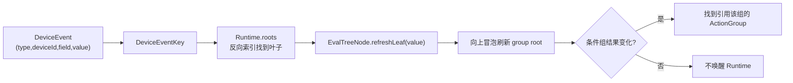

### 类型和值比较

`TypedValueParser` 和 `RecordFieldTypeResolver` 负责字段类型解析和值比较：

- 字段类型通过设备类型映射到对应 Record 类，再用反射查字段。
- 数值字段支持 `EQ`、`NE`、`GT`、`GE`、`ST`、`SE`。
- 布尔、枚举、字符串等非数值字段只真正支持 `EQ`、`NE`，大小比较会返回 `false`。
- 枚举值按 Java enum 名称解析，例如空调模式需要写入后端枚举值，而不是中文显示名。

## 时间条件设计

时间条件组由多条完整时间条件组成，组内条件是 OR 关系。单条时间条件内部的日期范围、星期、时间点或时间段是 AND 关系。

当前支持两种时间条件：

- `WINDOW`：时间窗口，例如 08:00-10:00。
- `TIME_POINT`：瞬时时间点，例如每天 21:00。

`CalendarConstraint` 负责共用的日历约束：

- `startDate` / `endDate`：可为空，空表示不限制日期范围。
- `weekdays`：可为空，空表示每天。
- `zoneId`：IANA 时区，例如 `Asia/Shanghai`。

### 时间窗口

`TimeWindowCondition` 支持跨午夜窗口。例如星期一 22:00-06:00 会持续到星期二 06:00，但星期约束归属于窗口开始日。

`startTime` 和 `endTime` 不能相同。

### 时间点

`TimePointCondition` 表示在匹配日期上的指定时间发生一次。时间点不写入长期窗口状态，只在本次调度脉冲中成立。

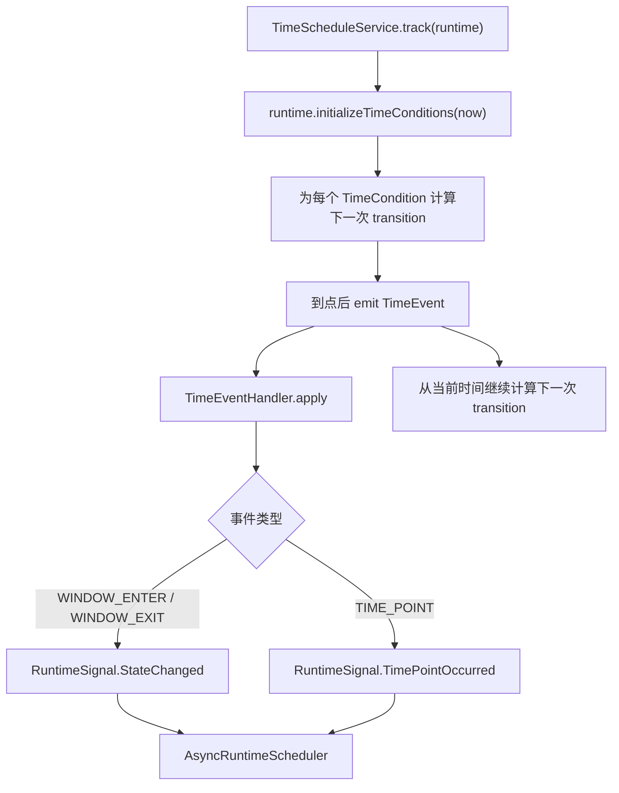

当前 misfire 语义是 SKIP：如果回调延迟，调度器不会补发历史边界，而是从当前时间继续计算下一次边界。

## Runtime 生命周期

`RuntimeLifecycleManager` 管理策略有效期：

- 如果当前时间早于 `activeFrom`，Runtime 初始为 `PENDING`，到点激活。
- 如果当前时间落在有效期内，立即激活。
- 如果当前时间已经晚于或等于 `activeUntil`，直接过期。
- 到达 `activeUntil` 后注销 Runtime。

生命周期使用独立单线程调度器。回调执行前会核对 slot 是否仍是当前实例，避免旧 Runtime 的延迟任务误操作同 `runtimeId` 的新实例。

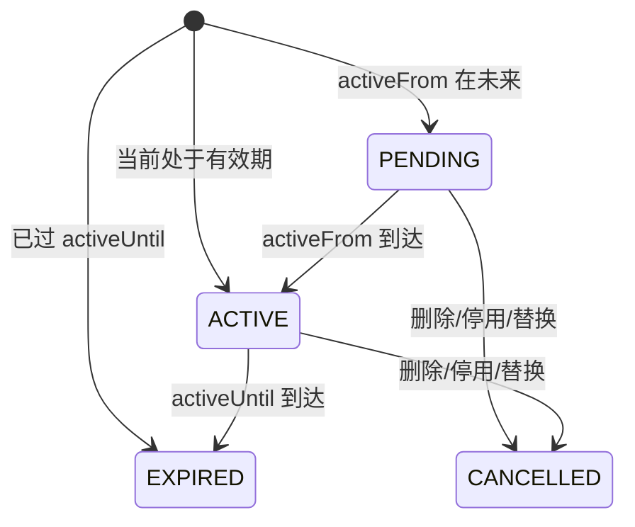

## Engine 事件路由

`Engine` 是规则引擎入口，只负责 Runtime 管理和事件路由。它不持有动作执行细节。

注册 Runtime 时：

1. 移除同 `runtimeId` 的旧 Runtime。
2. 加入 `RuntimeTable`。
3. 交给 `RuntimeLifecycleManager` 管理生命周期。
4. 激活时把 Runtime 的设备事件 key 加入全局反向索引。
5. 启动时间条件调度。
6. 如果激活时存在有效时间窗口，则调度一次全量状态推演。

设备事件路由：

1. `DeviceRecordChangeListener` 接收 Redis Pub/Sub 快照。
2. 对比内存中的上次快照，只为发生变化的字段发布 `DeviceEvent`。
3. `Engine` 用全局 `EventTable` 找到关注该字段的 Runtime。
4. `RuntimeEventRouter` 委托 `DeviceEventHandler` 更新 Runtime 内的条件叶子。
5. 若条件组根结果变化，则调度引用该条件组的 ActionGroup。

时间事件路由：

1. `TimeScheduleService` 为每个时间条件计算下一次边界。
2. 到点生成 `TimeEvent`。
3. `TimeEventHandler` 更新时间组状态或保留时间点脉冲。
4. 调度引用该时间组的 ActionGroup。

## Runtime 调度器

`AsyncRuntimeScheduler` 负责把 RuntimeSignal 转换为动作执行。

设计原则：

- 不同 Runtime 可以并行执行。
- 同一个 Runtime 始终单飞，避免动作重入。
- 状态变化可以合并，因为只需要推演最新状态。
- 时间点事件必须逐个保留，因为每个 occurrence 都代表一次独立触发机会。
- 时间点通过 `occurrenceId` 去重，保留最近 1024 个 occurrence。

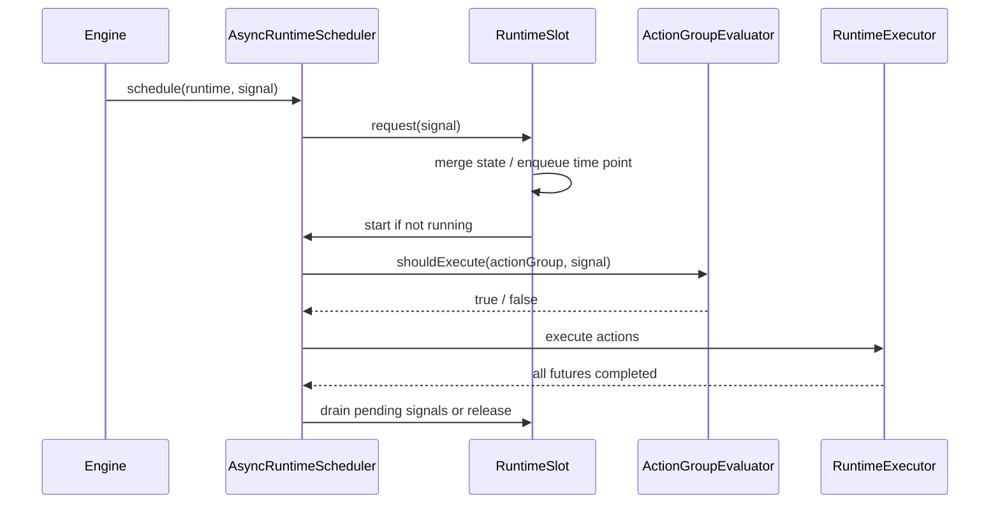

### ActionGroup 判断

`ActionGroupEvaluator.shouldExecute` 同时检查：

1. 当前 ActionGroup 是否是候选。
2. Runtime 是否处于 ACTIVE 且在生命周期范围内。
3. 设备条件组根节点是否为 true。
4. 时间条件组是否允许当前 signal。

空设备条件组和空时间条件组可以表示“始终满足”。这也是前端动态表单中默认空组可以合法序列化的基础。

## 动作执行

`DefaultRuntimeExecutor` 当前支持两类动作。

### ControlAction

`ControlAction` 包含一个 `MqttTaskDto`。执行时：

1. 通过 Dubbo 引用 `MqttRuleIo`。
2. 调用 `asyncSend(task)`。
3. 将成功、RPC 错误、业务错误都转换为结构化 `ActionExecutionResult`。
4. 成功记录到 `ActionExecutionTracker`。
5. 失败记录 `ActionFailure`，并写 warn 日志。

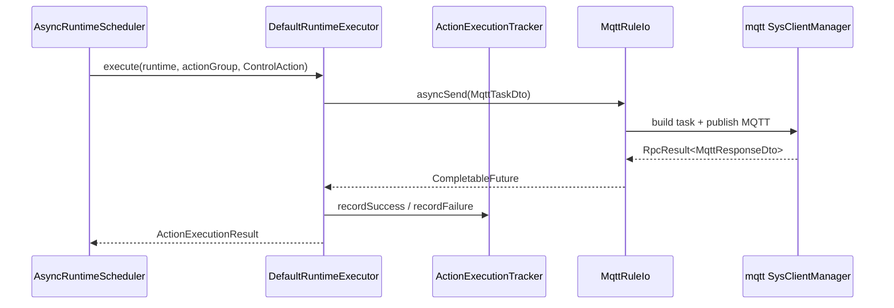

### ReportAction

`ReportAction` 的模型已经保留：

- 用户 ID 列表
- 通知类型：`SMS`、`SMTP`
- 内容

但当前通知通道尚未实现。执行时仅记录日志，并返回 `ActionExecutionResult.notImplemented`。

## 持久化与恢复

`RuntimePersistHelper` 是策略持久化与内存 Engine 同步入口。

数据库保存两类数据：

- Runtime metadata：当前版本号、启用状态、生命周期、状态等。
- 不可变 revision：每次创建、更新、启停都会追加一个新版本 JSON，并保存 SHA-256 checksum。

### 创建和更新

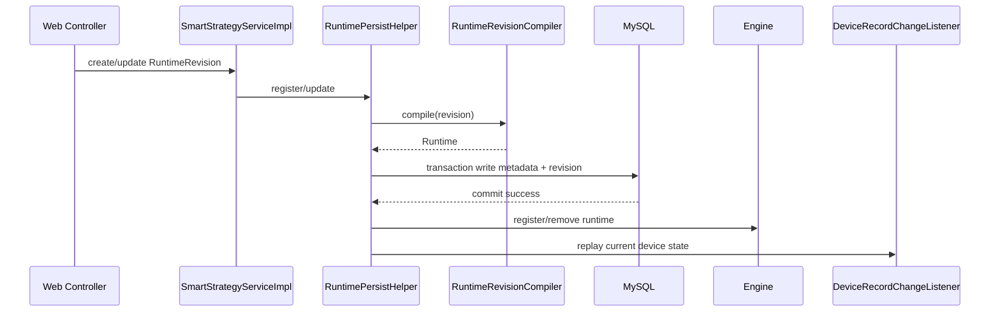

关键点：

- 先编译，保证非法 revision 不会写入数据库。
- 数据库事务成功后才同步内存 Engine。
- 更新不是覆盖旧 revision，而是追加新 revision 并发布为当前版本。
- 停用策略会追加 `enabled=false` 的 revision，并从 Engine 中移除 Runtime。
- 启用策略会追加 `enabled=true` 的 revision，并注册 Runtime。

### 启动恢复

应用启动完成后，`restoreEnabledRuntimes`：

1. 查询全部当前 revision。
2. 跳过未启用或已过期的策略。
3. 编译并注册 Runtime。
4. 对 Runtime 关注的设备字段重放当前设备状态。

重放优先使用 `DeviceRecordChangeListener` 内存快照；进程刚启动尚未收到 Pub/Sub 时，从 MQTT 模块维护的 Redis Hash 中恢复。

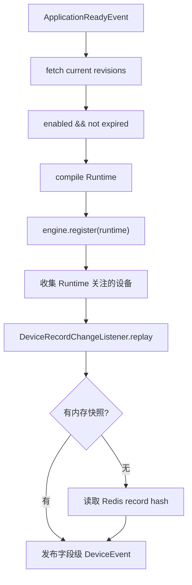

## 设备事件监听

`DeviceRecordChangeListener` 监听 Redis channel `RuleEngineChannels.DEVICE_RECORD_CHANGE`，消息来自 MQTT 模块的 `MessageHandler.publishSnapshot`。

它不会对每条快照的每个字段都重复推演，而是维护 `RecordIdentity(deviceType, deviceId) -> fields` 的内存快照：

- 第一条快照：所有字段都发布事件。
- 后续快照：只发布值发生变化的字段。

这样可以减少 Runtime 调度次数，也避免不必要的动作执行判断。

## 和 MQTT 模块的协作边界

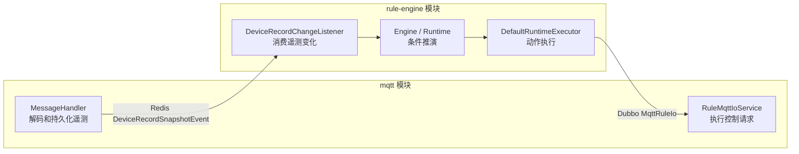

边界说明：

- MQTT 模块负责把物理世界状态变成标准化 `DeviceRecordSnapshotEvent`。
- Rule Engine 模块只关心字段级值变化，不关心 payload 字节含义。
- Rule Engine 模块发出的控制动作仍是 `MqttTaskDto`，不会绕过 MQTT 模块直接操作 broker。
- `MqttRuleIo` 使用内部 Dubbo group，和面向用户的 `MqttIo` 隔离。

## 权限与安全边界

`SmartStrategyServiceImpl` 的 CRUD、启停接口使用 `@ActionAuthorized`，策略管理入口需要经过授权。

规则运行时动作由系统线程触发，不携带当前登录用户上下文，因此：

- 策略保存阶段必须保证用户有权创建/修改对应策略。
- 策略内容本身要可信。
- 执行动作时走 `MqttRuleIo`，不再按当前用户实验室范围校验。

这和 MQTT 模块面向用户的 `MqttIo` 不同；用户直接控制设备时仍会校验 `VisibleLaboratoryScope`。

## 配置项

主要配置位于 `domains/rule/engine/src/main/resources/application.yaml`：

| 配置 | 含义 |
| --- | --- |
| `lab.rule-engine.persistence.enabled` | 是否启用策略持久化与 Dubbo 服务 |
| `lab.rule-engine.simple-test.enabled` | 是否启用简单测试链路 |
| `dubbo.consumer.check=false` | 启动时不强制要求 MQTT provider 在线 |
| `dubbo.consumer.retries=0` | 规则动作 RPC 不自动重试，避免重复控制 |
| `lab.redis.*` | 设备事件监听和快照重放依赖 Redis |
| `lab.auth.permify.*` | 策略管理权限校验 |

## 失败处理与一致性

### Revision 失败

- 编译失败：不会写入数据库。
- 数据库唯一键冲突：创建返回策略已存在。
- 更新或启停找不到 runtime：返回不存在。
- malformed revision：启动恢复时跳过并记录错误。

### Runtime 失败

- Runtime 删除、停用、过期都会注销生命周期、时间调度、事件索引和调度 slot。
- 同 runtimeId 的新 Runtime 注册时会先移除旧 Runtime。
- lifecycle callback 会核对当前 slot，避免旧延迟任务误操作新 Runtime。

### 动作失败

`DefaultRuntimeExecutor` 不让异常 future 打断 Runtime mailbox，而是统一转换成 `ActionExecutionResult.failed`，并通过 `ActionExecutionTracker` 记录失败详情。

### 时间事件延迟

时间调度采用 SKIP 型 misfire 语义。若线程延迟导致错过历史边界，不补发旧事件，而是从当前时间继续计算下一次 transition。

## 扩展点

### 新增设备条件字段

如果只是设备 Record 增加字段，通常需要：

1. 在 `device-domain` 的对应 `*Record` 中增加字段。
2. 确保 MQTT handler 解码并写入该字段。
3. 前端字段目录增加中文名、单位、枚举映射和操作符限制。

`RecordFieldTypeResolver` 会通过反射识别字段类型，不需要为每个字段手写后端映射。

### 新增操作符

需要同时修改：

1. `rule-api` 的 `Operator`。
2. `TypedValueParser.compare`。
3. 前端动态表单的操作符目录。
4. 单元测试覆盖数值、布尔、枚举字段。

### 新增动作类型

需要同时修改：

1. `RuntimeRevision.ActionType` 和 `ActionDefinition`。
2. `RuntimeRevisionCompiler.compileAction`。
3. `DefaultRuntimeExecutor.execute`。
4. 前端动作表单。
5. 持久化序列化兼容测试。

### 接入通知能力

当前 `ReportAction` 只是模型和日志占位。真正接入时需要补：

- 通知 provider，例如短信、邮件或站内信。
- `DefaultRuntimeExecutor.executeReport` 的真实投递逻辑。
- 失败重试或幂等策略。
- 用户查询通知发送结果的接口。

## 当前已知边界

- `ReportAction` 尚未真实发送通知。
- 规则引擎只消费 MQTT 模块发布的设备快照事件，不直接读取 MQTT broker。
- 设备字段事件只在值变化时发布；如果上游重复推送相同值，不会唤醒 Runtime。
- 时间点事件是瞬时脉冲，只在本次 signal 推演中成立。
- 策略执行不会继承 Web 用户上下文，运行时控制动作依赖策略管理入口的授权正确性。
- 单 Runtime 单飞可以避免重入，但一个 Runtime 内多个 Action 仍以 future 集合等待完成；动作执行耗时会影响该 Runtime 后续 signal 的处理延迟。
